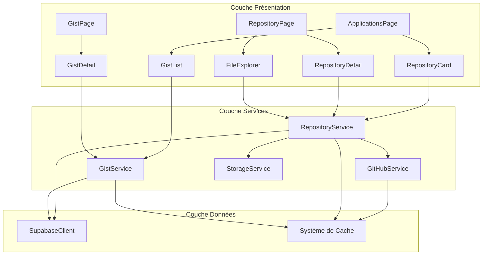
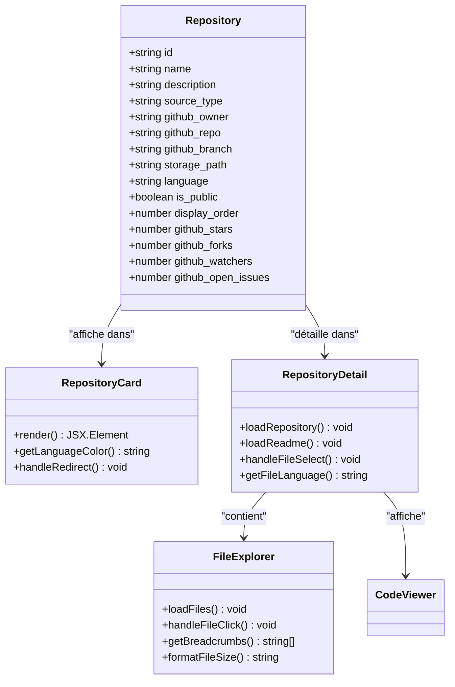
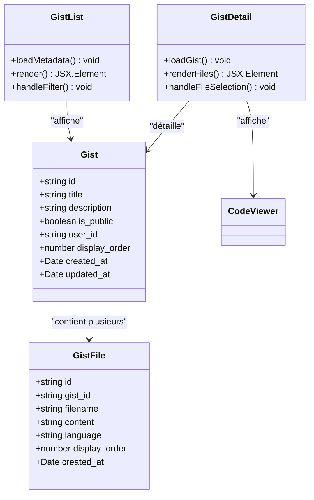
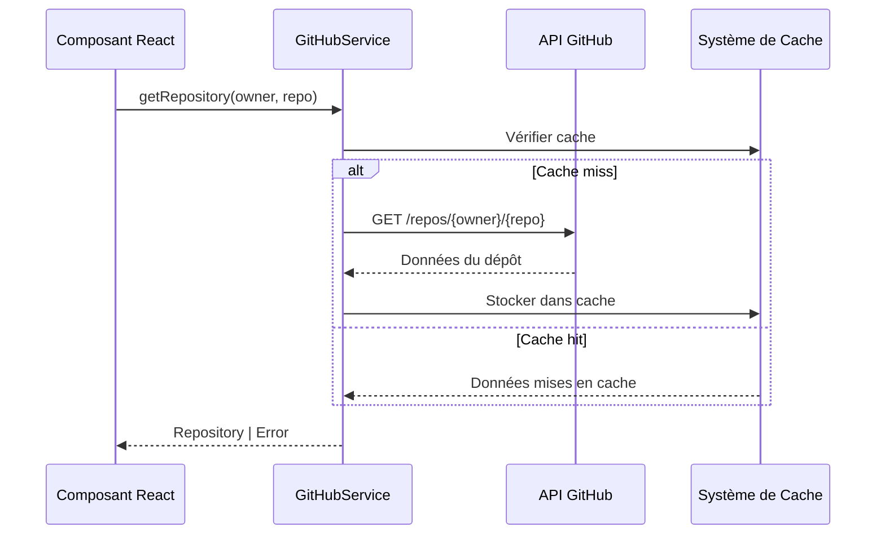
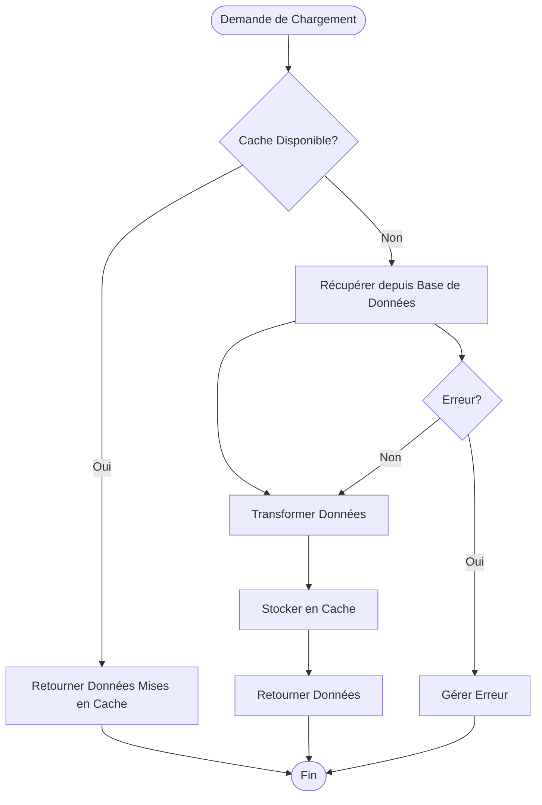

# Documentation du Module Applications

<cite>
**Fichiers Référencés dans ce Document**
- [app/applications/page.tsx](file://app/applications/page.tsx)
- [app/applications/[id]/page.tsx](file://app/applications/[id]/page.tsx)
- [app/applications/gist/[id]/page.tsx](file://app/applications/gist/[id]/page.tsx)
- [components/repositories/RepositoryList.tsx](file://components/repositories/RepositoryList.tsx)
- [components/repositories/RepositoryCard.tsx](file://components/repositories/RepositoryCard.tsx)
- [components/repositories/RepositoryDetail.tsx](file://components/repositories/RepositoryDetail.tsx)
- [components/repositories/FileExplorer.tsx](file://components/repositories/FileExplorer.tsx)
- [components/repositories/RepositoryUploadForm.tsx](file://components/repositories/RepositoryUploadForm.tsx)
- [components/repositories/RepositoryEditDialog.tsx](file://components/repositories/RepositoryEditDialog.tsx)
- [components/gists/GistList.tsx](file://components/gists/GistList.tsx)
- [components/gists/GistDetail.tsx](file://components/gists/GistDetail.tsx)
- [services/githubService.ts](file://services/githubService.ts)
- [services/repositoryService.ts](file://services/repositoryService.ts)
- [services/gistService.ts](file://services/gistService.ts)
- [lib/supabaseClient.ts](file://lib/supabaseClient.ts)
</cite>

## Table des Matières
1. [Introduction](#introduction)
2. [Structure du Module](#structure-du-module)
3. [Système de Dépôts](#système-de-dépôts)
4. [Système de Gists](#système-de-gists)
5. [Services et Intégrations](#services-et-intégrations)
6. [Architecture et Flux de Données](#architecture-et-flux-de-données)
7. [Fonctionnalités Avancées](#fonctionnalités-avancées)
8. [Sécurité et Authentification](#sécurité-et-authentification)
9. [Optimisations et Performance](#optimisations-et-performance)
10. [Guide de Dépannage](#guide-de-dépannage)

## Introduction

Le module Applications constitue le cœur de la présentation du portfolio de développement, offrant une interface unifiée pour gérer et visualiser les projets de code, incluant les dépôts GitHub et les snippets de code (Gists). Cette architecture modulaire permet une expérience utilisateur fluide tout en maintenant une séparation claire entre les différentes sources de contenu.

Le système supporte deux types principaux de contenu :
- **Dépôts** : Projets complets pouvant provenir de GitHub ou être des uploads locaux
- **Gists** : Snippets de code et notes techniques partagées

## Structure du Module

Le module Applications suit une architecture en couches bien définie qui sépare les préoccupations entre présentation, logique métier et accès aux données.

**Sources du Diagramme**
- [app/applications/page.tsx](file://app/applications/page.tsx#L1-L102)
- [components/repositories/RepositoryList.tsx](file://components/repositories/RepositoryList.tsx#L1-L104)
- [components/gists/GistList.tsx](file://components/gists/GistList.tsx#L1-L146)

**Sources de Section**
- [app/applications/page.tsx](file://app/applications/page.tsx#L1-L102)
- [app/applications/[id]/page.tsx](file://app/applications/[id]/page.tsx#L1-L47)
- [app/applications/gist/[id]/page.tsx](file://app/applications/gist/[id]/page.tsx#L1-L50)

## Système de Dépôts

### Vue d'Ensemble des Dépôts

Le système de dépôts offre une interface complète pour gérer les projets de code, supportant à la fois les dépôts GitHub externes et les uploads locaux. Cette flexibilité permet aux utilisateurs de présenter leur travail sous diverses formes.

**Sources du Diagramme**
- [components/repositories/RepositoryCard.tsx](file://components/repositories/RepositoryCard.tsx#L1-L150)
- [components/repositories/RepositoryDetail.tsx](file://components/repositories/RepositoryDetail.tsx#L1-L248)
- [components/repositories/FileExplorer.tsx](file://components/repositories/FileExplorer.tsx#L1-L211)

### Affichage des Dépôts avec RepositoryCard

Le composant RepositoryCard présente chaque dépôt de manière cohérente, avec support des couleurs de langage et des métriques GitHub.

**Caractéristiques principales :**
- **Couleurs de langage** : Attribution automatique de couleurs basées sur le langage de programmation
- **Métriques GitHub** : Affichage des étoiles, forks, watchers et issues ouvertes
- **Redirection intelligente** : Redirection vers GitHub pour les dépôts externes, vers la page de détail pour les dépôts locaux
- **Badges contextuels** : Indicateurs visuels pour le type de source et la visibilité

### Exploration des Fichiers avec FileExplorer

Le FileExplorer fournit une interface d'exploration de fichiers similaire à celle de GitHub, permettant aux utilisateurs de naviguer dans l'arborescence des projets.

**Fonctionnalités avancées :**
- **Navigation hiérarchique** : Support des dossiers imbriqués avec expansion dynamique
- **Affichage des métadonnées** : Taille des fichiers et breadcrumbs de navigation
- **Gestion des erreurs** : Affichage clair des problèmes de chargement
- **Performance optimisée** : Chargement paresseux des contenus de dossiers

**Sources de Section**
- [components/repositories/RepositoryCard.tsx](file://components/repositories/RepositoryCard.tsx#L1-L150)
- [components/repositories/RepositoryDetail.tsx](file://components/repositories/RepositoryDetail.tsx#L1-L248)
- [components/repositories/FileExplorer.tsx](file://components/repositories/FileExplorer.tsx#L1-L211)

## Système de Gists

### Architecture des Gists

Les Gists constituent un système de snippets de code et notes techniques, permettant aux développeurs de partager rapidement du code ou des idées sans créer de dépôts complets.

**Sources du Diagramme**
- [components/gists/GistList.tsx](file://components/gists/GistList.tsx#L1-L146)
- [components/gists/GistDetail.tsx](file://components/gists/GistDetail.tsx#L1-L179)
- [lib/supabaseClient.ts](file://lib/supabaseClient.ts#L156-L179)

### Gestion des Snippets avec GistDetail

Le composant GistDetail offre une interface de lecture optimisée pour les snippets de code, avec support des multiples fichiers et de la syntaxe.

**Fonctionnalités clés :**
- **Interface tabulaire** : Navigation entre fichiers multiples avec onglets
- **Coloration syntaxique** : Support automatique des langages de programmation
- **Métadonnées enrichies** : Informations sur la taille, les langages et la visibilité
- **Gestion des cas limites** : Affichage approprié pour les Gists vides ou avec un seul fichier

**Sources de Section**
- [components/gists/GistList.tsx](file://components/gists/GistList.tsx#L1-L146)
- [components/gists/GistDetail.tsx](file://components/gists/GistDetail.tsx#L1-L179)

## Services et Intégrations

### GitHubService - Intégration API GitHub

Le GitHubService constitue la couche d'abstraction pour interagir avec l'API GitHub, gérant les requêtes, l'authentification et la transformation des données.

**Sources du Diagramme**
- [services/githubService.ts](file://services/githubService.ts#L49-L75)

**Capacités du GitHubService :**
- **Récupération de dépôts** : Métadonnées complètes des dépôts GitHub
- **Exploration de fichiers** : Arborescence et contenu des fichiers
- **Gestion des branches** : Support des branches spécifiques
- **Authentification** : Support des tokens d'accès personnels
- **Gestion d'erreurs** : Traitement robuste des erreurs API

### RepositoryService - Synchronisation des Données

Le RepositoryService orchestre la synchronisation entre les dépôts locaux et GitHub, gérant le cache et les opérations CRUD.

**Fonctionnalités principales :**
- **Cache intelligent** : Stratégies de mise en cache avec TTL
- **Synchronisation** : Coordination entre sources de données multiples
- **Validation** : Vérification des permissions et de l'authentification
- **Gestion des uploads** : Traitement des fichiers locaux avec filtrage .gitignore

### GistService - Gestion des Snippets

Le GistService fournit une API complète pour la gestion des snippets, incluant la création, modification et suppression.

**Opérations supportées :**
- **Création de Gists** : Upload de fichiers avec détection automatique de langage
- **Gestion des métadonnées** : Titres, descriptions et ordre d'affichage
- **Sécurité** : Contrôle d'accès basé sur la visibilité publique/privée
- **Ordre dynamique** : Réorganisation des Gists par priorité

**Sources de Section**
- [services/githubService.ts](file://services/githubService.ts#L1-L236)
- [services/repositoryService.ts](file://services/repositoryService.ts#L1-L460)
- [services/gistService.ts](file://services/gistService.ts#L1-L376)

## Architecture et Flux de Données

### Flux de Chargement des Dépôts

Le système implémente un flux de données optimisé avec gestion du cache et des états de chargement.

**Sources du Diagramme**
- [services/repositoryService.ts](file://services/repositoryService.ts#L13-L41)
- [services/gistService.ts](file://services/gistService.ts#L11-L41)

### Gestion des États de Chargement

Le système utilise une approche granulaire pour la gestion des états de chargement, permettant des feedbacks utilisateur précis.

**Types d'état :**
- **Chargement global** : État principal pour les opérations de données
- **Chargement spécifique** : États détaillés pour les fichiers et contenus
- **États d'erreur** : Gestion structurée des erreurs avec messages adaptés
- **Chargement paresseux** : Chargement différé des contenus volumineux

## Fonctionnalités Avancées

### Upload et Gestion des Dépôts Locaux

Le RepositoryUploadForm offre une interface complète pour l'upload de projets locaux, avec support des fichiers et dossiers.

**Fonctionnalités avancées :**
- **Filtrage .gitignore** : Exclusion automatique des fichiers indésirables
- **Drag-and-drop** : Support complet du glisser-déposer pour les fichiers
- **Prévisualisation** : Aperçu des fichiers avant upload
- **Validation** : Vérification des métadonnées et permissions

### Édition et Personnalisation

Le RepositoryEditDialog permet la modification des propriétés des dépôts avec validation et feedback immédiat.

**Caractéristiques :**
- **Formulaire dynamique** : Adaptation selon le type de source (GitHub/local)
- **Validation en temps réel** : Feedback immédiat des erreurs de saisie
- **Historique des modifications** : Suivi des changements effectués
- **Annulation rapide** : Retour facile aux valeurs précédentes

### Système de Filtres et Recherche

Les composants utilisent un système de filtres avancé basé sur `useFilters` pour une navigation efficace.

**Capacités de filtrage :**
- **Recherche textuelle** : Recherche dans les titres, descriptions et métadonnées
- **Filtres par date** : Tri et filtrage temporel
- **Filtres par tags** : Support des catégories et labels
- **Réinitialisation rapide** : Remise à zéro des filtres actifs

**Sources de Section**
- [components/repositories/RepositoryUploadForm.tsx](file://components/repositories/RepositoryUploadForm.tsx#L1-L535)
- [components/repositories/RepositoryEditDialog.tsx](file://components/repositories/RepositoryEditDialog.tsx#L1-L218)

## Sécurité et Authentification

### Gestion des Tokens d'Accès

Le système implémente une gestion sécurisée des tokens d'accès GitHub avec protection contre les fuites.

**Mesures de sécurité :**
- **Variables d'environnement** : Stockage sécurisé des tokens dans les variables d'environnement
- **Protection côté client** : Masquage des tokens dans les requêtes front-end
- **Expiration automatique** : Gestion de l'expiration des tokens
- **Fallback sécurisé** : Mode de fonctionnement limité en l'absence de token

### Contrôle d'Accès

Le système implémente un contrôle d'accès basé sur l'authentification utilisateur et les permissions de dépôt.

**Niveaux d'accès :**
- **Utilisateur anonyme** : Accès en lecture seule aux dépôts publics
- **Utilisateur authentifié** : Accès complet aux dépôts personnels
- **Administrateur** : Gestion complète du contenu et des permissions
- **Contrôle granulaire** : Permissions spécifiques par dépôt et Gist

### Validation des Entrées

Toutes les entrées utilisateur sont validées côté serveur et client pour prévenir les attaques.

**Types de validation :**
- **Validation des URLs** : Vérification des liens GitHub
- **Validation des fichiers** : Contrôle des extensions et tailles
- **Validation des permissions** : Vérification des droits d'accès
- **Sanitisation** : Nettoyage des données d'entrée

## Optimisations et Performance

### Stratégies de Cache

Le système utilise un système de cache multi-niveaux pour optimiser les performances.

**Stratégies de cache :**
- **Cache mémoire** : Stockage temporaire des données fréquemment accédées
- **Cache TTL** : Expiration automatique des données obsolètes
- **Invalidation intelligente** : Mise à jour des caches lors des modifications
- **Cache distribué** : Partage des données entre instances

### Chargement Paresseux

Les composants utilisent le chargement paresseux pour optimiser les performances initiales.

**Techniques de chargement paresseux :**
- **Lazy loading** : Import dynamique des composants lourds
- **Chargement différé** : Récupération des données uniquement quand nécessaire
- **Virtualisation** : Affichage virtuel des grandes listes
- **Préchargement stratégique** : Chargement anticipé des données probables

### Optimisation des Requêtes

Le système optimise les requêtes vers les APIs externes et la base de données.

**Optimisations :**
- **Regroupement de requêtes** : Agrégation de multiples requêtes en une seule
- **Pagination intelligente** : Chargement paginé des grandes collections
- **Compression** : Compression des données en transit
- **Caching HTTP** : Utilisation des headers de cache HTTP

## Guide de Dépannage

### Problèmes Courants avec les Dépôts GitHub

**Symptôme** : Impossible de charger les métadonnées d'un dépôt GitHub
**Cause** : Token d'accès invalide ou dépôt privé
**Solution** : Vérifier la configuration du token GitHub et les permissions du dépôt

**Symptôme** : Erreur lors du chargement du contenu des fichiers
**Cause** : Limite de taux de l'API GitHub atteinte
**Solution** : Implémenter un système de retry avec backoff exponentiel

### Problèmes avec les Gists

**Symptôme** : Gists non visibles malgré être publics
**Cause** : Problème de cache ou de permissions
**Solution** : Vider le cache et vérifier les permissions utilisateur

**Symptôme** : Upload de fichiers échoue
**Cause** : Fichiers trop volumineux ou extensions non supportées
**Solution** : Vérifier les limitations de taille et les formats supportés

### Problèmes de Performance

**Symptôme** : Chargement lent des listes de dépôts
**Cause** : Cache non optimisé ou requêtes multiples
**Solution** : Vérifier la configuration du cache et optimiser les requêtes

**Symptôme** : Latence lors de l'exploration des fichiers
**Cause** : Chargement synchrone des contenus
**Solution** : Implémenter un chargement asynchrone avec préchargement

### Configuration et Déploiement

**Problème** : Variables d'environnement manquantes
**Solution** : Configurer NEXT_PUBLIC_GITHUB_TOKEN et variables Supabase

**Problème** : Erreurs CORS avec l'API GitHub
**Solution** : Vérifier la configuration CORS côté serveur et les headers d'autorisation

**Problème** : Limites de quota GitHub dépassées
**Solution** : Implémenter un système de monitoring des quotas et de gestion des retry

Cette documentation fournit une vue d'ensemble complète du module Applications, couvrant tous les aspects de conception, d'implémentation et de maintenance. Le système est conçu pour être robuste, performant et facile à maintenir tout en offrant une expérience utilisateur optimale.