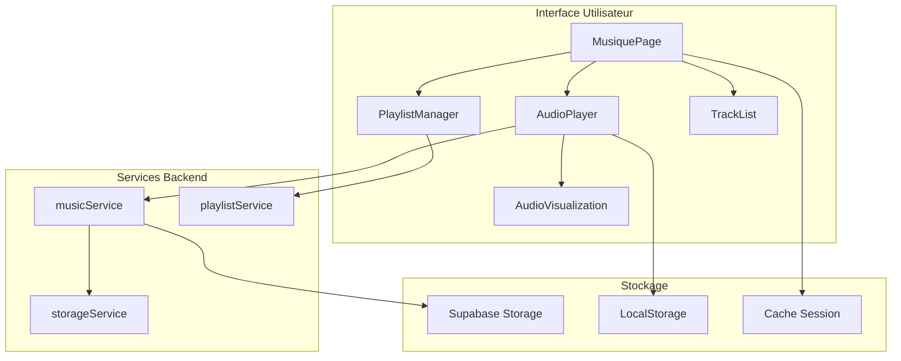
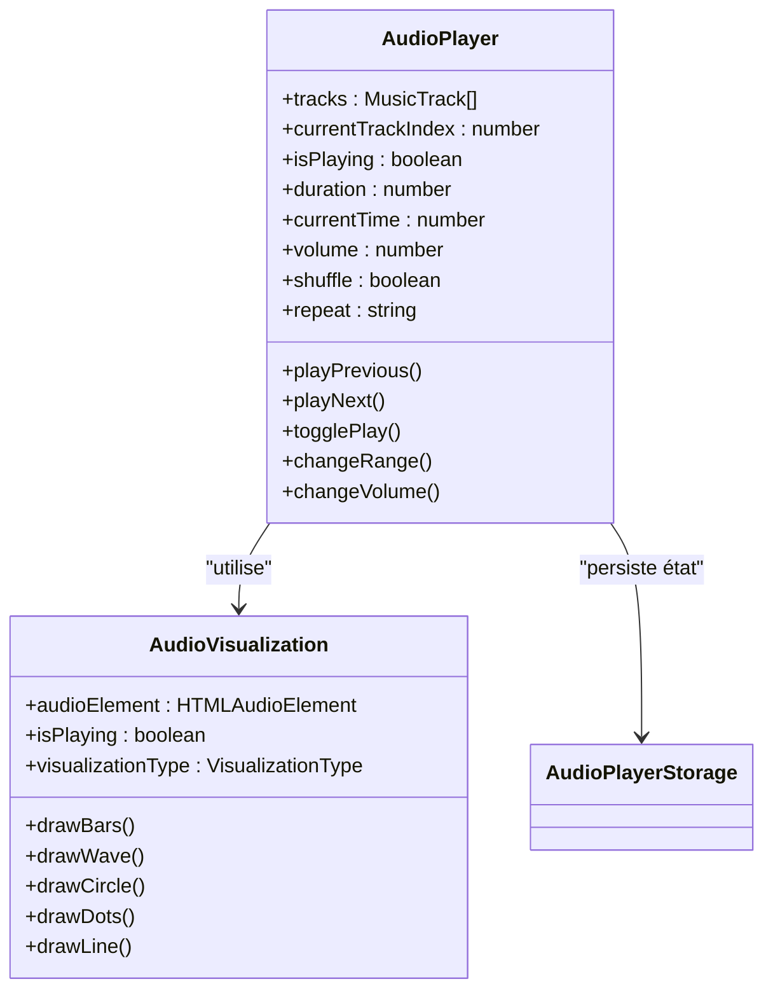
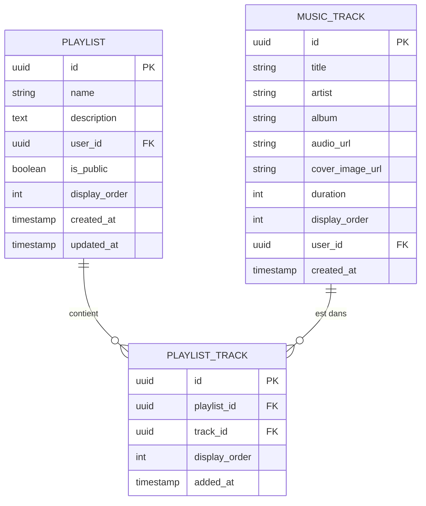
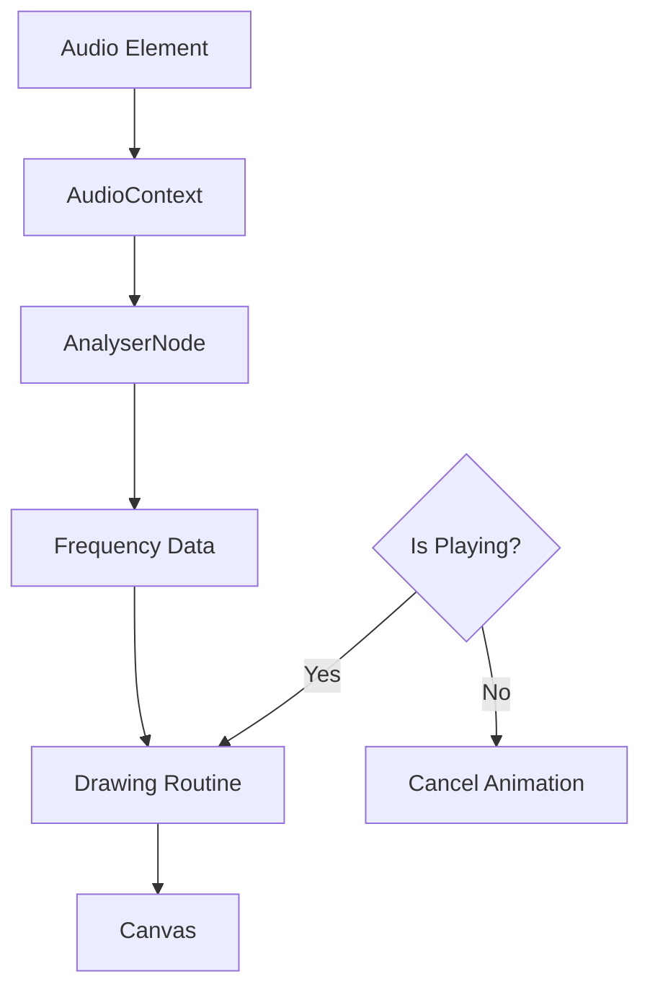
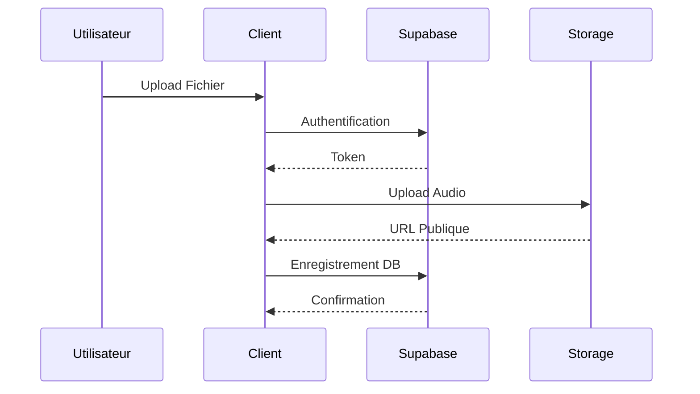

# Module Musique - Documentation Technique

<cite>
**Fichiers Référencés dans ce Document**
- [app/musique/page.tsx](file://app/musique/page.tsx)
- [components/music/AudioPlayer.tsx](file://components/music/AudioPlayer.tsx)
- [components/music/PlaylistManager.tsx](file://components/music/PlaylistManager.tsx)
- [components/music/CreatePlaylistDialog.tsx](file://components/music/CreatePlaylistDialog.tsx)
- [components/music/AudioVisualization.tsx](file://components/music/AudioVisualization.tsx)
- [components/music/TrackList.tsx](file://components/music/TrackList.tsx)
- [services/musicService.ts](file://services/musicService.ts)
- [services/playlistService.ts](file://services/playlistService.ts)
- [lib/audioPlayerStorage.ts](file://lib/audioPlayerStorage.ts)
- [lib/supabaseClient.ts](file://lib/supabaseClient.ts)
- [lib/cache.ts](file://lib/cache.ts)
- [services/storageService.ts](file://services/storageService.ts)
</cite>

## Table des Matières
1. [Introduction](#introduction)
2. [Architecture Globale](#architecture-globale)
3. [Composant AudioPlayer](#composant-audioplayer)
4. [Services Backend](#services-backend)
5. [Gestion des Playlists](#gestion-des-playlists)
6. [Stockage Local et Cache](#stockage-local-et-cache)
7. [Visualisation Audio](#visualisation-audio)
8. [Optimisations de Performance](#optimisations-de-performance)
9. [Intégration Supabase](#intégration-supabase)
10. [Gestion des Erreurs](#gestion-des-erreurs)

## Introduction

Le module musique du portfolio constitue un système audio complet basé sur React, offrant une expérience de lecture musicale enrichie avec gestion d'état avancée, visualisations dynamiques et intégration cloud. Ce système combine un lecteur audio sophistiqué avec des fonctionnalités de gestion de playlists, de recherche et de partage social.

## Architecture Globale

Le module musique suit une architecture modulaire avec séparation claire des responsabilités :

**Sources du Diagramme**
- [app/musique/page.tsx](file://app/musique/page.tsx#L1-L577)
- [components/music/AudioPlayer.tsx](file://components/music/AudioPlayer.tsx#L1-L849)
- [services/musicService.ts](file://services/musicService.ts#L1-L301)

## Composant AudioPlayer

Le composant `AudioPlayer` constitue le cœur du système audio, implémentant une logique de lecture avancée avec gestion d'état complexe.

### Fonctionnalités Principales

#### Contrôle de Lecture
- **Lecture/Pause** : Contrôle fluide avec gestion des états de lecture
- **Navigation** : Navigation entre pistes avec support du mode shuffle et répétition
- **Contrôles Avancés** : Contrôles clavier pour navigation rapide et ajustement du volume

#### Gestion d'État
Le composant maintient un état complexe incluant :
- Position courante et durée totale
- Volume et statut de mute
- Mode shuffle et répétition
- État de chargement et d'erreur

#### Optimisations de Performance
- **Mise en cache** : Sauvegarde automatique de l'état de lecture
- **Lazy Loading** : Chargement différé des pistes audio
- **Animations** : Animation de la barre de progression avec `requestAnimationFrame`

### Architecture du Composant

**Sources du Diagramme**
- [components/music/AudioPlayer.tsx](file://components/music/AudioPlayer.tsx#L48-L849)
- [components/music/AudioVisualization.tsx](file://components/music/AudioVisualization.tsx#L1-L248)

**Sources de Section**
- [components/music/AudioPlayer.tsx](file://components/music/AudioPlayer.tsx#L48-L849)

## Services Backend

### musicService

Le service `musicService` gère toutes les opérations CRUD sur les pistes musicales avec optimisations de performance.

#### Fonctionnalités
- **Récupération** : Chargement des pistes avec ou sans tags
- **Création** : Ajout de nouvelles pistes avec validation
- **Mise à jour** : Modification des métadonnées
- **Suppression** : Suppression sécurisée des pistes

#### Optimisations
- **Cache** : Mise en cache des données avec TTL de 5 minutes
- **Validation** : Validation des URLs et contrôle de taux
- **Invalidation** : Invalidation automatique du cache après modification

### playlistService

Le service `playlistService` implémente une gestion complète des playlists utilisateur.

#### Fonctionnalités
- **Création** : Création de playlists avec visibilité configurable
- **Gestion** : Ajout et suppression de pistes
- **Ordre** : Réorganisation des pistes avec persistance
- **Partage** : Partage public des playlists

#### Architecture des Données

**Sources du Diagramme**
- [services/playlistService.ts](file://services/playlistService.ts#L1-L446)
- [lib/supabaseClient.ts](file://lib/supabaseClient.ts#L180-L202)

**Sources de Section**
- [services/musicService.ts](file://services/musicService.ts#L1-L301)
- [services/playlistService.ts](file://services/playlistService.ts#L1-L446)

## Gestion des Playlists

### PlaylistManager

Le composant `PlaylistManager` offre une interface complète pour la gestion des playlists utilisateur.

#### Fonctionnalités
- **Liste des Playlists** : Affichage et organisation des playlists
- **Création** : Interface de création avec validation
- **Modification** : Édition des métadonnées
- **Suppression** : Suppression sécurisée avec confirmation
- **Partage** : Génération de liens partagés

### CreatePlaylistDialog

Interface modale pour la création de nouvelles playlists avec validation formulaire.

#### Caractéristiques
- **Formulaire Typé** : Validation Zod avec feedback utilisateur
- **Visibilité** : Option de rendre publique la playlist
- **Feedback** : Notifications Sonner pour les actions

**Sources de Section**
- [components/music/PlaylistManager.tsx](file://components/music/PlaylistManager.tsx#L1-L300)
- [components/music/CreatePlaylistDialog.tsx](file://components/music/CreatePlaylistDialog.tsx#L1-L194)

## Stockage Local et Cache

### audioPlayerStorage

Le module `audioPlayerStorage` gère la persistance de l'état du lecteur audio.

#### Fonctionnalités
- **Sauvegarde d'État** : Position et volume des pistes
- **État de Playlist** : Configuration shuffle et répétition
- **Expiration** : Gestion automatique de l'expiration (30 jours)
- **Sécurité** : Protection contre les erreurs de stockage

### Cache Session

Le système de cache utilise une approche hybride avec mémoire et session storage.

#### Optimisations
- **TTL** : Durée de vie configurable (5 minutes par défaut)
- **Invalidation** : Invalidation par pattern pour les mises à jour
- **Synchronisation** : Synchronisation automatique avec sessionStorage

**Sources de Section**
- [lib/audioPlayerStorage.ts](file://lib/audioPlayerStorage.ts#L1-L170)
- [lib/cache.ts](file://lib/cache.ts#L1-L211)

## Visualisation Audio

### AudioVisualization

Le composant `AudioVisualization` implémente des visualisations audio en temps réel avec Canvas.

#### Types de Visualisation
- **Barres** : Visualisation spectrale avec barres colorées
- **Onde** : Représentation de la forme d'onde
- **Cercle** : Visualisation circulaire animée
- **Points** : Points flottants dynamiques
- **Ligne** : Graphique de fréquence

#### Architecture Technique
- **Web Audio API** : Analyse des fréquences en temps réel
- **Canvas Rendering** : Rendu optimisé avec `requestAnimationFrame`
- **Gestion d'État** : Synchronisation avec l'état de lecture

**Sources du Diagramme**
- [components/music/AudioVisualization.tsx](file://components/music/AudioVisualization.tsx#L24-L248)

**Sources de Section**
- [components/music/AudioVisualization.tsx](file://components/music/AudioVisualization.tsx#L1-L248)

## Optimisations de Performance

### Mise en Cache Intelligente
- **Cache de Session** : Données persistantes entre sessions
- **TTL Granulaire** : Durées différentes selon le type de donnée
- **Invalidation Ciblée** : Mise à jour précise après modifications

### Chargement Différé
- **Lazy Loading** : Chargement des pistes seulement quand nécessaire
- **Préchargement** : Préparation anticipée des pistes adjacentes
- **Gestion Mémoire** : Libération automatique des ressources

### Optimisations DOM
- **Virtualisation** : Rendu virtuel pour les grandes listes
- **Re-rendus Minimaux** : Optimisation des re-rendus avec `useMemo`
- **Animations Fluides** : Utilisation de `requestAnimationFrame`

## Intégration Supabase

### Architecture de Stockage
Le système utilise Supabase Storage pour héberger les fichiers audio avec sécurité renforcée.

#### Configuration du Bucket
- **Bucket Name** : `audio-files`
- **Accès Public** : Lecture publique des fichiers
- **Limites** : 10MB par fichier, types MIME spécifiques
- **Politiques RLS** : Sécurité fine-grainée

#### Flux de Données

**Sources du Diagramme**
- [services/storageService.ts](file://services/storageService.ts#L71-L119)

**Sources de Section**
- [lib/supabaseClient.ts](file://lib/supabaseClient.ts#L1-L344)

## Gestion des Erreurs

### Stratégies de Résilience
- **Gestion Gracieuse** : Affichage d'erreurs utilisateur-friendly
- **Fallbacks** : Alternatives lorsque les services échouent
- **Logging Centralisé** : Surveillance des erreurs avec Sentry

### Types d'Erreurs
- **Erreurs Réseau** : Timeout et perte de connexion
- **Erreurs de Validation** : Données invalides
- **Erreurs d'Authentification** : Accès refusé
- **Erreurs de Stockage** : Problèmes de fichiers

### Feedback Utilisateur
- **Notifications** : Toasts Sonner pour les actions
- **Indicateurs Visuels** : États de chargement
- **Messages d'Erreur** : Informations détaillées

**Sources de Section**
- [components/music/AudioPlayer.tsx](file://components/music/AudioPlayer.tsx#L350-L380)
- [services/musicService.ts](file://services/musicService.ts#L82-L120)

## Conclusion

Le module musique du portfolio représente une implémentation complète et sophistiquée d'un lecteur audio web moderne. Avec sa combinaison de technologies React, Supabase et Web Audio API, il offre une expérience utilisateur fluide et performante tout en maintenant une architecture extensible et maintenable.

Les optimisations de performance, la gestion robuste des états et l'intégration cloud assurent une expérience de lecture musicale de haute qualité adaptée aux besoins d'un portfolio professionnel.