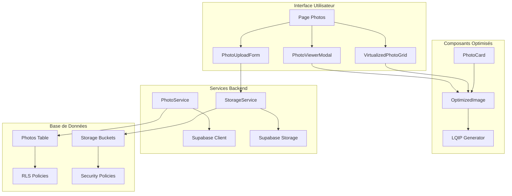
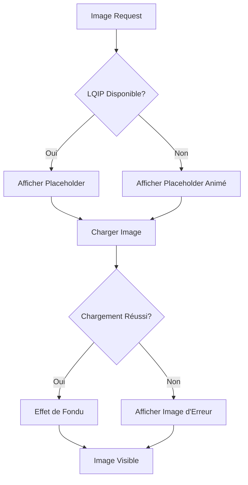
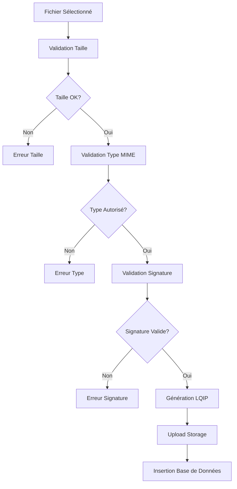

# Documentation du Module Photo

<cite>
**Fichiers Référencés dans ce Document**
- [VirtualizedPhotoGrid.tsx](file://components/photos/VirtualizedPhotoGrid.tsx)
- [PhotoViewerModal.tsx](file://components/photos/PhotoViewerModal.tsx)
- [OptimizedImage.tsx](file://components/OptimizedImage.tsx)
- [generate-lqip-for-existing.ts](file://scripts/generate-lqip-for-existing.ts)
- [PhotoUploadForm.tsx](file://components/photos/PhotoUploadForm.tsx)
- [fileValidation.ts](file://lib/fileValidation.ts)
- [PhotoCard.tsx](file://components/photos/PhotoCard.tsx)
- [imageUtils.ts](file://lib/imageUtils.ts)
- [photoService.ts](file://services/photoService.ts)
- [storageService.ts](file://services/storageService.ts)
- [page.tsx](file://app/photos/page.tsx)
- [supabaseClient.ts](file://lib/supabaseClient.ts)
- [20251106122804_create_photo_storage_bucket.sql](file://supabase/migrations/20251106122804_create_photo_storage_bucket.sql)
- [20251105115814_create_photos_table.sql](file://supabase/migrations/20251105115814_create_photos_table.sql)
</cite>

## Table des Matières
1. [Introduction](#introduction)
2. [Architecture du Système Photo](#architecture-du-système-photo)
3. [Galerie Photo avec Grille Virtuelle](#galerie-photo-avec-grille-virtuelle)
4. [Visualisation en Plein Écran](#visualisation-en-plein-écran)
5. [Système LQIP (Low-Quality Image Placeholders)](#système-lqip-low-quality-image-placeholders)
6. [Processus d'Upload](#processus-dupload)
7. [Intégration Supabase Storage](#intégration-supabase-storage)
8. [Sécurité et RLS](#sécurité-et-rls)
9. [Optimisations de Performance](#optimisations-de-performance)
10. [Accessibilité](#accessibilité)
11. [Exemples de Code](#exemples-de-code)
12. [Conclusion](#conclusion)

## Introduction

Le module photo constitue le cœur de la galerie photographique de ce portfolio moderne, offrant une expérience utilisateur fluide et performante grâce à des technologies avancées comme la virtualisation, les placeholders LQIP et la gestion optimisée des ressources. Le système est construit avec Next.js 14, TypeScript et Supabase, garantissant une architecture robuste et scalable.

## Architecture du Système Photo

Le système photo suit une architecture modulaire bien structurée qui sépare clairement les responsabilités :



**Sources du Diagramme**
- [page.tsx](file://app/photos/page.tsx#L40-L171)
- [VirtualizedPhotoGrid.tsx](file://components/photos/VirtualizedPhotoGrid.tsx#L14-L123)
- [PhotoViewerModal.tsx](file://components/photos/PhotoViewerModal.tsx#L28-L235)

## Galerie Photo avec Grille Virtuelle

### VirtualizedPhotoGrid.tsx

Le composant `VirtualizedPhotoGrid` implémente une grille photo virtuelle sophistiquée qui optimise les performances pour les grandes collections d'images.

#### Fonctionnalités Principales

- **Virtualisation Intelligente** : Utilise `@tanstack/react-virtual` pour ne rendre que les éléments visibles dans le viewport
- **Grille Responsive** : Adapte dynamiquement le nombre de colonnes selon la largeur de l'écran
- **Chargement Incrémental** : Charge progressivement les lignes hors écran pour maintenir les performances
- **Support Accessibilité** : Implémente les rôles ARIA appropriés pour la navigation au clavier

#### Configuration Responsive

```typescript
// Configuration des colonnes selon la taille d'écran
const columnCount = useMemo(() => {
  if (windowWidth < 640) return 2; // sm
  if (windowWidth < 1024) return 3; // lg
  return 4; // xl
}, [windowWidth]);
```

#### Optimisations de Performance

- **Overscan** : Rend 2 lignes supplémentaires en dehors du viewport
- **Estimation de Taille** : Hauteur estimée de 300px par ligne
- **Memoization** : Calcul du nombre de colonnes avec `useMemo`

**Sources de Section**
- [VirtualizedPhotoGrid.tsx](file://components/photos/VirtualizedPhotoGrid.tsx#L14-L123)

## Visualisation en Plein Écran

### PhotoViewerModal.tsx

Le `PhotoViewerModal` offre une expérience de visualisation immersive avec support complet des interactions tactiles et clavier.

#### Fonctionnalités Avancées

- **Navigation Clavier** : Flèches gauche/droite, Escape, +/- pour zoom
- **Contrôles Touch** : Support des gestes tactiles sur mobile
- **Zoom Dynamique** : Contrôle du niveau de zoom avec limite haute/basse
- **Téléchargement** : Fonctionnalité de téléchargement avec feedback visuel
- **Partage Social** : Intégration des boutons de partage

#### Gestion des Événements Clavier

```typescript
const handleKeyDown = (e: KeyboardEvent) => {
  switch (e.key) {
    case 'ArrowLeft': goToPrevious(); break;
    case 'ArrowRight': goToNext(); break;
    case 'Escape': onClose(); break;
    case '+': case '=': handleZoomIn(); break;
    case '-': handleZoomOut(); break;
  }
};
```

#### Interface Utilisateur Intuitive

L'interface comprend :
- **Boutons de Navigation** : Flèches gauche/droite pour parcourir les photos
- **Contrôles de Zoom** : Boutons + et - avec état désactivé selon la limite
- **Bouton Télécharger** : Indicateur de chargement pendant le téléchargement
- **Informations Photo** : Titre, description et indicateur de position

**Sources de Section**
- [PhotoViewerModal.tsx](file://components/photos/PhotoViewerModal.tsx#L28-L235)

## Système LQIP (Low-Quality Image Placeholders)

### OptimizedImage.tsx

Le composant `OptimizedImage` implémente un système d'optimisation avancé avec support des placeholders LQIP pour une expérience de chargement fluides.

#### Architecture LQIP



**Sources du Diagramme**
- [OptimizedImage.tsx](file://components/OptimizedImage.tsx#L58-L159)

#### Fonctionnalités LQIP

- **Placeholder Flou** : Utilise `blurDataURL` pour un effet de chargement progressif
- **Fallback Animé** : Placeholder pulsant pendant le chargement
- **Gestion d'Erreurs** : Image de remplacement en cas d'échec de chargement
- **Transition Douce** : Effet de fondu de 300ms pour le changement d'état

#### Génération LQIP

Le script `generate-lqip-for-existing.ts` permet de migrer les images existantes vers le système LQIP :

```typescript
// Exemple de génération LQIP
const blurDataUrl = await generateLQIP(photo.image_url, 20, 20);
```

**Sources de Section**
- [OptimizedImage.tsx](file://components/OptimizedImage.tsx#L1-L159)
- [generate-lqip-for-existing.ts](file://scripts/generate-lqip-for-existing.ts#L1-L104)
- [imageUtils.ts](file://lib/imageUtils.ts#L1-L112)

## Processus d'Upload

### PhotoUploadForm.tsx

Le formulaire d'upload `PhotoUploadForm` implémente une interface utilisateur intuitive avec validation complète des fichiers.

#### Validation Multi-niveaux



**Sources du Diagramme**
- [PhotoUploadForm.tsx](file://components/photos/PhotoUploadForm.tsx#L62-L76)
- [fileValidation.ts](file://lib/fileValidation.ts#L136-L187)

#### Caractéristiques du Formulaire

- **Drag & Drop** : Support complet des opérations glisser-déposer
- **Validation Avancée** : Vérification des signatures de fichiers
- **Compression Automatique** : Compression côté client des images
- **Prévisualisation** : Aperçu en temps réel du fichier sélectionné
- **Gestion d'État** : États de chargement et d'erreur clairs

#### Types de Fichiers Supportés

```typescript
const ACCEPTED_TYPES = ['image/jpeg', 'image/png', 'image/webp', 'image/gif'];
const MAX_FILE_SIZE = 5 * 1024 * 1024; // 5MB
```

**Sources de Section**
- [PhotoUploadForm.tsx](file://components/photos/PhotoUploadForm.tsx#L1-L313)
- [fileValidation.ts](file://lib/fileValidation.ts#L1-L187)

## Intégration Supabase Storage

### Services de Stockage

Le système utilise Supabase Storage pour la gestion des fichiers avec des optimisations spécifiques pour les images.

#### Configuration du Bucket

```sql
-- Configuration du bucket photo-files
INSERT INTO storage.buckets (id, name, public, file_size_limit, allowed_mime_types)
VALUES (
  'photo-files',
  'photo-files',
  true,
  5242880, -- 5MB
  ARRAY['image/jpeg', 'image/jpg', 'image/png', 'image/webp', 'image/gif']
)
```

#### Optimisations de Compression

Le service de stockage implémente une compression intelligente :

```typescript
const options = {
  maxSizeMB: 1, // Taille maximale de 1MB
  maxWidthOrHeight: 1920, // Largeur/hauteur max
  useWebWorker: true, // Web Worker pour ne pas bloquer
  initialQuality: 0.85, // Qualité initiale à 85%
};
```

#### Gestion des URLs

```typescript
// Génération d'URL publique
const publicUrl = storageService.getPublicUrl(fileName);

// Génération LQIP pour les nouveaux uploads
const blurDataUrl = await storageService.generateLQIPForPhoto(file);
```

**Sources de Section**
- [storageService.ts](file://services/storageService.ts#L1-L310)

## Sécurité et RLS

### Politiques de Sécurité

Le système implémente une sécurité robuste via les Row Level Security (RLS) de Supabase.

#### Politiques de la Table Photos

```sql
-- Politique de lecture publique
CREATE POLICY "Photos are viewable by everyone"
  ON photos FOR SELECT
  USING (true);

-- Politiques d'écriture réservées aux authentifiés
CREATE POLICY "Authenticated users can insert photos"
  ON photos FOR INSERT
  WITH CHECK (auth.role() = 'authenticated');

CREATE POLICY "Authenticated users can update photos"
  ON photos FOR UPDATE
  USING (auth.role() = 'authenticated');

CREATE POLICY "Authenticated users can delete photos"
  ON photos FOR DELETE
  USING (auth.role() = 'authenticated');
```

#### Politiques du Storage

```sql
-- Politique de lecture publique
CREATE POLICY "Tous peuvent télécharger les photos"
  ON storage.objects FOR SELECT
  USING (bucket_id = 'photo-files');

-- Politiques d'écriture réservées aux authentifiés
CREATE POLICY "Utilisateurs authentifiés peuvent uploader des photos"
  ON storage.objects FOR INSERT
  TO authenticated
  WITH CHECK (bucket_id = 'photo-files');
```

**Sources de Section**
- [20251105115814_create_photos_table.sql](file://supabase/migrations/20251105115814_create_photos_table.sql#L1-L41)
- [20251106122804_create_photo_storage_bucket.sql](file://supabase/migrations/20251106122804_create_photo_storage_bucket.sql#L1-L55)

## Optimisations de Performance

### Stratégies de Performance

Le système implémente plusieurs optimisations pour garantir des performances optimales :

#### 1. Virtualisation
- **React Virtual** : Seulement les éléments visibles sont rendus
- **Overscan** : Chargement anticipé des éléments hors viewport
- **Estimation de Taille** : Calcul optimisé des dimensions

#### 2. Lazy Loading
- **Intersection Observer** : Chargement intelligent basé sur la visibilité
- **Priority Loading** : Images au-dessus du pli chargées immédiatement
- **Fallback Native** : Support du lazy loading natif avec polyfill

#### 3. Optimisation des Images
- **Compression Client-side** : Réduction de la taille des fichiers
- **Format Adaptatif** : Choix optimal du format selon le navigateur
- **Responsive Images** : Tailles adaptatives selon l'écran

#### 4. Cache Intelligent
- **Cache Session** : Mise en cache des données de photos
- **Invalidation Automatique** : Mise à jour du cache après modifications
- **TTL Optimisé** : Durée de vie du cache adaptée aux besoins

**Sources de Section**
- [VirtualizedPhotoGrid.tsx](file://components/photos/VirtualizedPhotoGrid.tsx#L42-L47)
- [OptimizedImage.tsx](file://components/OptimizedImage.tsx#L64-L93)
- [photoService.ts](file://services/photoService.ts#L18-L49)

## Accessibilité

### Implémentation ARIA

Le système photo respecte les standards d'accessibilité WCAG 2.1 AA.

#### Rôles et Attributs ARIA

```typescript
// Grille photo virtuelle
<div
  role="grid"
  aria-label="Galerie de photos"
  aria-rowcount={rowCount}
  aria-colcount={columnCount}
/>

// Cellules de grille
<div
  role="gridcell"
  aria-colindex={colIndex + 1}
/>
```

#### Navigation au Clavier

- **Flèches Directionnelles** : Navigation entre les photos
- **Escape** : Fermeture de la modal
- **Touches Plus/Moins** : Contrôle du zoom
- **Tabulation** : Navigation dans les contrôles

#### Compatibilité Navigateurs

- **Progressive Enhancement** : Fonctionnalités enrichies selon les capacités
- **Fallbacks** : Support des navigateurs plus anciens
- **Tests Cross-browser** : Validation sur différents environnements

**Sources de Section**
- [VirtualizedPhotoGrid.tsx](file://components/photos/VirtualizedPhotoGrid.tsx#L66-L70)
- [PhotoViewerModal.tsx](file://components/photos/PhotoViewerModal.tsx#L87-L113)

## Exemples de Code

### Affichage d'une Photo avec Effet de Fondu

Voici comment utiliser le composant `OptimizedImage` pour afficher une photo avec effet de fondu :

```typescript
// Exemple d'utilisation dans PhotoCard
<OptimizedImage
  src={photo.image_url}
  alt={photo.title}
  className="aspect-square"
  objectFit="cover"
  sizes="(max-width: 768px) 100vw, (max-width: 1200px) 50vw, 33vw"
  blurDataURL={photo.blur_data_url || undefined}
/>
```

### Gestion des Erreurs de Chargement

Le composant `OptimizedImage` gère automatiquement les erreurs :

```typescript
// Gestion automatique des erreurs
const handleError = () => {
  setHasError(true);
  onError?.();
};

// Image de fallback en cas d'erreur
const fallbackSrc = 'data:image/svg+xml,...';
```

### Intégration avec le Système de Tags

```typescript
// Upload avec tags associés
const { photo, error } = await photoService.createPhotoWithTags({
  title: title.trim(),
  description: description.trim() || null,
  image_url: publicUrl,
  blur_data_url: blurDataUrl,
  display_order: nextOrder,
}, selectedTagIds);
```

**Sources de Section**
- [PhotoCard.tsx](file://components/photos/PhotoCard.tsx#L23-L30)
- [OptimizedImage.tsx](file://components/OptimizedImage.tsx#L100-L107)
- [PhotoUploadForm.tsx](file://components/photos/PhotoUploadForm.tsx#L159-L170)

## Conclusion

Le module photo représente une solution complète et sophistiquée pour la gestion de galeries photographiques modernes. Son architecture modulaire, ses optimisations de performance avancées et son respect des standards d'accessibilité en font un exemple exemplaire d'application Next.js 14.

### Points Forts du Système

- **Performance Exceptionnelle** : Virtualisation et optimisations de chargement
- **Expérience Utilisateur** : Interface intuitive avec support tactile et clavier
- **Sécurité Robuste** : Politiques RLS et validation multi-niveaux
- **Extensibilité** : Architecture modulaire permettant l'ajout de nouvelles fonctionnalités
- **Accessibilité** : Respect complet des standards WCAG

### Recommandations Futures

- **Lazy Loading Progressif** : Amélioration du système de chargement
- **WebP Support** : Optimisation supplémentaire des formats d'image
- **Analytics Avancés** : Suivi des interactions utilisateur
- **Import de Galeries** : Fonctionnalité d'import de collections externes

Cette documentation fournit une base solide pour comprendre, maintenir et étendre le module photo selon les besoins futurs du projet.