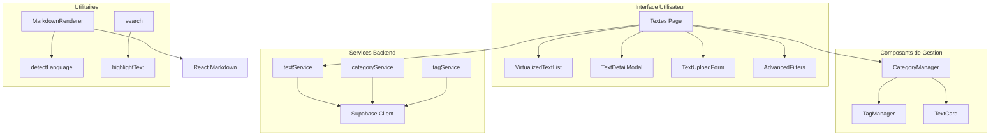
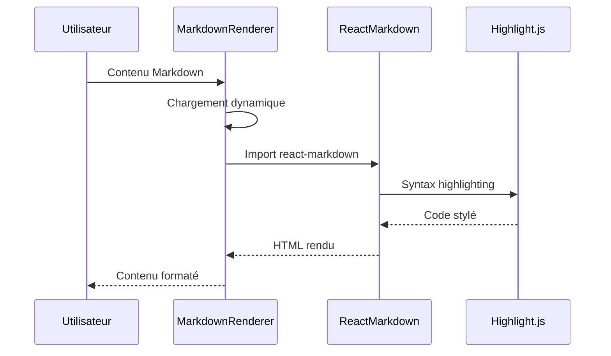
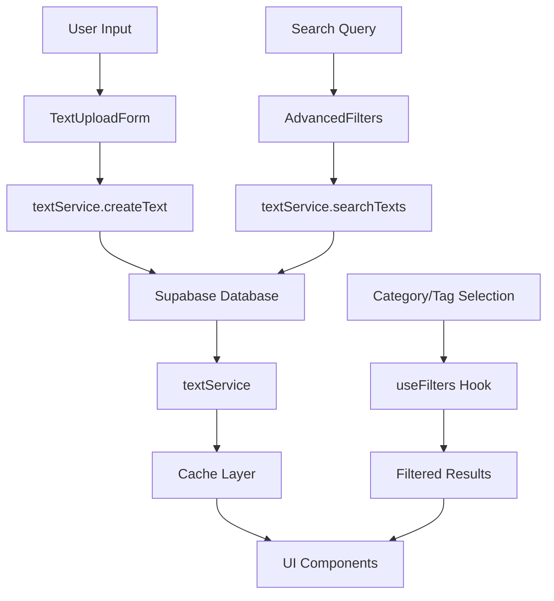
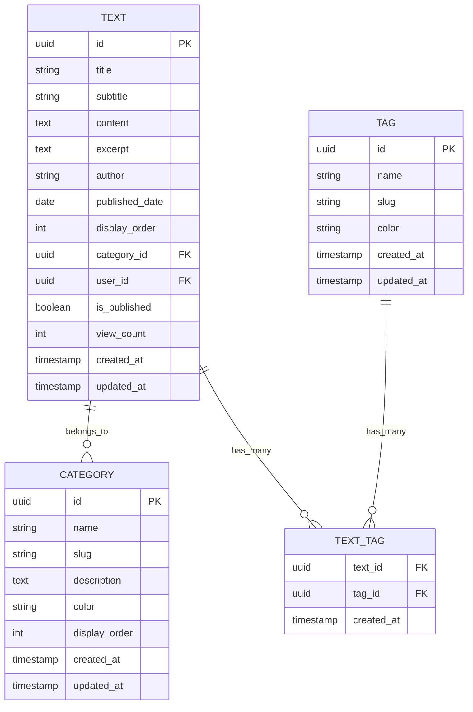
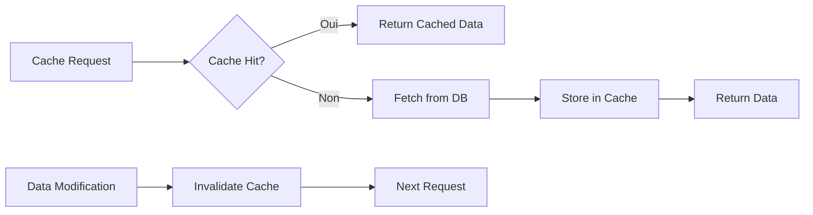
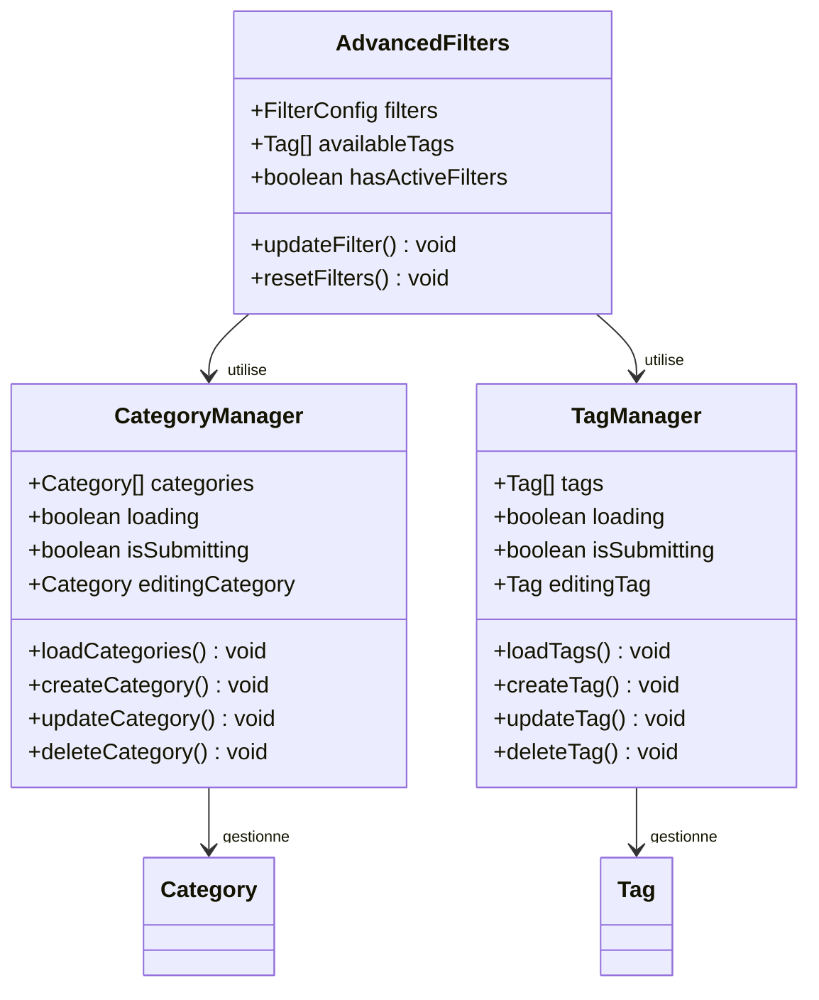

# Documentation du Module Textes

<cite>
**Fichiers Référencés dans ce Document**
- [VirtualizedTextList.tsx](file://components/texts/VirtualizedTextList.tsx)
- [MarkdownRenderer.tsx](file://components/texts/MarkdownRenderer.tsx)
- [TextDetailModal.tsx](file://components/texts/TextDetailModal.tsx)
- [textService.ts](file://services/textService.ts)
- [TextUploadForm.tsx](file://components/texts/TextUploadForm.tsx)
- [CategoryManager.tsx](file://components/texts/CategoryManager.tsx)
- [TagManager.tsx](file://components/texts/TagManager.tsx)
- [detectLanguage.ts](file://lib/detectLanguage.ts)
- [page.tsx](file://app/textes/page.tsx)
- [TextCard.tsx](file://components/texts/TextCard.tsx)
- [supabaseClient.ts](file://lib/supabaseClient.ts)
</cite>

## Table des Matières
1. [Introduction](#introduction)
2. [Structure du Projet](#structure-du-projet)
3. [Composants Principaux](#composants-principaux)
4. [Architecture du Système](#architecture-du-système)
5. [Services et Données](#services-et-données)
6. [Fonctionnalités Avancées](#fonctionnalités-avancées)
7. [Gestion des Métadonnées](#gestion-des-métadonnées)
8. [Optimisations et Performance](#optimisations-et-performance)
9. [Guide de Dépannage](#guide-de-dépannage)
10. [Conclusion](#conclusion)

## Introduction

Le module textes constitue le cœur de la gestion des contenus écrits dans le portfolio. Il offre un système complet d'affichage, de création, de recherche et de gestion des textes avec support Markdown, catégorisation avancée et système de tags. Le module intègre des fonctionnalités de virtualisation pour les performances, un moteur de recherche full-text et une interface utilisateur moderne.

## Structure du Projet

Le module textes est organisé autour de plusieurs couches distinctes :



**Sources du Diagramme**
- [page.tsx](file://app/textes/page.tsx#L1-L231)
- [VirtualizedTextList.tsx](file://components/texts/VirtualizedTextList.tsx#L1-L115)
- [textService.ts](file://services/textService.ts#L1-L385)

**Sources de Section**
- [page.tsx](file://app/textes/page.tsx#L1-L231)
- [VirtualizedTextList.tsx](file://components/texts/VirtualizedTextList.tsx#L1-L115)

## Composants Principaux

### VirtualizedTextList : Affichage Virtuel

Le composant `VirtualizedTextList` implémente une liste virtuelle optimisée pour afficher de grandes quantités de textes avec une excellente performance.

```mermaid
classDiagram
class VirtualizedTextList {
+TextWithMetadata[] texts
+function onTextClick
+ref parentRef
+number windowWidth
+useVirtualizer virtualizer
+render() JSX.Element
-calculateColumnCount() number
-handleResize() void
}
class TextCard {
+Text text
+function onClick
+string highlightQuery
+memo() TextCard
}
VirtualizedTextList --> TextCard : "affiche"
VirtualizedTextList --> "@tanstack/react-virtual" : "utilise"
```

**Sources du Diagramme**
- [VirtualizedTextList.tsx](file://components/texts/VirtualizedTextList.tsx#L13-L115)
- [TextCard.tsx](file://components/texts/TextCard.tsx#L18-L83)

**Caractéristiques principales :**
- **Virtualisation** : Utilise `@tanstack/react-virtual` pour le rendu virtuel
- **Responsive** : Adapte automatiquement le nombre de colonnes selon la largeur de l'écran
- **Performance** : Optimisé pour les milliers de textes
- **Accessibilité** : Implémentation ARIA complète

### MarkdownRenderer : Rendu Markdown

Le composant `MarkdownRenderer` charge dynamiquement React Markdown avec des plugins optimisés pour le rendu de contenu Markdown enrichi.



**Sources du Diagramme**
- [MarkdownRenderer.tsx](file://components/texts/MarkdownRenderer.tsx#L1-L84)

**Fonctionnalités :**
- **Code Splitting** : Chargement dynamique pour réduire la taille initiale
- **Syntax Highlighting** : Support automatique pour les langages de programmation
- **Custom Components** : Personnalisation des éléments HTML
- **Sécurité** : Protection contre les injections XSS

### TextDetailModal : Visualisation en Modal

Le `TextDetailModal` offre une expérience de lecture immersive avec toutes les métadonnées du texte.

**Sources de Section**
- [VirtualizedTextList.tsx](file://components/texts/VirtualizedTextList.tsx#L1-L115)
- [MarkdownRenderer.tsx](file://components/texts/MarkdownRenderer.tsx#L1-L84)
- [TextDetailModal.tsx](file://components/texts/TextDetailModal.tsx#L1-L82)

## Architecture du Système

### Flux de Données



**Sources du Diagramme**
- [textService.ts](file://services/textService.ts#L1-L385)
- [page.tsx](file://app/textes/page.tsx#L1-L231)

### Modèle de Données



**Sources du Diagramme**
- [supabaseClient.ts](file://lib/supabaseClient.ts#L42-L106)

**Sources de Section**
- [textService.ts](file://services/textService.ts#L1-L385)
- [supabaseClient.ts](file://lib/supabaseClient.ts#L1-L344)

## Services et Données

### textService : Service Principal

Le `textService` centralise toutes les opérations CRUD et de recherche sur les textes avec gestion du cache et des métadonnées.

**Opérations principales :**
- **Récupération** : `getAllTexts()`, `getTextById()`, `getPublishedTexts()`
- **Création** : `createText()`, `createTextWithTags()`
- **Mise à jour** : `updateText()`, `updateTextWithTags()`
- **Suppression** : `deleteText()`
- **Recherche** : `searchTexts()` avec recherche full-text
- **Filtrage** : `getTextsByCategory()`, `getTextsByTag()`

### Gestion du Cache

Le service implémente un système de cache intelligent avec invalidation automatique :



**Sources du Diagramme**
- [textService.ts](file://services/textService.ts#L160-L196)

**Sources de Section**
- [textService.ts](file://services/textService.ts#L1-L385)

## Fonctionnalités Avancées

### Système de Recherche Full-Text

Le moteur de recherche utilise la puissance de PostgreSQL avec la fonctionnalité `textSearch` :

**Caractéristiques :**
- **Langage** : Recherche en français avec configuration appropriée
- **Types** : Recherche web avec opérateurs (`AND`, `OR`, `NOT`)
- **Performance** : Indexation automatique pour les requêtes fréquentes
- **Résultats** : Tri automatique par pertinence

### Pagination Virtuelle

Pour les grandes collections de textes, le système utilise la virtualisation :

**Avantages :**
- **Performance** : Rendu de 1000+ éléments sans ralentissement
- **Mémoire** : Utilisation minimale de la mémoire
- **Responsivité** : Adaptation automatique aux changements de taille

### Détection Automatique de Langage

Le module `detectLanguage.ts` analyse automatiquement les extensions de fichiers pour fournir un syntax highlighting optimal.

**Support des langages :**
- JavaScript/TypeScript
- HTML/CSS
- Python, Java, C/C++
- PHP, Ruby, Go, Rust
- SQL, JSON, YAML, XML
- Markdown, Dockerfile, Makefile

**Sources de Section**
- [textService.ts](file://services/textService.ts#L301-L326)
- [VirtualizedTextList.tsx](file://components/texts/VirtualizedTextList.tsx#L32-L46)
- [detectLanguage.ts](file://lib/detectLanguage.ts#L1-L162)

## Gestion des Métadonnées

### Catégorisation

Le `CategoryManager` permet de créer, modifier et organiser les catégories avec :
- **Couleurs personnalisées** : Sélection de couleurs hexadécimales
- **Ordre d'affichage** : Gestion automatique du tri visuel
- **Descriptions** : Support des descriptions pour contexte

### Système de Tags

Le `TagManager` offre une gestion sophistiquée des tags :
- **Couleurs prédéfinies** : Palette de couleurs pour une meilleure visibilité
- **Association multiple** : Un texte peut avoir plusieurs tags
- **Recherche par tag** : Filtrage rapide par tags sélectionnés



**Sources du Diagramme**
- [CategoryManager.tsx](file://components/texts/CategoryManager.tsx#L32-L342)
- [TagManager.tsx](file://components/texts/TagManager.tsx#L42-L339)

**Sources de Section**
- [CategoryManager.tsx](file://components/texts/CategoryManager.tsx#L1-L342)
- [TagManager.tsx](file://components/texts/TagManager.tsx#L1-L339)

## Optimisations et Performance

### Lazy Loading

Tous les composants volumineux utilisent le lazy loading pour optimiser le temps de chargement initial :

**Composants lazy-loaded :**
- `TextDetailModal` (MarkdownRenderer inclus)
- `VirtualizedTextList` (@tanstack/react-virtual)
- `AdvancedFilters` (composant externe)
- `TextCard` (date-fns/locale)

### Code Splitting

Le MarkdownRenderer implémente un code splitting intelligent :
- **Chargement conditionnel** : Seuls les composants nécessaires sont chargés
- **SSR désactivé** : Pour éviter les problèmes de compatibilité
- **Fallbacks** : Skeletons et loaders pendant le chargement

### Optimisations de Recherche

- **Cache intelligent** : Stockage des résultats de recherche fréquents
- **Requêtes optimisées** : Utilisation des index PostgreSQL
- **Filtrage côté client** : Pour les résultats déjà chargés

**Sources de Section**
- [TextDetailModal.tsx](file://components/texts/TextDetailModal.tsx#L19-L23)
- [VirtualizedTextList.tsx](file://components/texts/VirtualizedTextList.tsx#L29-L30)
- [MarkdownRenderer.tsx](file://components/texts/MarkdownRenderer.tsx#L8-L15)

## Guide de Dépannage

### Problèmes Courants

**1. Problèmes de Performance**
- **Symptôme** : Liste lente sur mobile
- **Solution** : Vérifier que la virtualisation est activée pour plus de 50 éléments
- **Code** : Vérifier la condition `finalFilteredTexts.length > 50`

**2. Erreurs de Markdown**
- **Symptôme** : Contenu non rendu correctement
- **Solution** : Vérifier que les dépendances sont chargées
- **Code** : Contrôler la valeur de `remarkGfm`

**3. Problèmes de Cache**
- **Symptôme** : Données obsolètes
- **Solution** : Invalider le cache après modification
- **Code** : Appeler `cache.invalidatePattern('texts:')`

### Debugging

**Outils de développement recommandés :**
- Console browser pour les erreurs de chargement
- Network tab pour vérifier les requêtes API
- React DevTools pour inspecter les props

**Logs utiles :**
- `logger.debug('Create text - Starting', { title: text.title });`
- `console.error('Error loading categories:', error);`

**Sources de Section**
- [textService.ts](file://services/textService.ts#L108-L117)
- [CategoryManager.tsx](file://components/texts/CategoryManager.tsx#L67-L72)

## Conclusion

Le module textes représente un système complet et performant pour la gestion des contenus écrits. Ses principales forces incluent :

**Points forts :**
- **Performance** : Virtualisation et cache intelligent pour les grandes collections
- **Flexibilité** : Système de métadonnées extensible avec catégories et tags
- **Expérience utilisateur** : Interface moderne avec recherche avancée
- **Maintenabilité** : Architecture modulaire et code bien structuré

**Évolutions possibles :**
- Amélioration de l'interface de recherche
- Support de formats de fichiers supplémentaires
- Système de commentaires intégré
- Export de textes vers différents formats

Le module est conçu pour évoluer avec les besoins futurs tout en maintenant des performances optimales et une expérience utilisateur de qualité.