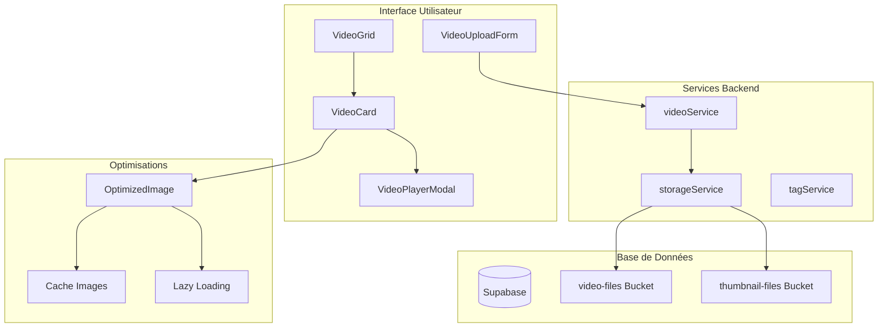
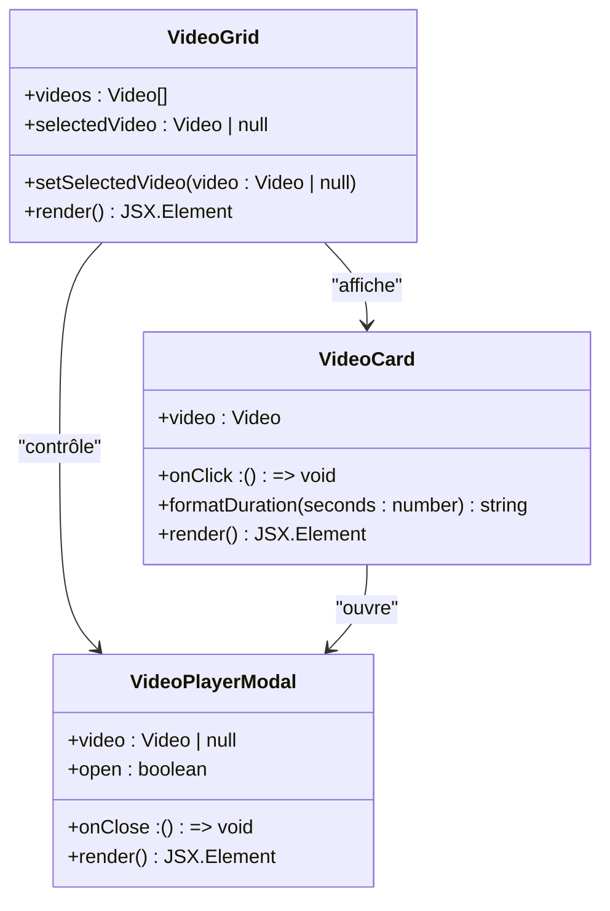
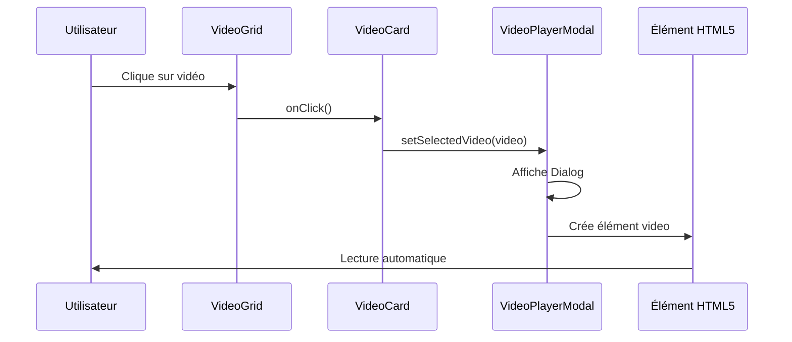
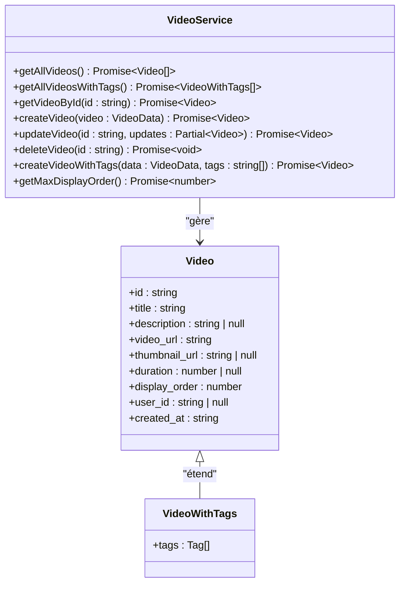
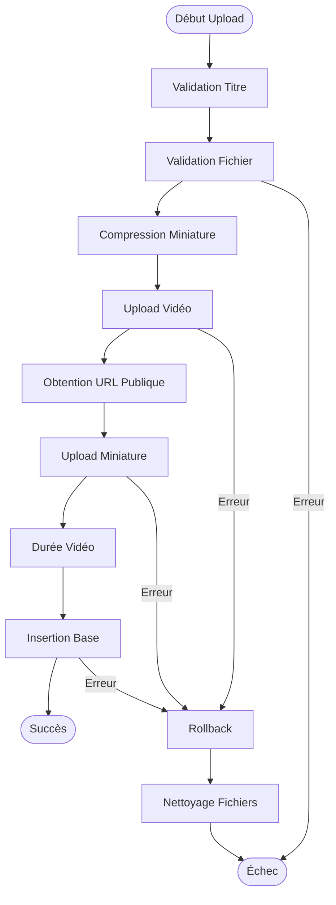
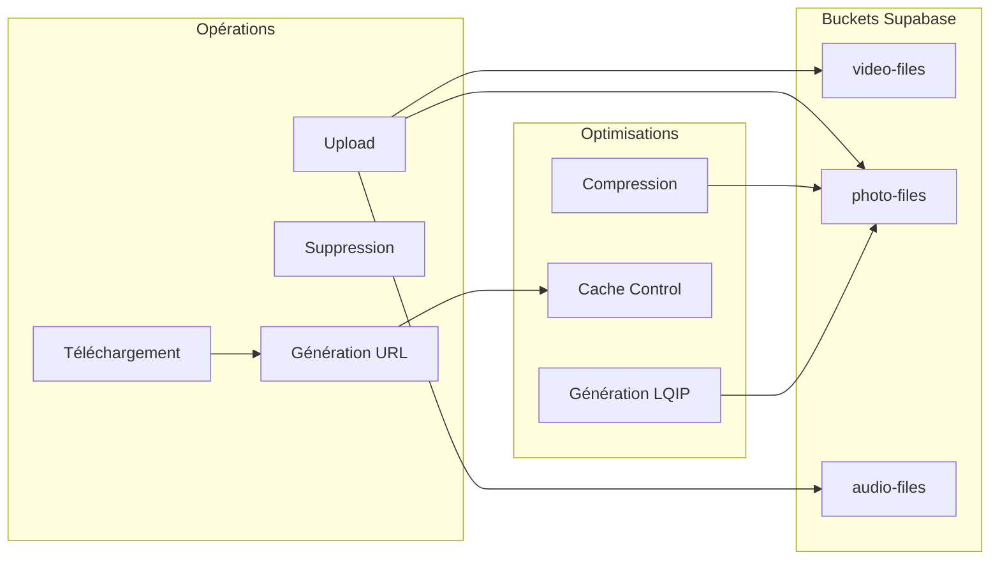
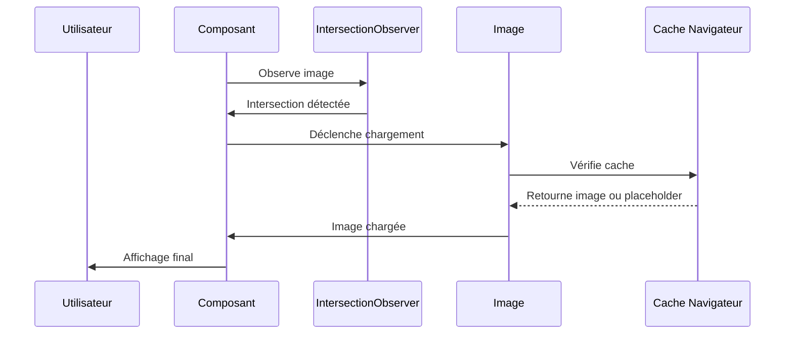
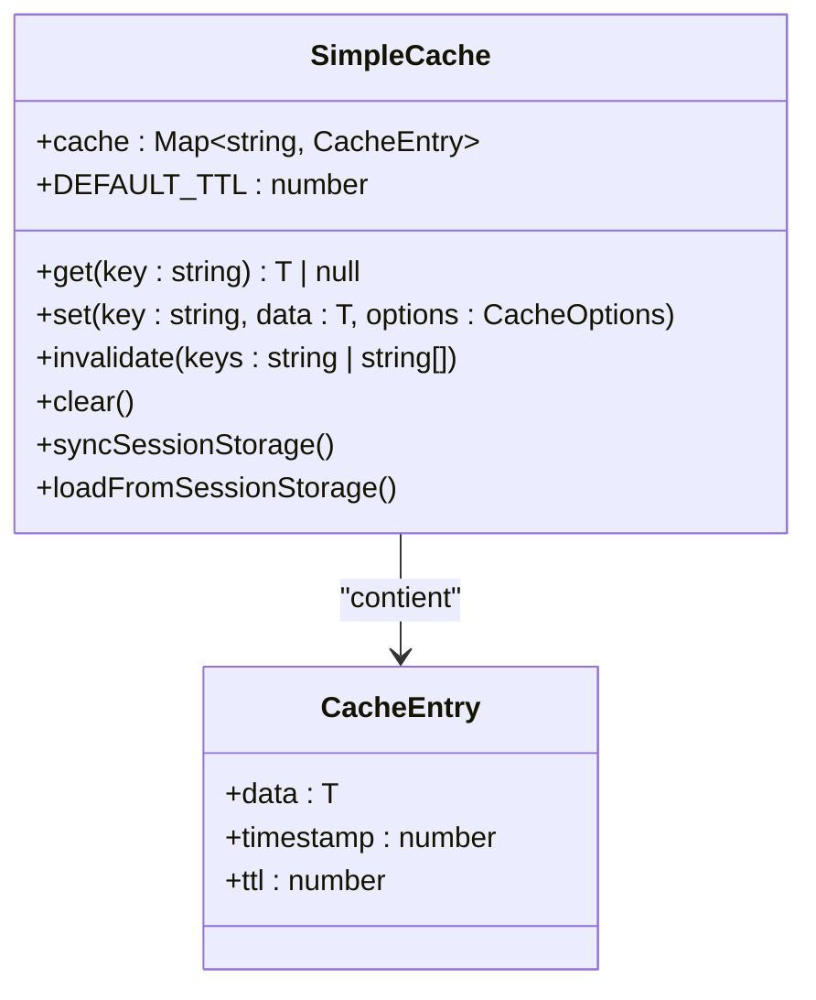

# Module Vidéo - Documentation Technique

<cite>
**Fichiers Référencés dans ce Document**
- [VideoGrid.tsx](file://components/videos/VideoGrid.tsx)
- [VideoPlayerModal.tsx](file://components/videos/VideoPlayerModal.tsx)
- [VideoUploadForm.tsx](file://components/videos/VideoUploadForm.tsx)
- [VideoCard.tsx](file://components/videos/VideoCard.tsx)
- [videoService.ts](file://services/videoService.ts)
- [storageService.ts](file://services/storageService.ts)
- [supabaseClient.ts](file://lib/supabaseClient.ts)
- [page.tsx](file://app/videos/page.tsx)
- [OptimizedImage.tsx](file://components/OptimizedImage.tsx)
- [cache.ts](file://lib/cache.ts)
- [imageUtils.ts](file://lib/imageUtils.ts)
</cite>

## Table des Matières
1. [Introduction](#introduction)
2. [Architecture du Module](#architecture-du-module)
3. [Composants de la Galerie](#composants-de-la-galerie)
4. [Lecteur Vidéo Intégré](#lecteur-vidéo-intégré)
5. [Service de Gestion des Vidéos](#service-de-gestion-des-videos)
6. [Processus d'Upload Sécurisé](#processus-dupload-sécurisé)
7. [Intégration Supabase Storage](#intégration-supabase-storage)
8. [Optimisations de Performance](#optimisations-de-performance)
9. [Gestion des Erreurs](#gestion-des-erreurs)
10. [Exemples d'Utilisation](#exemples-dutilisation)

## Introduction

Le module vidéo constitue un système complet de gestion et d'affichage de contenu vidéo dans l'application portfolio. Il offre une galerie interactive, un lecteur vidéo intégré, un formulaire d'upload sécurisé et des optimisations de performance avancées pour une expérience utilisateur fluide et efficace.

## Architecture du Module

Le module vidéo suit une architecture modulaire basée sur les composants React avec une couche de services dédiée pour la gestion des données et des opérations backend.



**Sources du Diagramme**
- [VideoGrid.tsx](file://components/videos/VideoGrid.tsx#L12-L42)
- [VideoPlayerModal.tsx](file://components/videos/VideoPlayerModal.tsx#L18-L43)
- [videoService.ts](file://services/videoService.ts#L6-L268)
- [storageService.ts](file://services/storageService.ts#L37-L310)

## Composants de la Galerie

### VideoGrid - Galerie Principale

Le composant `VideoGrid` constitue le cœur de l'interface de visualisation des vidéos. Il organise les vidéos en grille responsive et coordonne l'affichage du lecteur modal.



**Sources du Diagramme**
- [VideoGrid.tsx](file://components/videos/VideoGrid.tsx#L8-L42)
- [VideoCard.tsx](file://components/videos/VideoCard.tsx#L10-L76)
- [VideoPlayerModal.tsx](file://components/videos/VideoPlayerModal.tsx#L12-L43)

#### Caractéristiques Principales

- **Grille Responsive** : Adaptation automatique aux différentes tailles d'écran
- **Gestion d'État Centralisée** : Contrôle du lecteur modal via le state parent
- **Affichage Conditionnel** : Message "Aucune vidéo" quand la collection est vide
- **Intégration avec OptimizedImage** : Chargement optimisé des miniatures

**Sources de Section**
- [VideoGrid.tsx](file://components/videos/VideoGrid.tsx#L12-L42)

### VideoCard - Carte de Vidéo

Le composant `VideoCard` affiche chaque vidéo avec ses métadonnées et interactions tactiles.

#### Fonctionnalités Avancées

- **Formatage Dynamique** : Conversion automatique des durées en format MM:SS
- **Placeholder Intelligent** : Affichage d'icônes quand aucune miniature
- **Bouton Favoris** : Intégration avec le système de marque-pages
- **Survol Interactif** : Animation des éléments au survol

**Sources de Section**
- [VideoCard.tsx](file://components/videos/VideoCard.tsx#L15-L76)

## Lecteur Vidéo Intégré

### VideoPlayerModal - Lecteur Modal

Le lecteur vidéo intégré offre une expérience de lecture immersive avec contrôle natif du navigateur.



**Sources du Diagramme**
- [VideoGrid.tsx](file://components/videos/VideoGrid.tsx#L26-L41)
- [VideoPlayerModal.tsx](file://components/videos/VideoPlayerModal.tsx#L18-L43)

#### Caractéristiques du Lecteur

- **Contrôles Natifs** : Utilisation des contrôles HTML5 standard
- **Lecture Automatique** : Démarrage immédiat après l'ouverture
- **Support Multi-format** : MP4, WebM, QuickTime
- **Responsive Design** : Adaptation automatique aux tailles d'écran

**Sources de Section**
- [VideoPlayerModal.tsx](file://components/videos/VideoPlayerModal.tsx#L18-L43)

## Service de Gestion des Videos

### videoService - Couche d'Abstraction

Le service `videoService` centralise toutes les opérations CRUD et métier relatives aux vidéos.



**Sources du Diagramme**
- [videoService.ts](file://services/videoService.ts#L6-L268)
- [supabaseClient.ts](file://lib/supabaseClient.ts#L204-L214)

#### Opérations Principales

- **Récupération** : Chargement avec ou sans tags associés
- **Création** : Insertion avec validation et gestion des erreurs
- **Mise à Jour** : Modification sélective des champs
- **Suppression** : Suppression physique des données
- **Tri** : Gestion de l'ordre d'affichage

**Sources de Section**
- [videoService.ts](file://services/videoService.ts#L6-L268)

## Processus d'Upload Sécurisé

### VideoUploadForm - Formulaire d'Upload

Le formulaire d'upload implémente une validation complète et une gestion d'état robuste pour les uploads sécurisés.



**Sources du Diagramme**
- [VideoUploadForm.tsx](file://components/videos/VideoUploadForm.tsx#L181-L320)

#### Validation et Sécurité

- **Validation Client-side** : Types MIME et tailles maximales
- **Compression Automatique** : Réduction de la bande passante
- **Génération de Noms Uniques** : Prévention des collisions
- **Rollback Automatique** : Nettoyage en cas d'erreur
- **Sécurité CSRF** : Protection contre les attaques

**Sources de Section**
- [VideoUploadForm.tsx](file://components/videos/VideoUploadForm.tsx#L66-L108)

### Formats et Limites Supportés

| Type de Fichier | Formats Acceptés | Taille Max | Compression |
|-----------------|------------------|------------|-------------|
| Vidéos | MP4, WebM, MOV | 100MB | Non requise |
| Miniatures | JPEG, PNG, WebP | 2MB | Obligatoire |
| Durée | Variable | N/A | Calcul automatique |

## Intégration Supabase Storage

### Stratégies de Stockage

Le service `storageService` gère l'upload et la gestion des fichiers multimédia avec optimisations spécifiques.



**Sources du Diagramme**
- [storageService.ts](file://services/storageService.ts#L37-L310)

#### Optimisations Spécifiques

- **Compression Client-side** : Réduction automatique des images
- **Cache Control** : Headers HTTP optimisés (3600s)
- **Génération LQIP** : Placeholders flous pour améliorer l'UX
- **Gestion d'Erreurs** : Rollback automatique des uploads

**Sources de Section**
- [storageService.ts](file://services/storageService.ts#L37-L310)

## Optimisations de Performance

### OptimizedImage - Chargement Intelligent

Le composant `OptimizedImage` implémente plusieurs techniques de performance pour les images.



**Sources du Diagramme**
- [OptimizedImage.tsx](file://components/OptimizedImage.tsx#L55-L90)

#### Techniques d'Optimisation

- **Lazy Loading** : Chargement différé avec Intersection Observer
- **Placeholder LQIP** : Images floutées pendant le chargement
- **Compression Automatique** : Réduction de la taille des images
- **Cache HTTP** : Headers optimisés pour la mise en cache

**Sources de Section**
- [OptimizedImage.tsx](file://components/OptimizedImage.tsx#L39-L158)

### Gestion du Cache

Le système de cache utilise une approche hybride mémoire/sessionStorage.



**Sources du Diagramme**
- [cache.ts](file://lib/cache.ts#L17-L211)

**Sources de Section**
- [cache.ts](file://lib/cache.ts#L17-L211)

## Gestion des Erreurs

### Stratégies de Résilience

Le module implémente plusieurs couches de gestion d'erreurs pour assurer une expérience utilisateur robuste.

#### Types d'Erreurs Gérées

- **Erreurs de Validation** : Formats incorrects, tailles excessives
- **Erreurs de Network** : Timeout, perte de connexion
- **Erreurs de Base de Données** : Conflits, contraintes
- **Erreurs de Stockage** : Espace insuffisant, permissions

#### Mécanismes de Recovery

- **Rollback Automatique** : Suppression des fichiers en cas d'échec
- **Retry Logic** : Tentatives de reconnexion automatiques
- **Fallback Images** : Images de remplacement en cas d'échec
- **Toast Notifications** : Feedback utilisateur en temps réel

## Exemples d'Utilisation

### Initialisation du Lecteur

Pour initialiser le lecteur vidéo dans une application React :

```typescript
// Exemple d'utilisation du VideoGrid
import { VideoGrid } from '@/components/videos/VideoGrid';

const videos = await videoService.getAllVideosWithTags();
return <VideoGrid videos={videos} />;
```

### Gestion des Événements de Lecture

Le système expose des callbacks pour intégrer avec des systèmes externes :

```typescript
// Exemple de gestion d'événements
const handleVideoPlay = (video: Video) => {
  console.log('Lecture démarrée:', video.title);
  // Analytics tracking
};

const handleVideoPause = (video: Video) => {
  console.log('Lecture interrompue:', video.title);
  // Sauvegarde position
};
```

### Configuration du Cache

Pour optimiser les performances avec le système de cache :

```typescript
// Configuration du cache pour les métadonnées vidéo
const cacheOptions = {
  ttl: 5 * 60 * 1000, // 5 minutes
  storage: 'session' // Persistance entre sessions
};
```

**Sources de Section**
- [VideoGrid.tsx](file://components/videos/VideoGrid.tsx#L12-L42)
- [cache.ts](file://lib/cache.ts#L193-L211)

## Conclusion

Le module vidéo représente une solution complète et optimisée pour la gestion de contenu vidéo dans l'application. Son architecture modulaire, ses optimisations de performance et sa robustesse technique en font un système fiable et extensible pour l'affichage et la gestion de médias vidéo.

Les techniques employées incluent le lazy loading intelligent, la compression automatique, la gestion d'erreurs robuste et des optimisations de bande passante, garantissant une expérience utilisateur fluide même avec de gros volumes de contenu.