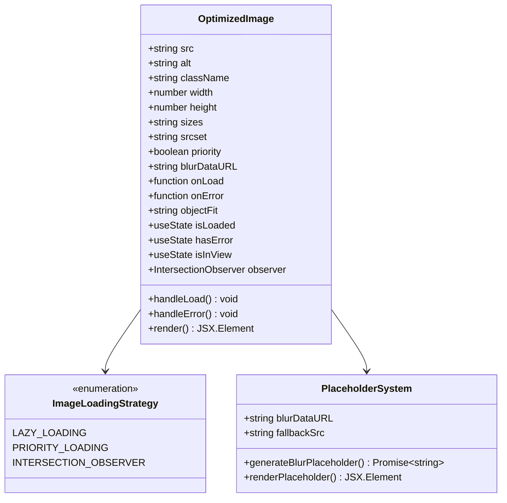
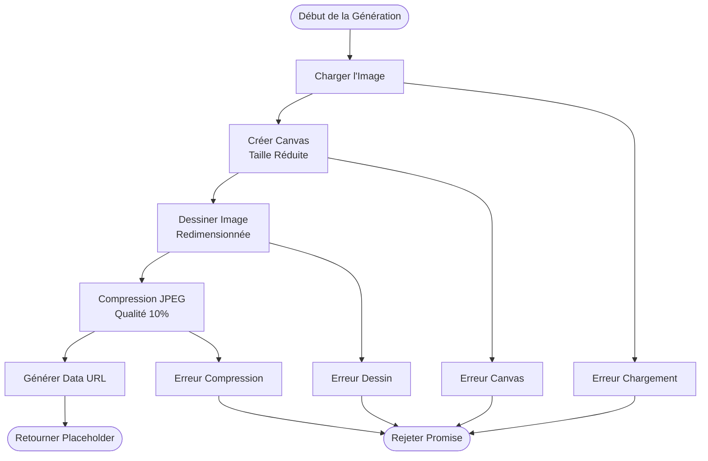
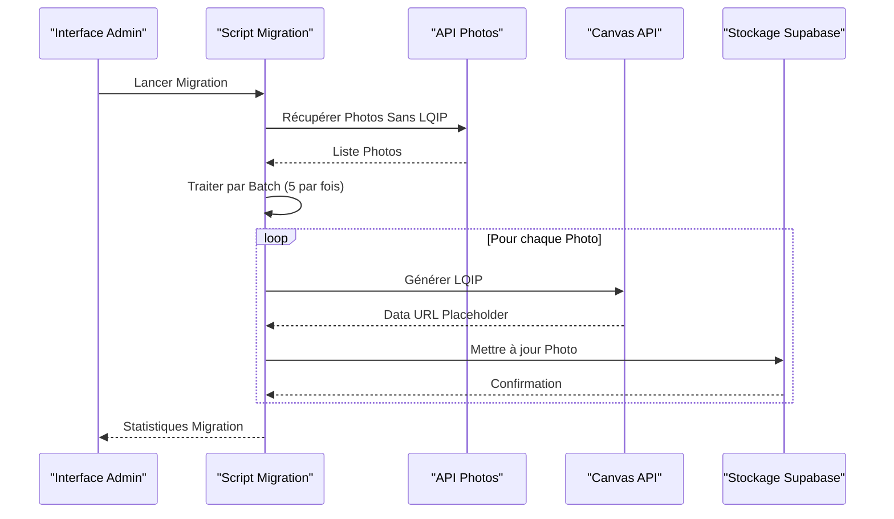
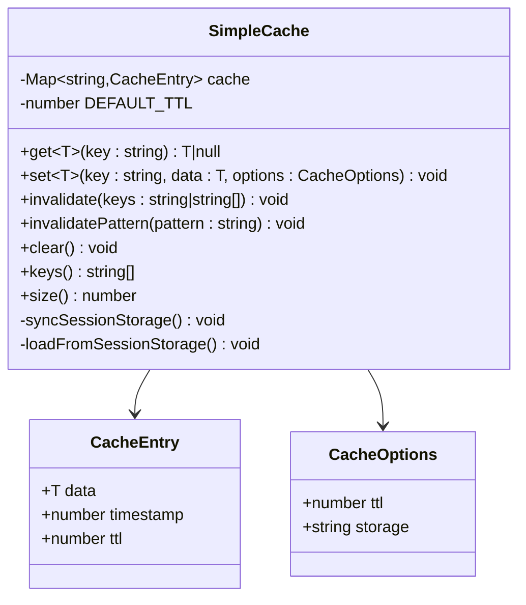
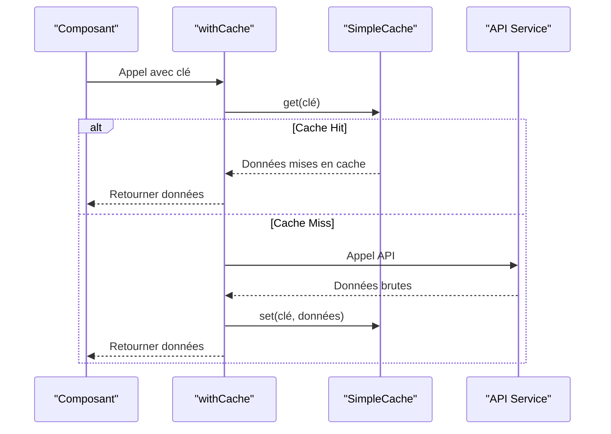
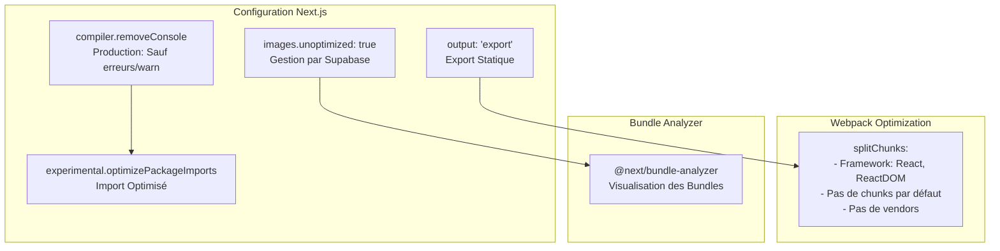
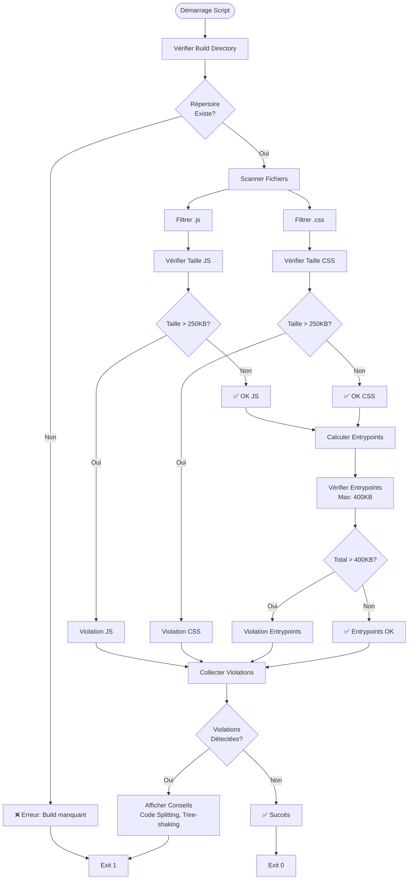

# Optimisations de Performance

<cite>
**Fichiers Référencés dans ce Document**
- [OptimizedImage.tsx](file://components/OptimizedImage.tsx)
- [image.ts](file://lib/image.ts)
- [imageUtils.ts](file://lib/imageUtils.ts)
- [next.config.js](file://next.config.js)
- [cache.ts](file://lib/cache.ts)
- [check-bundle-size.js](file://scripts/check-bundle-size.js)
- [generate-lqip-for-existing.ts](file://scripts/generate-lqip-for-existing.ts)
- [PhotoCard.tsx](file://components/photos/PhotoCard.tsx)
- [PhotoViewerModal.tsx](file://components/photos/PhotoViewerModal.tsx)
- [package.json](file://package.json)
</cite>

## Table des Matières
1. [Introduction](#introduction)
2. [Système d'Images Optimisées](#système-dimages-optimisées)
3. [Gestion du Cache Côté Client](#gestion-du-cache-côté-client)
4. [Configuration Next.js](#configuration-nextjs)
5. [Surveillance de la Taille du Bundle](#surveillance-de-la-taille-du-bundle)
6. [Bonnes Pratiques de Développement](#bonnes-pratiques-de-développement)
7. [Conclusion](#conclusion)

## Introduction

Ce projet implémente un système complet d'optimisations de performance conçu pour améliorer significativement les temps de chargement et l'expérience utilisateur. Les optimisations incluent le chargement paresseux des images, la gestion intelligente du cache, la configuration webpack optimisée, et des outils de surveillance continue de la performance.

## Système d'Images Optimisées

### OptimizedImage.tsx - Composant Principal

Le composant `OptimizedImage` constitue le cœur du système d'optimisation des images. Il offre plusieurs fonctionnalités avancées pour améliorer les performances :



**Sources du Diagramme**
- [OptimizedImage.tsx](file://components/OptimizedImage.tsx#L44-L159)

#### Fonctionnalités Clés

**Chargement Paresseux (Lazy Loading)**
- Utilise l'Intersection Observer API pour détecter quand l'image entre dans la zone visible
- Fallback vers le chargement eager pour les images prioritaires (above-the-fold)
- Margin de préchargement de 50px pour anticiper le chargement

**Placeholders LQIP (Low-Quality Image Placeholders)**
- Support natif des placeholders flous générés côté client
- Effet de transition smooth lors du chargement de l'image
- Compatibilité avec l'export statique Next.js

**Gestion d'Erreurs Robuste**
- Image de fallback SVG en cas d'échec de chargement
- Callbacks personnalisables pour gestionnaires d'erreurs
- Aspect ratio préservé même en cas d'erreur

**Sources du Section**
- [OptimizedImage.tsx](file://components/OptimizedImage.tsx#L58-L159)

### Génération de Thumbnails et Compression

Le système d'images utilise deux approches pour la génération de placeholders :

#### Fonction generateBlurPlaceholder (lib/image.ts)
Cette fonction crée des placeholders flous en utilisant l'API Canvas :



**Sources du Diagramme**
- [image.ts](file://lib/image.ts#L10-L48)

#### Fonction generateLQIP (lib/imageUtils.ts)
Version optimisée pour les uploads avec meilleure qualité :

**Sources du Section**
- [image.ts](file://lib/image.ts#L10-L86)
- [imageUtils.ts](file://lib/imageUtils.ts#L13-L112)

### Génération de Srcset et Sizes Responsifs

Le système génère automatiquement les attributs srcset et sizes pour optimiser le chargement d'images responsives :

**Attributs Generated**
- **Srcset** : Images aux résolutions 320px, 640px, 1024px, 1920px
- **Sizes** : Adapté aux breakpoints Tailwind (full, half, third, card)
- **Responsive** : Optimisation automatique selon la taille de l'écran

**Sources du Section**
- [image.ts](file://lib/image.ts#L58-L86)

### Migration LQIP pour Images Existantes

Un script dédié permet de générer des placeholders pour les images déjà uploadées :



**Sources du Diagramme**
- [generate-lqip-for-existing.ts](file://scripts/generate-lqip-for-existing.ts#L20-L92)

**Sources du Section**
- [generate-lqip-for-existing.ts](file://scripts/generate-lqip-for-existing.ts#L1-L104)

## Gestion du Cache Côté Client

### Système SimpleCache

Le système de cache offre une solution complète pour réduire les appels réseau et améliorer la réactivité :



**Sources du Diagramme**
- [cache.ts](file://lib/cache.ts#L17-L211)

#### Fonctionnalités Avancées

**TTL (Time To Live) Intelligente**
- TTL par défaut de 5 minutes
- Expiration automatique des entrées obsolètes
- Nettoyage automatique lors de la récupération

**Stockage Hybride**
- Cache mémoire pour les performances maximales
- Synchronisation sessionStorage pour la persistance
- Sélection automatique du meilleur stockage

**Invalidation Flexible**
- Invalidation par clé spécifique
- Invalidation par pattern (includes)
- Nettoyage complet du cache

**Utilisation avecCache**
Une fonction utilitaire simplifie l'implémentation du cache :



**Sources du Diagramme**
- [cache.ts](file://lib/cache.ts#L183-L211)

**Sources du Section**
- [cache.ts](file://lib/cache.ts#L1-L211)

## Configuration Next.js

### Export Statique avec Optimisations

La configuration Next.js est spécifiquement optimisée pour les sites statiques :



**Sources du Diagramme**
- [next.config.js](file://next.config.js#L5-L62)

#### Optimisations Spécifiques

**Export Statique**
- Améliore les temps de chargement et la sécurité
- Élimine la nécessité d'un serveur Node.js
- Optimisations CDN intégrées

**Désactivation de l'Optimisation d'Images Next.js**
- Gestion centralisée par Supabase
- Contrôle précis des transformations d'images
- Réduction de la complexité du build

**Optimisation des Imports**
- Import sélectif des composants Radix UI
- Réduction de la taille des bundles
- Amélioration du tree-shaking

**Configuration Webpack Optimisée**
- Chunk framework isolé pour React
- Désactivation des chunks par défaut
- Préserve les optimisations Next.js essentielles

**Sources du Section**
- [next.config.js](file://next.config.js#L1-L63)

## Surveillance de la Taille du Bundle

### Script check-bundle-size.js

Un script automatisé surveille continuellement la taille des bundles pour maintenir les performances :



**Sources du Diagramme**
- [check-bundle-size.js](file://scripts/check-bundle-size.js#L51-L159)

#### Critères de Surveillance

**Budgets de Taille**
- **Assets individuels** : Maximum 250KB par fichier
- **Entrypoints** : Maximum 400KB combinés
- **Analyse automatique** : Rapport détaillé avec suggestions

**Analyse Détaillée**
- Vérification de tous les fichiers JS et CSS
- Calcul des tailles des chunks principaux
- Identification des fichiers trop volumineux
- Suggestions d'optimisation spécifiques

**Intégration CI/CD**
- Exécution automatique lors du build
- Échec du processus si budgets dépassés
- Rapports détaillés pour optimisation

**Sources du Section**
- [check-bundle-size.js](file://scripts/check-bundle-size.js#L1-L160)

## Bonnes Pratiques de Développement

### Ajout de Nouvelles Fonctionnalités

Pour maintenir les performances lors de l'ajout de nouvelles fonctionnalités :

#### 1. Utilisation du Composant OptimizedImage

**Quand Utiliser**
- Toutes les images dans l'application
- Galeries photo et médias
- Avatars et icônes
- Contenu média dynamique

**Bonnes Pratiques**
```typescript
// ✅ Bon exemple
<OptimizedImage
  src={imageUrl}
  alt={title}
  className="aspect-square"
  sizes="(max-width: 768px) 100vw, 50vw"
  blurDataURL={placeholder}
/>

// ❌ Mauvais exemple - image standard

```

#### 2. Stratégie de Lazy Loading

**Images Above-the-Fold**
```typescript
// Images importantes immédiatement visibles
<OptimizedImage src={heroImage} priority={true} />
```

**Images en Scroll**
```typescript
// Images normales avec lazy loading
<OptimizedImage src={thumbnail} />
```

#### 3. Gestion du Cache

**Appels API Optimisés**
```typescript
// ✅ Utilisation du cache avec withCache
const fetchData = async (id: string) => {
  return withCache(
    `photo-${id}`,
    () => fetchPhoto(id),
    { ttl: 5 * 60 * 1000 } // 5 minutes
  );
};
```

#### 4. Optimisation des Bundles

**Code Splitting**
- Utiliser `dynamic()` pour les composants lourds
- Lazy loading des grandes bibliothèques
- Import conditionnel basé sur la plateforme

**Tree Shaking**
- Import spécifique des fonctions
- Éviter les imports complets de bibliothèques
- Nettoyage régulier des dépendances inutilisées

#### 5. Monitoring Continu

**Scripts de Validation**
- Exécuter `npm run check-bundle` avant chaque commit
- Surveiller les tendances de taille des bundles
- Analyser les rapports Bundle Analyzer

**Tests de Performance**
- Mesurer les métriques Web Vitals
- Tester sur différents appareils et connexions
- Valider l'expérience utilisateur en conditions réelles

### Recommandations Spécifiques

#### Pour les Images
1. **Préférer le format WebP** lorsque supporté
2. **Optimiser les dimensions** avant upload
3. **Utiliser des placeholders LQIP** pour toutes les images
4. **Implémenter des fallbacks** robustes

#### Pour le Code
1. **Diviser les composants** volumineux
2. **Utiliser le lazy loading** pour les routes complexes
3. **Mettre en cache** les données coûteuses
4. **Surveiller les bundles** régulièrement

#### Pour la Métrique
1. **Surveiller les temps de chargement** avec Web Vitals
2. **Analyser les patterns d'utilisation** des images
3. **Tester les performances** sur mobile
4. **Optimiser progressivement** basé sur les données

## Conclusion

Le système d'optimisations de performance de ce projet représente une approche complète et holistique pour améliorer les performances web. Les optimisations incluent :

**Techniques d'Image Avancées**
- Chargement paresseux intelligent avec Intersection Observer
- Placeholders LQIP générés côté client
- Gestion automatique des résolutions responsives
- Migration automatique des images existantes

**Architecture de Cache Intelligente**
- Cache hybride mémoire/sessionStorage
- TTL automatique avec expiration intelligente
- Invalidation flexible par clé ou pattern
- Intégration transparente avec les appels API

**Configuration Webpack Optimisée**
- Export statique Next.js avec optimisations
- Fractionnement de bundles sélectif
- Import optimisé des packages populaires
- Bundle Analyzer intégré pour la surveillance

**Monitoring Automatisé**
- Scripts de validation de taille de bundle
- Budgets de performance stricts
- Rapports détaillés avec suggestions d'optimisation
- Intégration CI/CD pour la maintenance continue

Ces optimisations créent une base solide pour maintenir de excellentes performances tout au long du cycle de vie du projet, garantissant une expérience utilisateur fluide et rapide sur tous les appareils et connexions.