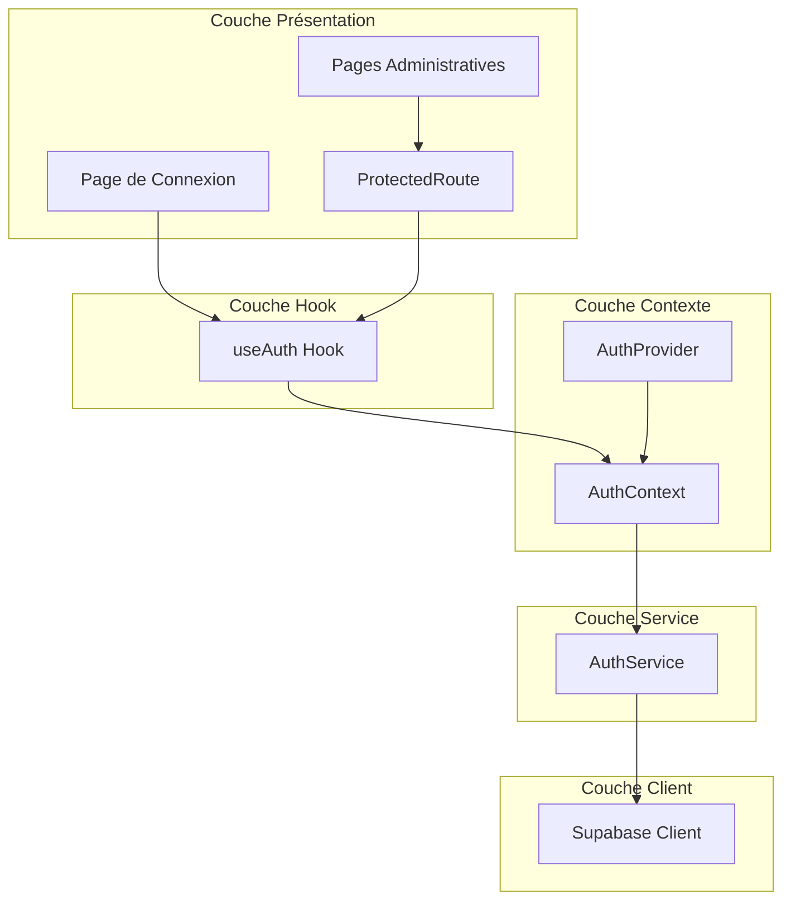
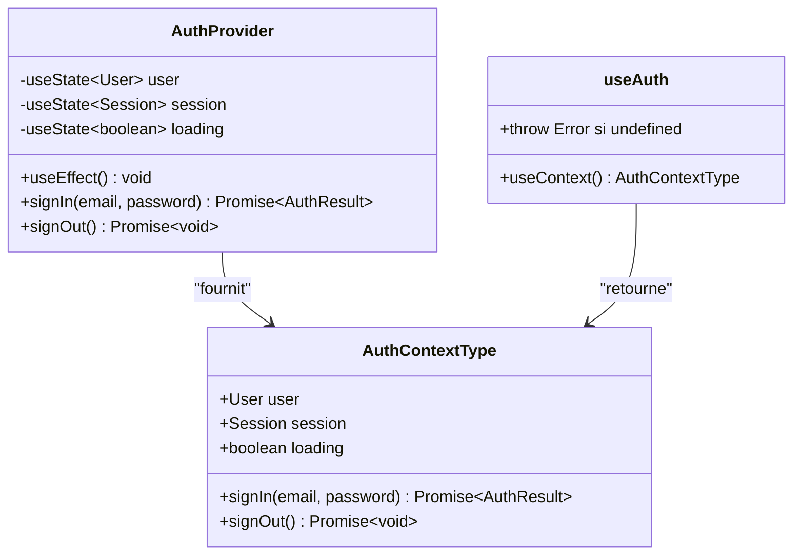
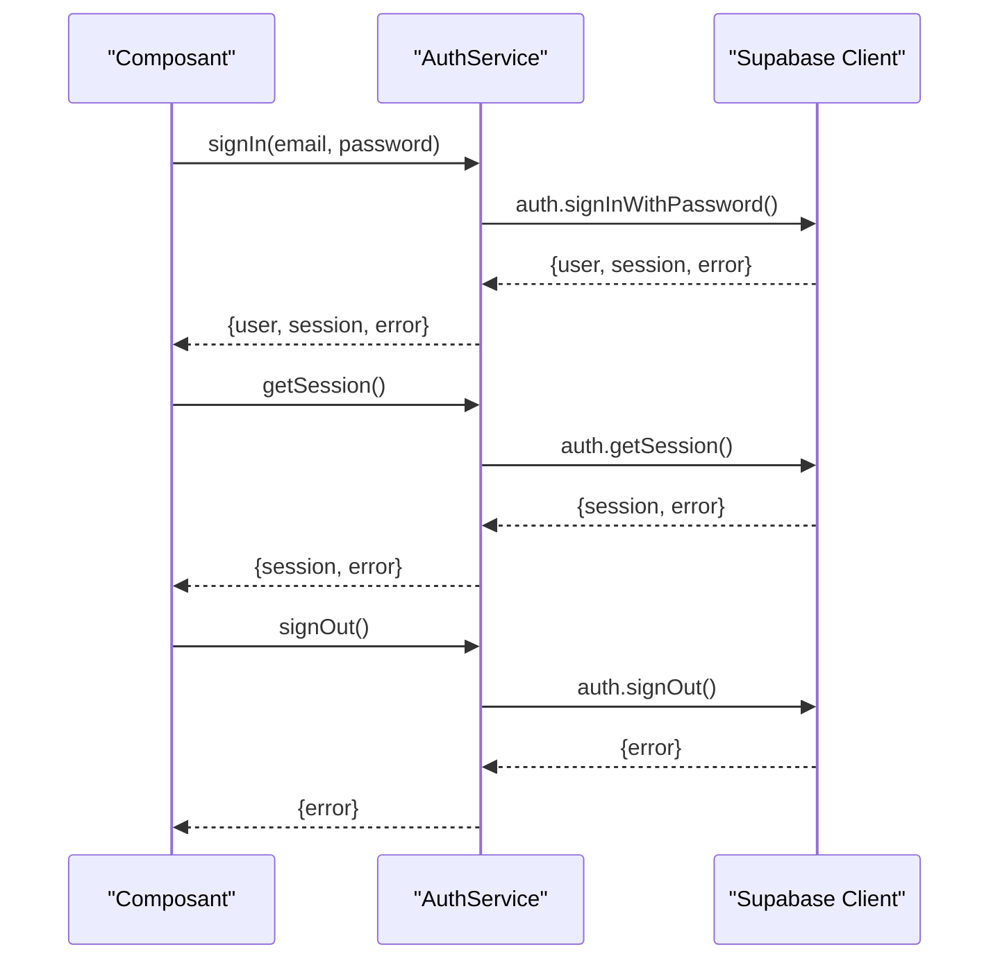
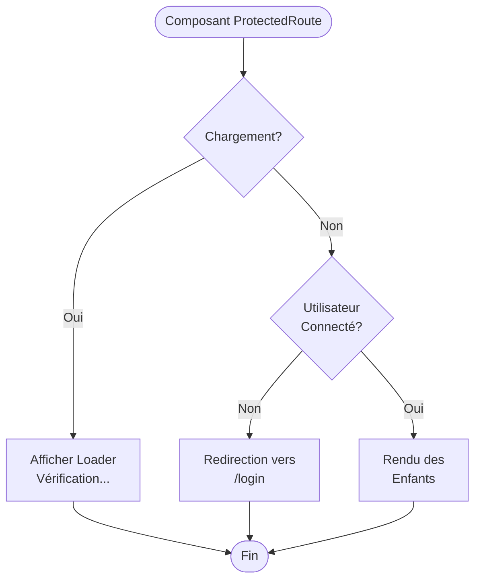
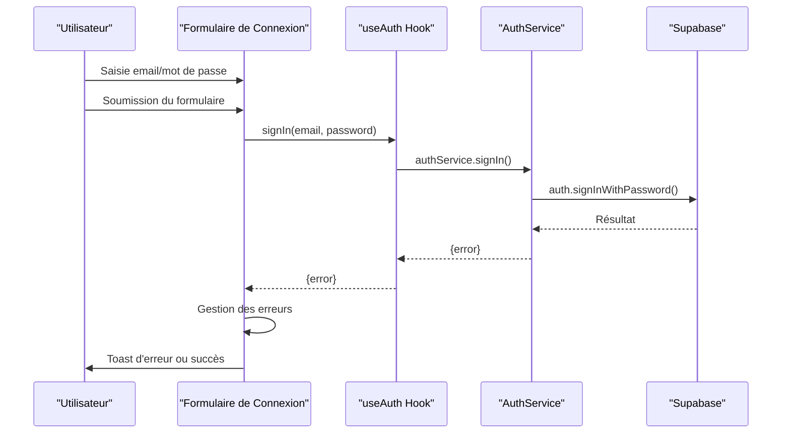
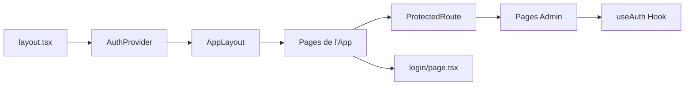

# Système d'Authentification Basé sur Supabase Auth

<cite>
**Fichiers Référencés dans ce Document**
- [AuthContext.tsx](file://contexts/AuthContext.tsx)
- [authService.ts](file://services/authService.ts)
- [ProtectedRoute.tsx](file://components/ProtectedRoute.tsx)
- [login/page.tsx](file://app/login/page.tsx)
- [useAuth.ts](file://hooks/useAuth.ts)
- [supabaseClient.ts](file://lib/supabaseClient.ts)
- [layout.tsx](file://app/layout.tsx)
- [admin/photos/page.tsx](file://app/admin/photos/page.tsx)
</cite>

## Table des Matières
1. [Introduction](#introduction)
2. [Architecture du Système d'Authentification](#architecture-du-système-dauthentification)
3. [AuthContext : Gestion de l'État Global](#authcontext-gestion-de-létat-global)
4. [AuthService : Interface avec Supabase](#authservice-interface-avec-supabase)
5. [ProtectedRoute : Protection des Routes](#protectedroute-protection-des-routes)
6. [Authentification Utilisateur](#authentification-utilisateur)
7. [Hook useAuth : Accès Centralisé](#hook-useauth-accès-centralisé)
8. [Intégration dans l'Application](#intégration-dans-lapplication)
9. [Gestion des Erreurs et Sécurité](#gestion-des-erreurs-et-sécurité)
10. [Bonnes Pratiques](#bonnes-pratiques)
11. [Dépannage](#dépannage)

## Introduction

Le système d'authentification de cette application utilise Supabase Auth pour fournir une solution d'authentification robuste et sécurisée. Il s'agit d'un système complet qui gère la connexion, la déconnexion, la protection des routes administratives et l'accès centralisé aux informations utilisateur à travers toute l'application.

## Architecture du Système d'Authentification

Le système d'authentification suit une architecture en couches bien définie :



**Sources du Diagramme**
- [AuthContext.tsx](file://contexts/AuthContext.tsx#L1-L71)
- [authService.ts](file://services/authService.ts#L1-L32)
- [ProtectedRoute.tsx](file://components/ProtectedRoute.tsx#L1-L35)

## AuthContext : Gestion de l'État Global

L'AuthContext constitue le cœur du système d'authentification, gérant l'état global de l'utilisateur et fournissant les méthodes d'authentification.

### Structure du Contexte



**Sources du Diagramme**
- [AuthContext.tsx](file://contexts/AuthContext.tsx#L7-L13)
- [AuthContext.tsx](file://contexts/AuthContext.tsx#L17-L71)

### Fonctionnalités Principales

Le AuthContext gère plusieurs aspects critiques :

1. **État de Chargement** : Indique quand l'authentification est en cours
2. **Gestion de Session** : Maintient la session utilisateur persistante
3. **Mises à Jour en Temps Réel** : Écoute les changements d'état d'authentification
4. **API d'Authentification** : Fournit des méthodes pour se connecter et se déconnecter

**Sources de Section**
- [AuthContext.tsx](file://contexts/AuthContext.tsx#L17-L71)

## AuthService : Interface avec Supabase

Le service authService fournit une interface propre entre le contexte d'authentification et le client Supabase.

### Méthodes Disponibles



**Sources du Diagramme**
- [authService.ts](file://services/authService.ts#L5-L31)

### Configuration Supabase

La configuration du client Supabase inclut des paramètres essentiels pour l'authentification :

- **persistSession** : Maintient la session même après le rechargement de la page
- **autoRefreshToken** : Actualise automatiquement les tokens expirés
- **detectSessionInUrl** : Détecte les sessions dans l'URL pour OAuth

**Sources de Section**
- [authService.ts](file://services/authService.ts#L1-L32)
- [supabaseClient.ts](file://lib/supabaseClient.ts#L10-L16)

## ProtectedRoute : Protection des Routes

ProtectedRoute est un composant de routage qui garantit que seules les utilisateurs authentifiés peuvent accéder aux pages administratives.

### Logique de Protection



**Sources du Diagramme**
- [ProtectedRoute.tsx](file://components/ProtectedRoute.tsx#L8-L34)

### Caractéristiques de Protection

1. **Vérification en Temps Réel** : Surveille l'état d'authentification
2. **Redirection Automatique** : Redirige vers la page de connexion si non authentifié
3. **Indicateur de Chargement** : Affiche un spinner pendant la vérification
4. **Gestion d'État** : Empêche le rendu des enfants si non autorisé

**Sources de Section**
- [ProtectedRoute.tsx](file://components/ProtectedRoute.tsx#L1-L35)

## Authentification Utilisateur

Le processus d'authentification suit un flux standard avec gestion d'erreurs appropriée.

### Page de Connexion

La page de connexion fournit une interface utilisateur complète pour l'authentification :



**Sources du Diagramme**
- [login/page.tsx](file://app/login/page.tsx#L19-L37)

### Flux de Connexion

1. **Validation Formulaire** : Vérification des champs requis
2. **Appel au Service** : Utilisation du hook useAuth pour l'authentification
3. **Gestion d'Erreurs** : Affichage des messages d'erreur appropriés
4. **Redirection** : Navigation vers la page d'administration en cas de succès

**Sources de Section**
- [login/page.tsx](file://app/login/page.tsx#L1-L97)

## Hook useAuth : Accès Centralisé

Le hook useAuth fournit un accès simplifié au contexte d'authentification depuis n'importe quel composant.

### Implémentation Simplifiée

Le hook exporte directement la fonction useAuth du AuthContext, offrant une API cohérente :

```typescript
// utilisation simplifiée dans les composants
const { user, loading, signIn, signOut } = useAuth();
```

### Validation du Contexte

Le hook inclut une validation stricte pour éviter les erreurs de développement :

- **Erreur de Contexte** : Lance une exception si utilisé hors d'un AuthProvider
- **Type Safety** : Garantit le typage TypeScript correct
- **Accessibilité** : Rend l'authentification disponible partout dans l'arbre de composants

**Sources de Section**
- [useAuth.ts](file://hooks/useAuth.ts#L1-L2)

## Intégration dans l'Application

L'authentification est intégrée de manière transparente dans toute l'application grâce à l'AuthProvider racine.

### Configuration Racine



**Sources du Diagramme**
- [layout.tsx](file://app/layout.tsx#L33-L35)

### Utilisation dans les Pages Administratives

Les pages administratives utilisent ProtectedRoute pour la protection :

```typescript
export default function AdminPhotosPage() {
  return (
    <ProtectedRoute>
      <AdminPhotosContent />
    </ProtectedRoute>
  );
}
```

Cette approche garantit que :
- Seules les sessions valides accèdent aux pages
- Le chargement est géré de manière transparente
- Les redirections sont automatiques

**Sources de Section**
- [admin/photos/page.tsx](file://app/admin/photos/page.tsx#L165-L171)

## Gestion des Erreurs et Sécurité

Le système implémente plusieurs mécanismes de sécurité et de gestion d'erreurs.

### Types d'Erreurs Courantes

| Erreur | Cause | Solution |
|--------|-------|----------|
| Session Expirée | Token JWT expiré | Actualisation automatique du token |
| Connexion Échouée | Email/mot de passe incorrect | Message d'erreur spécifique |
| Erreur Réseau | Problème de connexion | Retry automatique avec feedback |
| Session Non Trouvée | Session invalide | Redirection vers connexion |

### Mécanismes de Sécurité

1. **Validation des Tokens** : Vérification automatique des tokens JWT
2. **Actualisation Automatique** : Renouvellement transparent des tokens expirés
3. **Protection CSRF** : Utilisation des cookies sécurisés par Supabase
4. **Isolation des Sessions** : Chaque utilisateur a sa propre session

### Bonnes Pratiques de Sécurité

- **Stockage Sécurisé** : Les tokens sont stockés en sécurité dans les cookies
- **Expiration Contrôlée** : Durée de vie des sessions configurable
- **Audit Trail** : Traçabilité des événements d'authentification
- **Validation côté Client** : Validation des entrées utilisateur

## Bonnes Pratiques

### Configuration Supabase

Assurez-vous que votre configuration Supabase respecte ces bonnes pratiques :

1. **Variables d'Environnement** : Utilisez des variables NEXT_PUBLIC_ pour les clés publiques
2. **Politiques de Stockage** : Configurez des politiques restrictives pour les uploads
3. **Limitation des Rôles** : Restreignez les permissions des utilisateurs authentifiés
4. **Monitoring** : Activez le monitoring des événements d'authentification

### Développement

- **Gestion d'Erreurs** : Toujours gérer les erreurs d'authentification
- **Feedback Utilisateur** : Fournir des messages clairs lors d'échecs
- **Tests** : Tester tous les chemins d'authentification
- **Documentation** : Documenter les changements de sécurité

### Production

- **Mise à Jour** : Maintenir Supabase à jour
- **Backup** : Sauvegarder régulièrement les données d'authentification
- **Monitoring** : Surveiller les tentatives d'authentification suspectes
- **Réponse aux Incidents** : Avoir un plan de réponse aux incidents

## Dépannage

### Problèmes Courants

#### Variables d'Environnement Manquantes
**Symptôme** : Erreur "Variables d'environnement Supabase manquantes"
**Solution** : Vérifiez que .env.local contient NEXT_PUBLIC_SUPABASE_URL et NEXT_PUBLIC_SUPABASE_ANON_KEY

#### Session Non Détectée
**Symptôme** : Redirection vers /login malgré connexion
**Solution** : Vérifiez la configuration persistSession et les cookies

#### Erreurs de Connexion
**Symptôme** : Messages d'erreur génériques
**Solution** : Améliorez la gestion d'erreurs avec des messages spécifiques

#### Performance de Chargement
**Symptôme** : Latence lors de la vérification d'authentification
**Solution** : Optimisez les requêtes et utilisez le cache approprié

### Outils de Diagnostic

1. **Console Navigateur** : Vérifiez les erreurs JavaScript
2. **Onglet Network** : Surveillez les requêtes d'authentification
3. **Console Supabase** : Vérifiez les logs d'authentification
4. **Cookies** : Vérifiez la présence des tokens d'authentification

### Support et Ressources

- Documentation Supabase : https://supabase.com/docs
- GitHub Issues : Pour les problèmes techniques
- Discord Community : Pour le support communautaire
- Monitoring : Utilisez les outils de monitoring intégrés