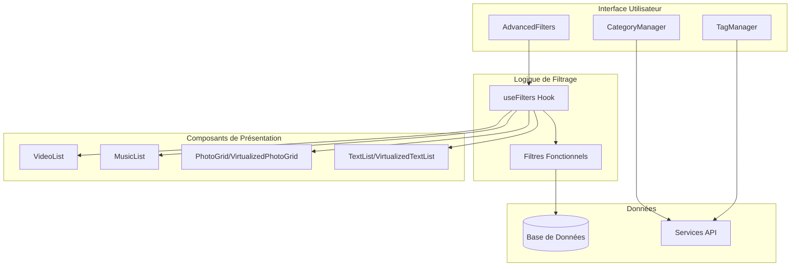
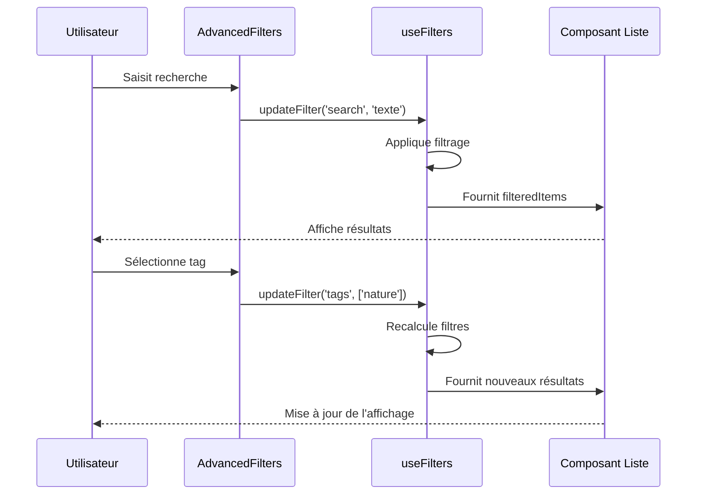
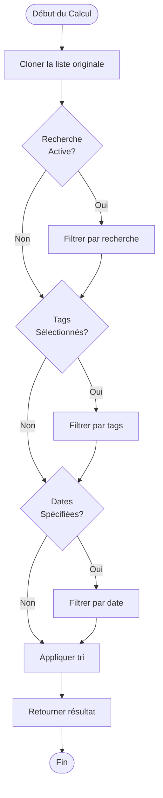
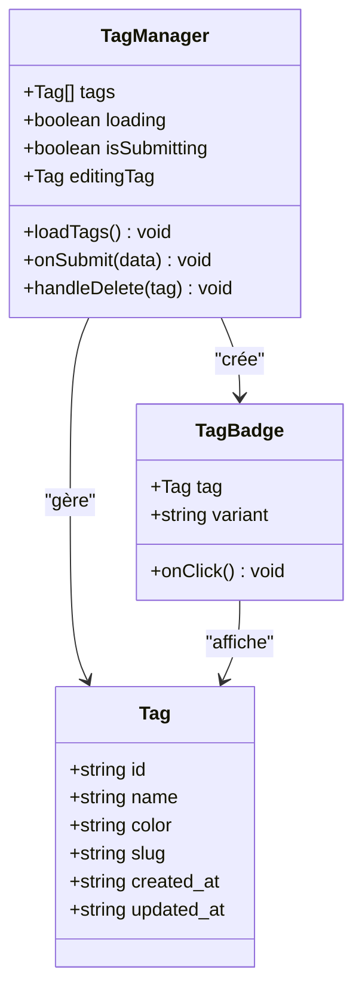
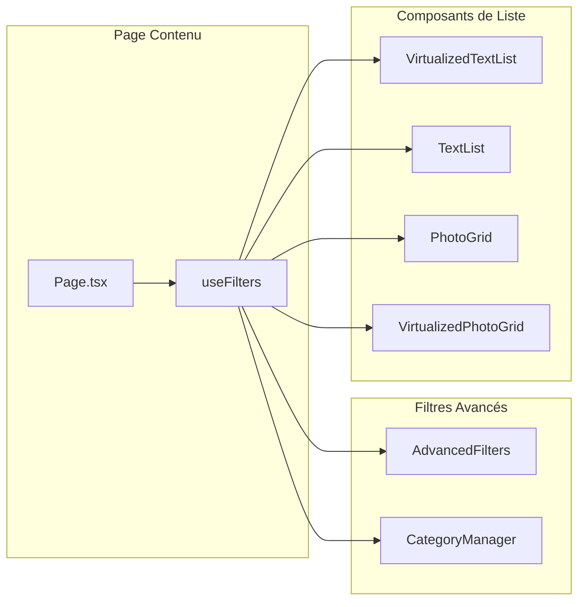
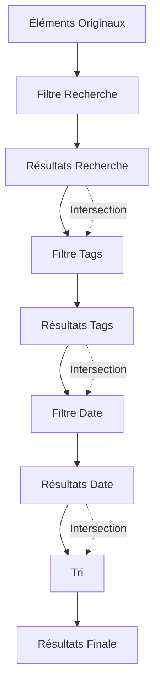
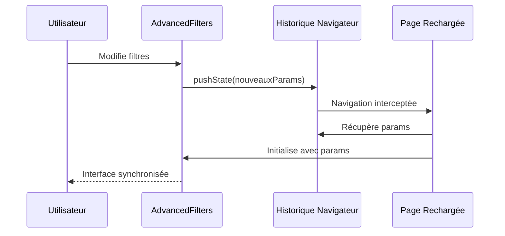
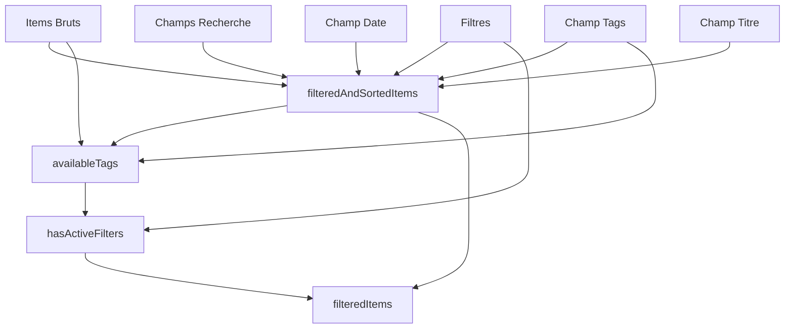
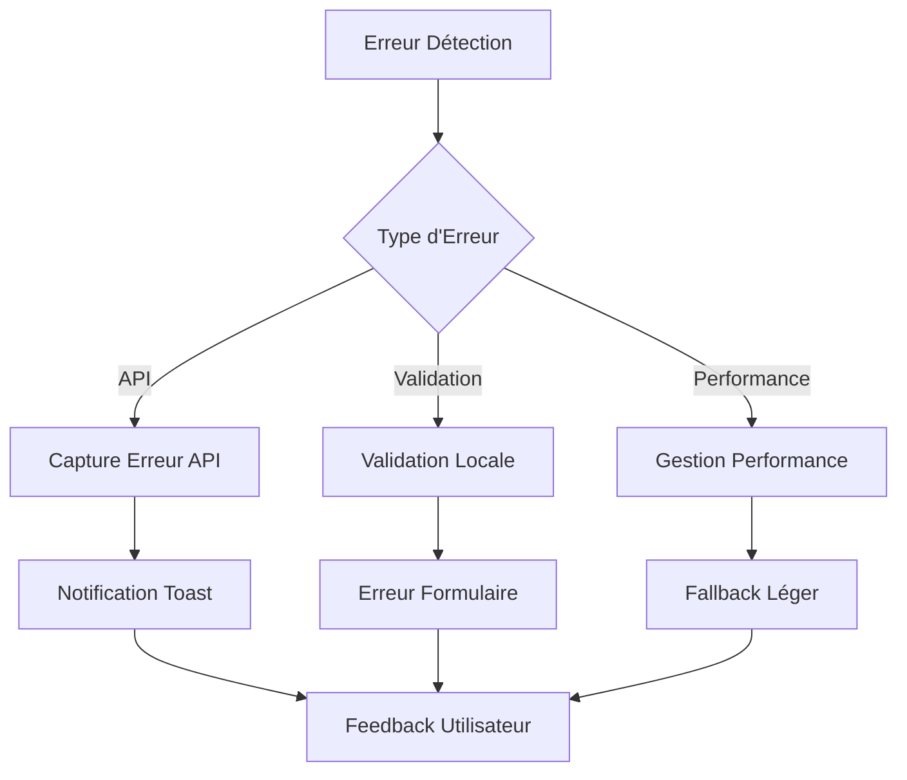

# Système de Filtres Avancés

<cite>
**Fichiers Référencés dans ce Document**
- [AdvancedFilters.tsx](file://components/AdvancedFilters.tsx)
- [useFilters.ts](file://hooks/useFilters.ts)
- [CategoryManager.tsx](file://components/texts/CategoryManager.tsx)
- [TagManager.tsx](file://components/texts/TagManager.tsx)
- [TextListAdmin.tsx](file://components/texts/TextListAdmin.tsx)
- [PhotoGrid.tsx](file://components/photos/PhotoGrid.tsx)
- [page.tsx (textes)](file://app/textes/page.tsx)
- [page.tsx (photos)](file://app/photos/page.tsx)
- [supabaseClient.ts](file://lib/supabaseClient.ts)
</cite>

## Table des Matières
1. [Introduction](#introduction)
2. [Architecture du Système](#architecture-du-système)
3. [Composant AdvancedFilters](#composant-advancedfilters)
4. [Hook useFilters](#hook-usefilters)
5. [Gestion des Tags et Catégories](#gestion-des-tags-et-catégories)
6. [Intégration avec les Composants de Liste](#intégration-avec-les-composants-de-liste)
7. [Composition et Exemples de Filtres](#composition-et-exemples-de-filtres)
8. [Persistance et URL](#persistance-et-url)
9. [Performance et Optimisations](#performance-et-optimisations)
10. [Cas Limites et Gestion d'Erreurs](#cas-limites-et-gestion-derreurs)
11. [Conclusion](#conclusion)

## Introduction

Le système de filtres avancés du portfolio constitue un ensemble sophistiqué d'outils permettant de naviguer efficacement dans les différentes collections de contenu (textes, photos, musiques, vidéos). Il combine un composant utilisateur intuitif avec un hook personnalisé de gestion d'état pour offrir une expérience de filtrage fluide et performante.

Le système supporte plusieurs types de filtres :
- **Filtrage textuel** : Recherche par mots-clés dans différents champs
- **Filtrage par tags** : Sélection multiple avec logique AND
- **Filtrage par date** : Plages temporelles avec calendrier
- **Tri** : Par date ou titre dans plusieurs ordres
- **Filtrage par catégories** : Organisation hiérarchique

## Architecture du Système

Le système suit une architecture modulaire basée sur des composants réutilisables et des hooks personnalisés :



**Sources du Diagramme**
- [AdvancedFilters.tsx](file://components/AdvancedFilters.tsx#L1-L301)
- [useFilters.ts](file://hooks/useFilters.ts#L1-L178)

## Composant AdvancedFilters

Le composant `AdvancedFilters` constitue l'interface principale pour la saisie des critères de filtrage. Il offre une expérience utilisateur moderne avec expansion dynamique et feedback visuel.

### Fonctionnalités Principales

#### Interface de Base
- **Barre de recherche** : Recherche textuelle en temps réel
- **Sélection de tri** : Options de tri par date ou titre
- **Indicateur de résultats** : Affichage du nombre de résultats
- **Réinitialisation** : Bouton pour effacer tous les filtres

#### Interface Avancée (Pliable)
- **Filtrage par tags** : Sélection multiple avec badges interactifs
- **Filtrage par date** : Calendriers pour plage de dates
- **État d'expansion** : Contrôle de visibilité des options avancées

### Structure et Propriétés

Le composant accepte les propriétés suivantes :

| Propriété | Type | Description |
|-----------|------|-------------|
| `filters` | `FilterOptions` | État actuel des filtres |
| `availableTags` | `string[]` | Liste des tags disponibles |
| `onFilterChange` | `Function` | Callback de mise à jour des filtres |
| `onReset` | `Function` | Callback de réinitialisation |
| `hasActiveFilters` | `boolean` | Indicateur d'activation des filtres |
| `resultCount` | `number` | Nombre de résultats actuels |
| `totalCount` | `number` | Nombre total d'éléments |
| `showTags` | `boolean` | Affichage des filtres par tags |
| `showDateRange` | `boolean` | Affichage des filtres par date |

### Interaction Utilisateur



**Sources du Diagramme**
- [AdvancedFilters.tsx](file://components/AdvancedFilters.tsx#L66-L100)
- [useFilters.ts](file://hooks/useFilters.ts#L47-L52)

**Sources de Section**
- [AdvancedFilters.tsx](file://components/AdvancedFilters.tsx#L25-L301)

## Hook useFilters

Le hook `useFilters` constitue le cœur logique du système de filtrage, gérant l'état des filtres et appliquant les règles de filtrage de manière optimisée.

### Interface et Types

#### Types de Données

```typescript
export interface FilterOptions {
  search: string;
  tags: string[];
  dateFrom: Date | null;
  dateTo: Date | null;
  sortBy: SortOption;
}

export type SortOption = 'date-desc' | 'date-asc' | 'title-asc' | 'title-desc';
```

#### Configuration du Hook

Le hook nécessite une configuration spécifique pour chaque type de contenu :

| Paramètre | Type | Description |
|-----------|------|-------------|
| `items` | `T[]` | Collection d'éléments à filtrer |
| `searchFields` | `(keyof T)[]` | Champs pouvant contenir le texte recherché |
| `dateField` | `keyof T` | Champ contenant la date |
| `tagsField` | `keyof T` | Champ contenant les tags |
| `titleField` | `keyof T` | Champ pour le tri par titre |

### Logique de Filtrage

#### Algorithme de Filtrage

Le hook applique les filtres dans l'ordre suivant pour optimiser les performances :

1. **Filtrage textuel** : Recherche dans les champs spécifiés
2. **Filtrage par tags** : Intersection des tags sélectionnés
3. **Filtrage par date** : Plage temporelle
4. **Tri** : Application de l'ordre de tri choisi

#### Optimisations Mémoire



**Sources du Diagramme**
- [useFilters.ts](file://hooks/useFilters.ts#L64-L135)

### Fonctions de Gestion

#### updateFilter
Permet de mettre à jour dynamiquement un filtre spécifique :

```typescript
const updateFilter = useCallback(
  <K extends keyof FilterOptions>(key: K, value: FilterOptions[K]) => {
    setFilters((prev) => ({ ...prev, [key]: value }));
  },
  []
);
```

#### resetFilters
Réinitialise tous les filtres à leurs valeurs par défaut :

```typescript
const resetFilters = useCallback(() => {
  setFilters({
    search: '',
    tags: [],
    dateFrom: null,
    dateTo: null,
    sortBy: 'date-desc',
  });
}, []);
```

**Sources de Section**
- [useFilters.ts](file://hooks/useFilters.ts#L1-L178)

## Gestion des Tags et Catégories

Le système inclut deux gestionnaires spécialisés pour les tags et catégories, permettant une administration complète des métadonnées.

### TagManager

Le `TagManager` offre une interface de gestion des tags avec couleurs et préréglages.

#### Fonctionnalités
- **Création et modification** : Formulaire avec validation Zod
- **Palette de couleurs** : Préréglages et sélecteur personnalisé
- **Suppression sécurisée** : Confirmation avant suppression
- **Import/export** : Gestion des tags utilisés

#### Architecture des Tags



**Sources du Diagramme**
- [TagManager.tsx](file://components/texts/TagManager.tsx#L1-L339)
- [supabaseClient.ts](file://lib/supabaseClient.ts#L53-L60)

### CategoryManager

Le `CategoryManager` permet la gestion des catégories avec ordre de présentation et couleurs.

#### Fonctionnalités
- **Ordre de présentation** : Glisser-déposer pour réorganiser
- **Couleurs personnalisées** : Sélecteur de couleur RGB
- **Description détaillée** : Champs optionnels
- **Validation** : Contraintes d'unicité et format

**Sources de Section**
- [TagManager.tsx](file://components/texts/TagManager.tsx#L1-L339)
- [CategoryManager.tsx](file://components/texts/CategoryManager.tsx#L1-L342)

## Intégration avec les Composants de Liste

Le système de filtres s'intègre seamlessment avec les différents composants d'affichage, adaptant l'expérience selon le type de contenu.

### Architecture d'Intégration



**Sources du Diagramme**
- [page.tsx (textes)](file://app/textes/page.tsx#L47-L70)
- [page.tsx (photos)](file://app/photos/page.tsx#L47-L63)

### Adaptation par Type de Contenu

#### Textes
- **Champs de recherche** : Titre, sous-titre, extrait, contenu
- **Affichage** : Grille flexible avec Virtualization pour >50 éléments
- **Catégories** : Filtre additionnel en plus des filtres avancés

#### Photos
- **Champs de recherche** : Titre, description
- **Affichage** : Grille responsive avec préchargement
- **Tags** : Optionnel selon disponibilité de la table

#### Musique
- **Champs de recherche** : Titre, artiste, album
- **Affichage** : Liste avec lecteur intégré
- **Tags** : Filtre par genre musical

#### Vidéos
- **Champs de recherche** : Titre, description
- **Affichage** : Grille avec vignettes
- **Tags** : Filtre par catégories vidéo

**Sources de Section**
- [page.tsx (textes)](file://app/textes/page.tsx#L1-L231)
- [page.tsx (photos)](file://app/photos/page.tsx#L1-L171)

## Composition et Exemples de Filtres

Le système permet la composition de filtres multiples avec logique AND entre les critères de même type.

### Exemples de Composition

#### Filtre Simple : Recherche Textuelle
```
Recherche : "photographie nature"
Résultats : Tous les éléments contenant "photographie" ou "nature"
```

#### Filtre Avancé : Photos + Tag + Période
```
Critères :
- Recherche : "voyage"
- Tags : ["nature", "voyage"]
- Dates : 01/01/2024 - 31/12/2024

Résultats : Photos de voyage naturelles de 2024
```

#### Filtre Complex : Textes + Catégorie + Tri
```
Critères :
- Recherche : "programmation"
- Catégorie : "Développement"
- Tri : "Titre (A-Z)"

Résultats : Articles de développement programmation triés alphabétiquement
```

### Logique de Composition



**Sources du Diagramme**
- [useFilters.ts](file://hooks/useFilters.ts#L64-L135)

**Sources de Section**
- [useFilters.ts](file://hooks/useFilters.ts#L64-L135)

## Persistance et URL

Bien que le code actuel ne montre pas de persistance automatique dans l'URL, le système est conçu pour supporter cette fonctionnalité.

### Architecture de Persistance

#### Variables de Filtre
Les filtres sont structurés pour une conversion facile en paramètres d'URL :

```typescript
interface FilterOptions {
  search: string;           // q
  tags: string[];           // tags[]
  dateFrom: Date | null;    // date_from
  dateTo: Date | null;      // date_to
  sortBy: SortOption;       // sort
}
```

#### Stratégie de Synchronisation



### Implémentation Potentielle

Pour implémenter la persistance URL, il faudrait :

1. **Surveillance des changements** : Utiliser `useEffect` pour détecter les modifications
2. **Mise à jour de l'URL** : Utiliser `router.push()` ou `history.pushState()`
3. **Initialisation depuis URL** : Parser les paramètres au chargement
4. **Gestion des erreurs** : Validation et fallback pour paramètres invalides

## Performance et Optimisations

Le système intègre plusieurs optimisations pour maintenir des performances satisfaisantes même avec de gros ensembles de données.

### Optimisations Mémoire

#### Memoization Stratifée



**Sources du Diagramme**
- [useFilters.ts](file://hooks/useFilters.ts#L64-L158)

#### Optimisations Spécifiques

1. **useMemo** : Calcul des résultats filtrés et tags disponibles
2. **useCallback** : Mémorisation des fonctions de callback
3. **Virtualization** : Utilisation de composants virtuaires pour >50 éléments
4. **Lazy Loading** : Chargement différé des composants lourds

### Gestion des Performances

#### Seuil de Virtualization
- **Textes** : >50 éléments → VirtualizedTextList
- **Photos** : >50 éléments → VirtualizedPhotoGrid
- **Musique** : >100 éléments → VirtualizedTrackList

#### Optimisations de Recherche
- **Recherche en temps réel** : Debounce pour éviter les calculs excessifs
- **Recherche insensible à la casse** : Pré-traitement des chaînes
- **Recherche partielle** : Algorithmes optimisés pour les substrings

**Sources de Section**
- [useFilters.ts](file://hooks/useFilters.ts#L64-L158)

## Cas Limites et Gestion d'Erreurs

Le système implémente une gestion robuste des cas limites pour assurer une expérience utilisateur fluide.

### Cas Limites Identifiés

#### Données Manquantes
- **Tags non disponibles** : Fallback vers affichage simplifié
- **Dates invalides** : Validation côté client et serveur
- **Champs manquants** : Vérification de présence avant accès

#### Erreurs de Performance
- **Grandes collections** : Activation automatique de la virtualization
- **Recherches complexes** : Timeout et feedback utilisateur
- **Concurrence** : Gestion des mises à jour concurrentes

### Gestion d'Erreurs



#### Exemples de Gestion

1. **Table manquante** (photos) : Fallback vers chargement sans tags
2. **Recherche vide** : Affichage de message approprié
3. **Aucun résultat** : Interface de retour à zéro
4. **Erreurs réseau** : Retry automatique et notifications

### Tests et Validation

#### Validation des Entrées
- **Recherche** : Nettoyage des espaces, validation longueur
- **Tags** : Vérification existence, limite taille
- **Dates** : Validation plage, format ISO
- **Tri** : Vérification options valides

#### Tests de Résilience
- **Données vides** : Comportement graceful
- **Performances limitées** : Optimisations automatiques
- **Erreurs réseau** : Retries et fallbacks

**Sources de Section**
- [page.tsx (photos)](file://app/photos/page.tsx#L69-L95)

## Conclusion

Le système de filtres avancés du portfolio représente une solution complète et élégante pour la navigation dans des collections de contenu variées. Sa conception modulaire, ses optimisations de performance et sa flexibilité d'intégration en font un outil puissant pour l'expérience utilisateur.

### Points Forts

1. **Architecture modulaire** : Séparation claire entre interface et logique
2. **Performance optimisée** : Memoization et virtualization pour gros volumes
3. **Flexibilité** : Support de multiples types de contenu
4. **Expérience utilisateur** : Interface intuitive avec feedback visuel
5. **Extensibilité** : Facilité d'ajout de nouveaux types de filtres

### Évolutions Possibles

1. **Persistance URL** : Sauvegarde automatique des filtres
2. **Filtres personnalisés** : Création de profils de filtres
3. **Export de résultats** : Téléchargement des listes filtrées
4. **Filtres temporisés** : Rappels de filtres fréquents
5. **Intelligence augmentée** : Suggestions de filtres basées sur l'historique

Le système constitue une base solide pour l'évolution future tout en maintenant des performances optimales et une expérience utilisateur de qualité.