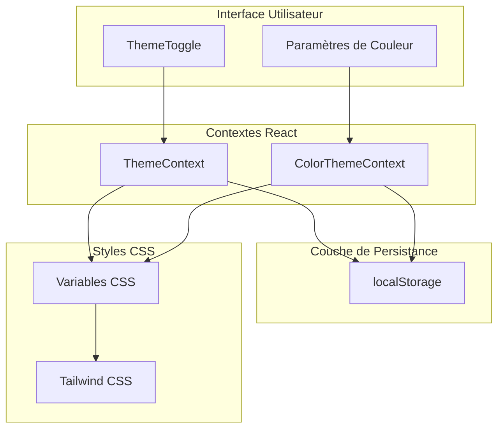
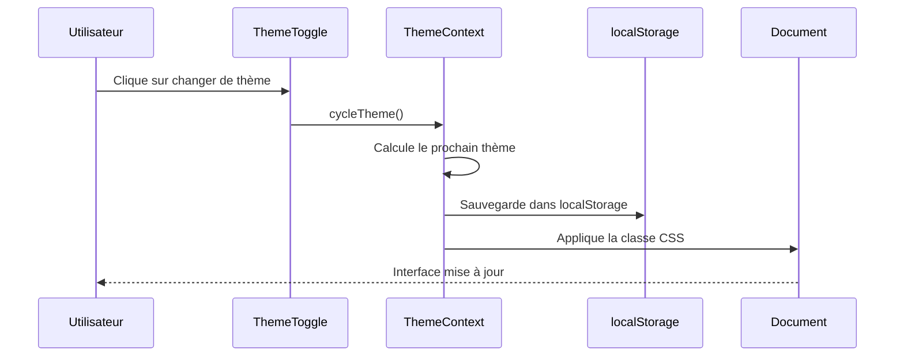
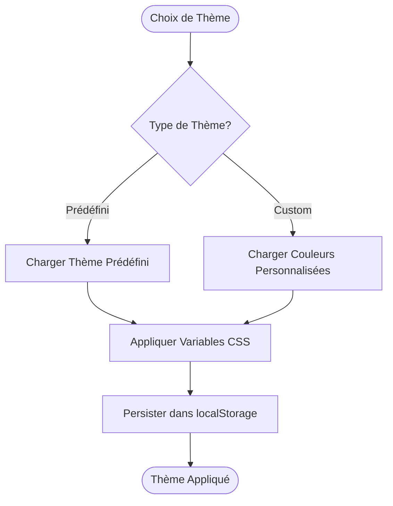
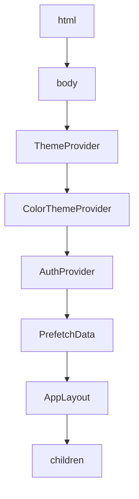
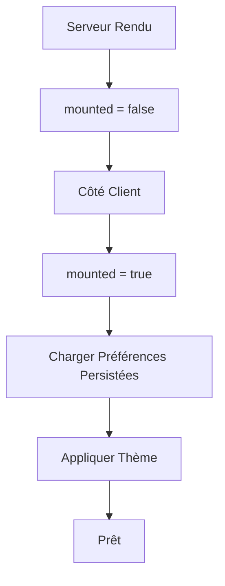

# Gestion de Thème

<cite>
**Fichiers Référencés dans ce Document**
- [ThemeContext.tsx](file://contexts/ThemeContext.tsx)
- [ColorThemeContext.tsx](file://contexts/ColorThemeContext.tsx)
- [ThemeToggle.tsx](file://components/ThemeToggle.tsx)
- [layout.tsx](file://app/layout.tsx)
- [globals.css](file://app/globals.css)
- [tailwind.config.ts](file://tailwind.config.ts)
- [button.tsx](file://components/ui/button.tsx)
- [card.tsx](file://components/ui/card.tsx)
</cite>

## Table des Matières
1. [Introduction](#introduction)
2. [Architecture du Système de Thème](#architecture-du-système-de-thème)
3. [ThemeContext : Gestion du Mode Clair/Sombre](#themectext-context-gestion-du-mode-clairsombre)
4. [ColorThemeContext : Personnalisation des Couleurs](#colorthemectext-context-personnalisation-des-couleurs)
5. [Intégration avec ThemeToggle](#intégration-avec-themetoggle)
6. [Fourniture des Contextes dans l'Application](#fourniture-des-contextes-dans-lapplication)
7. [Utilisation dans les Composants UI](#utilisation-dans-les-composants-ui)
8. [Stratégies de Fallback et de Persistance](#stratégies-de-fallback-et-de-persistance)
9. [Considérations de Performance](#considérations-de-performance)
10. [Bonnes Pratiques d'Accessibilité](#bonnes-pratiques-daccessibilité)
11. [Conclusion](#conclusion)

## Introduction

Le système de gestion de thème de cette application Next.js offre une expérience utilisateur flexible avec deux niveaux de personnalisation : le mode clair/sombre et la personnalisation des couleurs. Cette architecture modulaire permet aux utilisateurs de choisir entre différents thèmes prédéfinis ou de créer leurs propres thèmes personnalisés tout en maintenant la cohérence visuelle à travers toute l'application.

## Architecture du Système de Thème

Le système de thème est construit autour de deux contextes React spécialisés qui travaillent ensemble pour fournir une expérience de personnalisation complète.



**Sources du Diagramme**
- [ThemeContext.tsx](file://contexts/ThemeContext.tsx#L16-L86)
- [ColorThemeContext.tsx](file://contexts/ColorThemeContext.tsx#L45-L109)
- [ThemeToggle.tsx](file://components/ThemeToggle.tsx#L7-L26)

## ThemeContext : Gestion du Mode Clair/Sombre

Le `ThemeContext` gère la logique du mode clair/sombre avec support automatique du thème système.

### Fonctionnalités Principales

#### Types et Interfaces
Le contexte définit des types pour représenter les modes de thème disponibles et l'état du contexte.

#### Logique de Cycle de Thème
Le système implémente un cycle de thème intelligent qui permet de passer séquentiellement entre les modes :
- Mode clair (`light`)
- Mode sombre (`dark`)  
- Mode système (`system`)

#### Détection Automatique du Système
Le contexte surveille les préférences système via `window.matchMedia()` et met à jour automatiquement le thème lorsque l'utilisateur change ses paramètres système.

#### Persistance avec localStorage
Le choix de l'utilisateur est sauvegardé dans `localStorage` pour maintenir la préférence même après rechargement de la page.



**Sources du Diagramme**
- [ThemeContext.tsx](file://contexts/ThemeContext.tsx#L70-L75)
- [ThemeContext.tsx](file://contexts/ThemeContext.tsx#L65-L67)

**Sources de Section**
- [ThemeContext.tsx](file://contexts/ThemeContext.tsx#L1-L96)

## ColorThemeContext : Personnalisation des Couleurs

Le `ColorThemeContext` permet une personnalisation avancée des couleurs de l'interface grâce à des variables CSS modifiables.

### Jeux de Couleurs Prédéfinis

Le système propose quatre thèmes prédéfinis avec des palettes de couleurs harmonieuses :

| Thème | Couleur Principale | Couleur Secondaire | Couleur d'Accent |
|-------|-------------------|-------------------|------------------|
| Ocean | Bleu océan | Bleu marine | Bleu ciel | 
| Forest | Vert forêt | Vert mousse | Vert émeraude |
| Sun | Jaune soleil | Jaune sable | Orange caramel |
| Rose | Rose vif | Rose pastel | Violet lavande |

### Variables CSS Dynamiques

Les couleurs sont appliquées via des variables CSS qui sont modifiées dynamiquement :

```css
:root {
  --theme-primary: 200 90% 50%; /* Valeur HSL */
  --theme-secondary: 190 80% 45%;
  --theme-accent: 210 85% 55%;
}
```

### Gestion des Couleurs Personnalisées

Le contexte supporte la création de thèmes personnalisés avec persistance des couleurs définies par l'utilisateur.



**Sources du Diagramme**
- [ColorThemeContext.tsx](file://contexts/ColorThemeContext.tsx#L76-L81)
- [ColorThemeContext.tsx](file://contexts/ColorThemeContext.tsx#L47-L69)

**Sources de Section**
- [ColorThemeContext.tsx](file://contexts/ColorThemeContext.tsx#L1-L119)

## Intégration avec ThemeToggle

Le composant `ThemeToggle` fournit une interface utilisateur intuitive pour la gestion du thème.

### Fonctionnalité de Cycle
Le bouton agit comme un interrupteur qui passe séquentiellement entre les trois modes de thème lorsqu'il est cliqué.

### Icônes Adaptatives
Chaque mode de thème est associé à une icône représentative :
- Soleil pour le mode clair
- Lune pour le mode sombre  
- Écran pour le mode système

### Accessibilité
Le composant inclut des attributs ARIA appropriés pour garantir l'accessibilité aux technologies d'assistance.

**Sources de Section**
- [ThemeToggle.tsx](file://components/ThemeToggle.tsx#L1-L27)

## Fourniture des Contextes dans l'Application

Les contextes sont fournis dans l'ordre hiérarchique approprié dans le fichier `layout.tsx`.

### Ordre de Fourniture
1. **ThemeContext** : Fournit d'abord pour gérer le mode clair/sombre
2. **ColorThemeContext** : Ensuite pour gérer les couleurs
3. **AuthProvider** : Puis l'authentification
4. **AppLayout** : Enfin le layout principal

Cette hiérarchie garantit que tous les composants peuvent accéder aux contextes nécessaires sans conflits.



**Sources du Diagramme**
- [layout.tsx](file://app/layout.tsx#L25-L40)

**Sources de Section**
- [layout.tsx](file://app/layout.tsx#L1-L45)

## Utilisation dans les Composants UI

Les composants UI utilisent les contextes pour s'adapter dynamiquement aux préférences de l'utilisateur.

### Exemple d'Utilisation du ThemeContext

```typescript
// Exemple d'utilisation dans un composant
const { theme, resolvedTheme } = useTheme();
// theme : 'light' | 'dark' | 'system'
// resolvedTheme : 'light' | 'dark' (résolu)
```

### Exemple d'Utilisation du ColorThemeContext

```typescript
// Exemple d'utilisation dans un composant
const { colorTheme, setColorTheme, customColors } = useColorTheme();
// colorTheme : 'ocean' | 'forest' | 'sun' | 'rose' | 'custom'
// customColors : { primary: string, secondary: string, accent: string }
```

### Intégration avec Tailwind CSS

Les composants UI utilisent les couleurs du thème via les variables CSS :

```css
/* Utilisation dans les composants */
.button {
  background-color: hsl(var(--theme-primary));
  color: hsl(var(--theme-primary-foreground));
}
```

**Sources de Section**
- [button.tsx](file://components/ui/button.tsx#L1-L58)
- [card.tsx](file://components/ui/card.tsx#L1-L87)

## Stratégies de Fallback et de Persistance

### Gestion des Erreurs de Persistance

Le système implémente plusieurs stratégies de fallback pour garantir une expérience utilisateur robuste :

#### Fallback de Thème
- Si aucune préférence n'est trouvée, le thème par défaut est `'system'`
- Si la valeur stockée est invalide, elle est ignorée et le thème par défaut est utilisé

#### Fallback de Couleurs
- Les couleurs personnalisées invalides sont détectées et ignorées
- Les couleurs prédéfinies servent de fallback sécurisé

### Hydratation Hybride

Le système gère correctement l'hydratation côté serveur et client en utilisant un indicateur `mounted` pour éviter les problèmes de désynchronisation.



**Sources du Diagramme**
- [ThemeContext.tsx](file://contexts/ThemeContext.tsx#L18-L26)
- [ColorThemeContext.tsx](file://contexts/ColorThemeContext.tsx#L54-L70)

**Sources de Section**
- [ThemeContext.tsx](file://contexts/ThemeContext.tsx#L21-L27)
- [ColorThemeContext.tsx](file://contexts/ColorThemeContext.tsx#L54-L70)

## Considérations de Performance

### Optimisations React

#### Mémorisation des Valeurs
Toutes les valeurs exposées par les contextes sont mémorisées avec `useMemo` pour éviter les re-rendus inutiles.

#### Callbacks Optimisés
Les fonctions mutantes utilisent `useCallback` avec les dépendances appropriées pour minimiser les recréations.

### Gestion des Effets de Bord

#### Nettoyage des Écouteurs
Les écouteurs d'événements sont correctement nettoyés pour éviter les fuites mémoire.

#### Conditions de Rendu
Les effets ne s'exécutent que si certains états sont montés, optimisant les performances initiales.

### Impact sur le DOM

#### Classes CSS Légères
L'application de thème se fait uniquement via l'ajout/suppression de classes CSS, minimisant les reflows.

#### Variables CSS Efficaces
Les modifications de couleur se font via des variables CSS, évitant les recalculs coûteux.

**Sources de Section**
- [ThemeContext.tsx](file://contexts/ThemeContext.tsx#L77-L80)
- [ColorThemeContext.tsx](file://contexts/ColorThemeContext.tsx#L100-L103)

## Bonnes Pratiques d'Accessibilité

### Respect des Préférences Système

Le système respecte les préférences d'accessibilité du système d'exploitation en utilisant les médias queries pour détecter les préférences de contraste élevé et autres paramètres.

### Contraste et Lisibilité

#### Contraste Adéquat
Les thèmes prédéfinis respectent les normes WCAG pour le contraste minimal entre texte et arrière-plan.

#### Taille de Cible Touch
Les boutons ont une taille minimale de 44px pour faciliter la manipulation tactile.

### Navigation Clavier

#### Focus Visuel
Les éléments interactifs ont un focus visuel bien défini et perceptible.

#### Raccourcis Clavier
Le bouton de changement de thème peut être activé via la touche Enter.

### Technologies d'Assistance

#### Attributs ARIA
Les composants incluent des labels appropriés et des descriptions pour les lecteurs d'écran.

#### Rôles Semantiques
Les éléments sont structurés de manière sémantique pour une navigation optimale.

**Sources de Section**
- [ThemeToggle.tsx](file://components/ThemeToggle.tsx#L21-L22)

## Conclusion

Le système de gestion de thème de cette application représente une implémentation complète et robuste de la personnalisation visuelle. L'architecture modulaire avec deux contextes spécialisés permet une séparation claire des responsabilités, tandis que les stratégies de persistance et de fallback garantissent une expérience utilisateur fiable.

Les optimisations de performance et les bonnes pratiques d'accessibilité intégrées assurent que le système fonctionne efficacement sur tous les appareils et pour tous les utilisateurs. La combinaison de thèmes prédéfinis et de personnalisation avancée offre suffisamment de flexibilité pour répondre aux besoins divers de l'utilisateur tout en maintenant une cohérence visuelle globale.

Cette approche peut servir de référence pour d'autres projets nécessitant un système de thème sophistiqué et extensible.