# Système de Recherche Globale

<cite>
**Fichiers Référencés dans ce Document**
- [GlobalSearch.tsx](file://components/GlobalSearch.tsx)
- [useGlobalSearch.ts](file://hooks/useGlobalSearch.ts)
- [search.ts](file://lib/search.ts)
- [SearchSuggestions.tsx](file://components/texts/SearchSuggestions.tsx)
- [searchHistory.ts](file://lib/searchHistory.ts)
- [AppLayout.tsx](file://components/AppLayout.tsx)
- [useDebounce.ts](file://hooks/useDebounce.ts)
- [textService.ts](file://services/textService.ts)
- [photoService.ts](file://services/photoService.ts)
- [command.tsx](file://components/ui/command.tsx)
- [cache.ts](file://lib/cache.ts)
</cite>

## Table des Matières
1. [Introduction](#introduction)
2. [Architecture du Système](#architecture-du-système)
3. [Composant GlobalSearch](#composant-globalsearch)
4. [Hook useGlobalSearch](#hook-useglobalsearch)
5. [Moteur de Recherche](#moteur-de-recherche)
6. [Système de Suggestions](#système-de-suggestions)
7. [Historique de Recherche](#historique-de-recherche)
8. [Optimisations et Performance](#optimisations-et-performance)
9. [Intégration et Utilisation](#intégration-et-utilisation)
10. [Exemples Avancés](#exemples-avancés)
11. [Conclusion](#conclusion)

## Introduction

Le système de recherche globale de ce portfolio est une solution sophistiquée permettant aux utilisateurs de naviguer rapidement à travers tous les contenus du site (textes, photos, vidéos, musique, applications, etc.) via une interface de recherche unifiée. L'architecture repose sur une combinaison de technologies modernes incluant React, Next.js, et des algorithmes de recherche avancés avec support du fuzzy matching et de la suggestion en temps réel.

## Architecture du Système

Le système de recherche globale suit une architecture modulaire avec séparation claire des responsabilités :

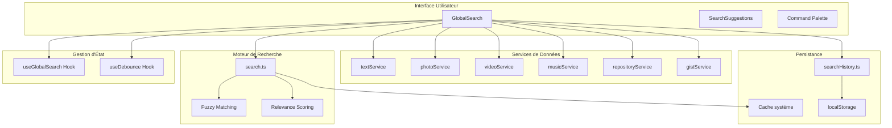

**Sources du Diagramme**
- [GlobalSearch.tsx](file://components/GlobalSearch.tsx#L42-L298)
- [useGlobalSearch.ts](file://hooks/useGlobalSearch.ts#L32-L73)
- [search.ts](file://lib/search.ts#L348-L534)
- [AppLayout.tsx](file://components/AppLayout.tsx#L51-L51)

## Composant GlobalSearch

Le composant `GlobalSearch` constitue le cœur de l'interface utilisateur du système de recherche. Il implémente une palette de commandes moderne utilisant la bibliothèque `cmdk` pour offrir une expérience de recherche fluide et intuitive.

### Fonctionnalités Principales

- **Raccourci clavier** : Ouverture via `⌘K` (Mac) ou `Ctrl+K` (Windows/Linux)
- **Recherche en temps réel** : Détection automatique des changements de requête
- **Multi-types de contenu** : Recherche simultanée dans textes, photos, vidéos, musique, applications
- **Suggestion historique** : Affichage des recherches récentes
- **Navigation clavier** : Support des flèches directionnelles et Enter/Escape

### Architecture du Composant

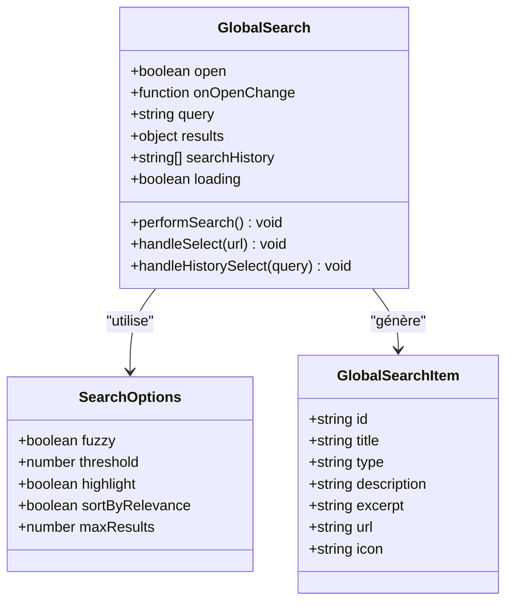

**Sources du Diagramme**
- [GlobalSearch.tsx](file://components/GlobalSearch.tsx#L37-L41)
- [search.ts](file://lib/search.ts#L6-L12)
- [search.ts](file://lib/search.ts#L331-L339)

### Logique de Recherche

Le composant orchestre la recherche en parallèle via `Promise.all()` pour optimiser les performances :

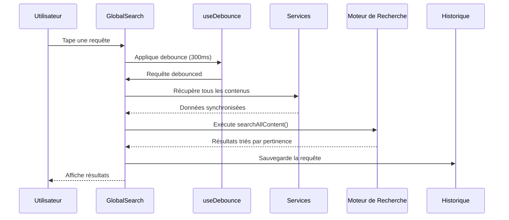

**Sources du Diagramme**
- [GlobalSearch.tsx](file://components/GlobalSearch.tsx#L56-L106)
- [useDebounce.ts](file://hooks/useDebounce.ts#L9-L25)

**Sources de la Section**
- [GlobalSearch.tsx](file://components/GlobalSearch.tsx#L42-L298)

## Hook useGlobalSearch

Le hook `useGlobalSearch` gère l'état global de la recherche et implémente le raccourci clavier pour une navigation optimisée.

### Caractéristiques Techniques

- **Gestion d'état** : Contrôle ouvert/fermé de la palette de recherche
- **Raccourci clavier** : Événement `keydown` capturé au niveau document
- **Compatibilité multiplateforme** : Support `metaKey` (Mac) et `ctrlKey` (Windows/Linux)
- **Gestion mémoire** : Nettoyage automatique des écouteurs d'événements

### Implémentation du Raccourci

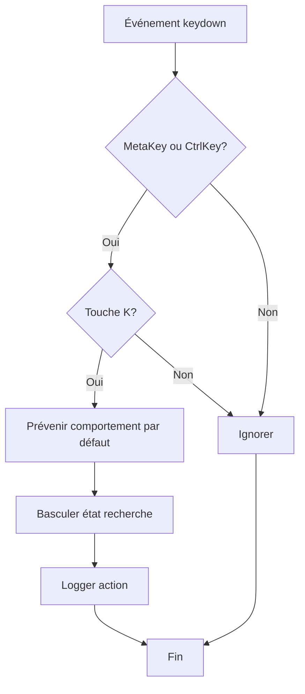

**Sources du Diagramme**
- [useGlobalSearch.ts](file://hooks/useGlobalSearch.ts#L50-L64)

**Sources de la Section**
- [useGlobalSearch.ts](file://hooks/useGlobalSearch.ts#L32-L73)

## Moteur de Recherche

Le moteur de recherche `search.ts` implémente un algorithme sophistiqué combinant fuzzy matching, scoring de pertinence et surlignage de termes.

### Algorithmes de Recherche

#### 1. Distance de Levenshtein

L'algorithme utilise la distance de Levenshtein pour calculer la similarité entre chaînes :

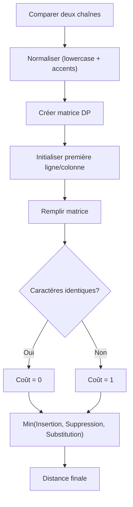

**Sources du Diagramme**
- [search.ts](file://lib/search.ts#L36-L67)

#### 2. Fuzzy Matching

Le système implémente une logique de fuzzy matching avancée :

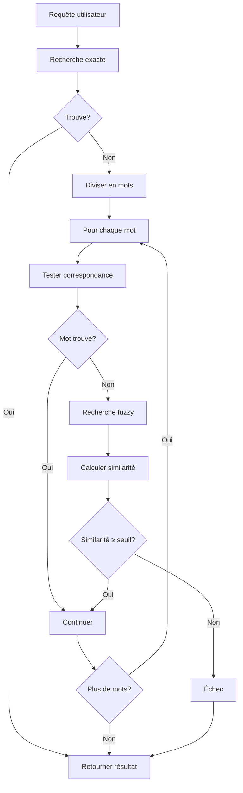

**Sources du Diagramme**
- [search.ts](file://lib/search.ts#L87-L122)

#### 3. Scoring de Pertinence

Le système calcule un score de pertinence basé sur plusieurs critères :

| Critère | Poids | Description |
|---------|-------|-------------|
| Correspondance exacte au début | ×3 | Score maximal |
| Correspondance exacte | ×2 | Bon score |
| Correspondance partielle | ×1 | Score standard |
| Similarité fuzzy | ×similarity | Score proportionnel |

**Sources de la Section**
- [search.ts](file://lib/search.ts#L196-L236)

## Système de Suggestions

Le composant `SearchSuggestions` offre une interface de suggestion en temps réel avec navigation clavier et historique.

### Fonctionnalités Avancées

- **Navigation clavier** : Support des flèches, Enter, Escape
- **Auto-scroll** : Défilement automatique vers l'élément sélectionné
- **Historique intelligent** : Affichage conditionnel basé sur la requête
- **Surlignage** : Termes recherchés mis en évidence

### Architecture des Suggestions

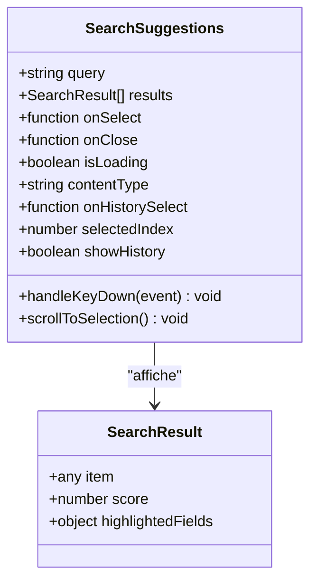

**Sources du Diagramme**
- [SearchSuggestions.tsx](file://components/texts/SearchSuggestions.tsx#L10-L18)
- [search.ts](file://lib/search.ts#L14-L18)

**Sources de la Section**
- [SearchSuggestions.tsx](file://components/texts/SearchSuggestions.tsx#L27-L208)

## Historique de Recherche

Le système d'historique `searchHistory.ts` persiste les requêtes de recherche dans `localStorage` avec gestion intelligente de la taille.

### Stratégies de Persistance

- **Stockage local** : Utilisation de `localStorage` pour la persistance
- **Limite fixe** : Maximum 5 requêtes sauvegardées
- **Déduplication** : Évite les doublons dans l'historique
- **Normalisation** : Conversion en lowercase pour comparaison

### Algorithme de Gestion

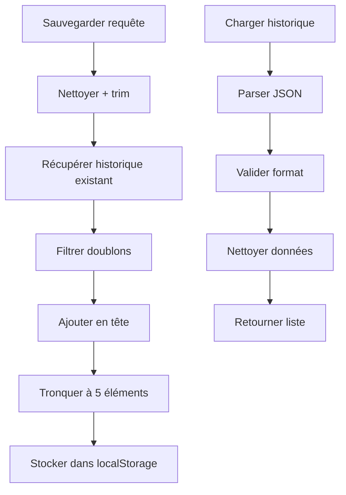

**Sources du Diagramme**
- [searchHistory.ts](file://lib/searchHistory.ts#L13-L26)
- [searchHistory.ts](file://lib/searchHistory.ts#L36-L48)

**Sources de la Section**
- [searchHistory.ts](file://lib/searchHistory.ts#L13-L82)

## Optimisations et Performance

Le système implémente plusieurs optimisations pour garantir des performances optimales même avec de gros ensembles de données.

### Stratégies de Cache

#### 1. Cache Multi-niveaux

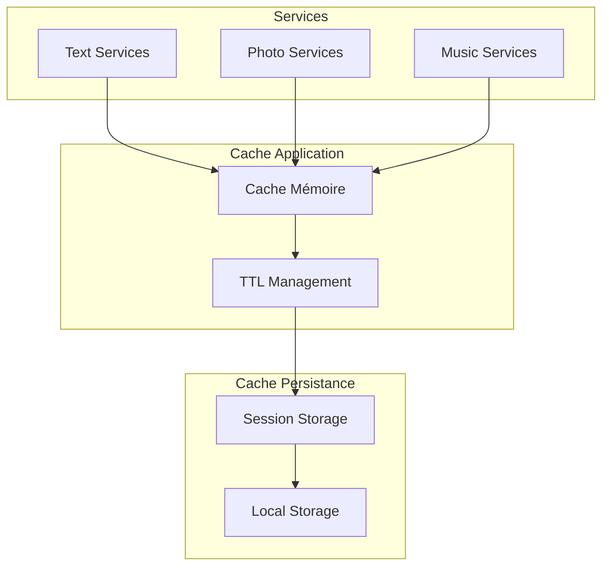

**Sources du Diagramme**
- [cache.ts](file://lib/cache.ts#L17-L21)
- [textService.ts](file://services/textService.ts#L160-L197)

#### 2. Debouncing Intelligent

Le système utilise un debounce de 300ms pour réduire les appels de recherche :

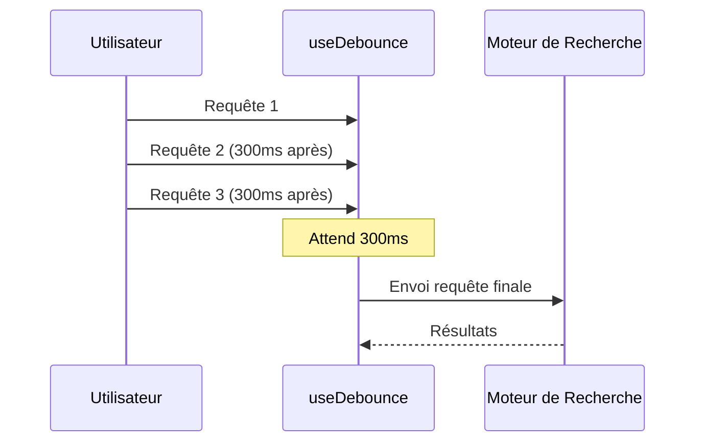

**Sources du Diagramme**
- [useDebounce.ts](file://hooks/useDebounce.ts#L9-L25)

#### 3. Recherche Asynchrone Parallèle

Les services de données sont chargés en parallèle pour minimiser les temps de réponse :

| Service | Temps de Chargement | Cache TTL |
|---------|-------------------|-----------|
| Textes | ~100ms | 5 minutes |
| Photos | ~150ms | 5 minutes |
| Musique | ~200ms | 5 minutes |
| Vidéos | ~250ms | 5 minutes |
| Repositories | ~300ms | 5 minutes |
| Gists | ~350ms | 5 minutes |

**Sources de la Section**
- [GlobalSearch.tsx](file://components/GlobalSearch.tsx#L66-L74)
- [cache.ts](file://lib/cache.ts#L18-L21)

## Intégration et Utilisation

Le système de recherche est intégré de manière transparente dans l'architecture globale du portfolio.

### Intégration dans l'Application

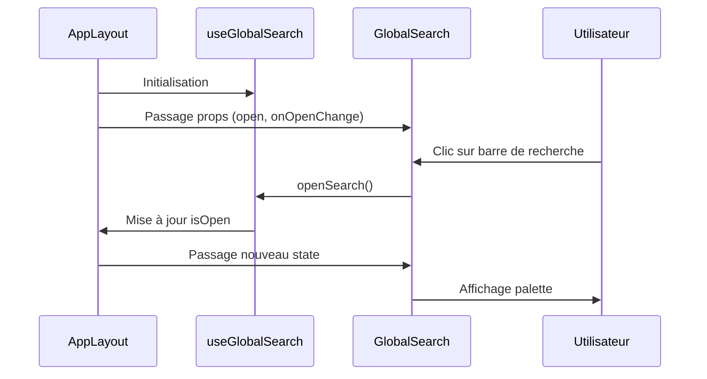

**Sources du Diagramme**
- [AppLayout.tsx](file://components/AppLayout.tsx#L51-L51)
- [useGlobalSearch.ts](file://hooks/useGlobalSearch.ts#L36-L48)

### Configuration des Services

Chaque service de contenu implémente des optimisations spécifiques :

- **Cache intelligent** : TTL configurable par service
- **Lazy loading** : Chargement différé des composants
- **Pagination** : Limitation des résultats par type
- **Validation** : Vérification des données avant recherche

**Sources de la Section**
- [AppLayout.tsx](file://components/AppLayout.tsx#L47-L73)

## Exemples Avancés

### Recherche Multi-critères

Le système supporte des requêtes complexes avec plusieurs critères :

```typescript
// Exemple de requête avancée
const query = "React TypeScript tutorial";
const results = searchAllContent(query, allContent, {
  fuzzy: true,
  threshold: 0.7,
  sortByRelevance: true,
  maxResults: 10
});
```

### Configuration Personnalisée

Différentes configurations selon le type de contenu :

| Type | Poids Titre | Poids Description | Poids Contenu | Max Résultats |
|------|-------------|-------------------|---------------|---------------|
| Textes | 3 | 2 | 1 | 5 |
| Photos | 3 | 2 | - | 5 |
| Musique | 3 | 2 | 1 | 5 |
| Vidéos | 3 | 2 | - | 5 |
| Applications | 3 | 2 | - | 5 |

### Stratégies de Fallback

Le système implémente des stratégies de fallback robustes :

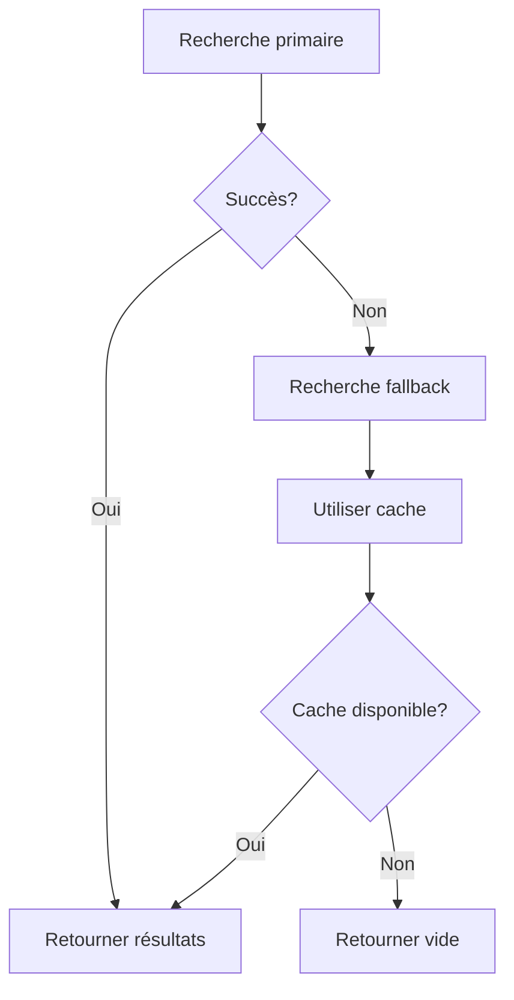

**Sources de la Section**
- [search.ts](file://lib/search.ts#L348-L534)

## Conclusion

Le système de recherche globale du portfolio représente une solution complète et sophistiquée pour la navigation dans un environnement de contenu riche. Ses principales forces incluent :

### Points Forts

- **Performance** : Optimisations multi-niveaux avec cache intelligent
- **Expérience utilisateur** : Interface moderne avec suggestions en temps réel
- **Flexibilité** : Support de multiples types de contenu et critères de recherche
- **Robustesse** : Gestion d'erreurs et stratégies de fallback
- **Extensibilité** : Architecture modulaire facilitant l'ajout de nouveaux types de contenu

### Améliorations Potentielles

- **Recherche vocale** : Intégration de la reconnaissance vocale
- **Recherche sémantique** : Utilisation d'embeddings pour la pertinence
- **Recherche par tags** : Support des métadonnées enrichies
- **Recherche distribuée** : Indexation côté serveur pour de très gros volumes

Ce système démontre l'évolution des interfaces de recherche modernes vers des solutions unifiées, intuitives et performantes, adaptées aux besoins d'un portfolio numérique contemporain.