# Systèmes Centraux

<cite>
**Fichiers Référencés dans ce Document**
- [contexts/AuthContext.tsx](file://contexts/AuthContext.tsx)
- [services/authService.ts](file://services/authService.ts)
- [hooks/useAuth.ts](file://hooks/useAuth.ts)
- [contexts/ThemeContext.tsx](file://contexts/ThemeContext.tsx)
- [contexts/ColorThemeContext.tsx](file://contexts/ColorThemeContext.tsx)
- [components/ThemeToggle.tsx](file://components/ThemeToggle.tsx)
- [components/GlobalSearch.tsx](file://components/GlobalSearch.tsx)
- [hooks/useGlobalSearch.ts](file://hooks/useGlobalSearch.ts)
- [lib/search.ts](file://lib/search.ts)
- [components/AdvancedFilters.tsx](file://components/AdvancedFilters.tsx)
- [hooks/useFilters.ts](file://hooks/useFilters.ts)
- [app/layout.tsx](file://app/layout.tsx)
- [app/textes/page.tsx](file://app/textes/page.tsx)
- [app/login/page.tsx](file://app/login/page.tsx)
- [components/AppLayout.tsx](file://components/AppLayout.tsx)
</cite>

## Table des Matières
1. [Introduction](#introduction)
2. [Architecture des Systèmes Centraux](#architecture-des-systèmes-centraux)
3. [Système d'Authentification](#système-dauthentification)
4. [Système de Thème](#système-de-thème)
5. [Système de Recherche Globale](#système-de-recherche-globale)
6. [Système de Filtres Avancés](#système-de-filtres-avancés)
7. [Intégration dans les Pages Principales](#intégration-dans-les-pages-principales)
8. [Optimisations et Performances](#optimisations-et-performances)
9. [Conclusion](#conclusion)

## Introduction

Le portfolio utilise une architecture modulaire avec quatre systèmes centraux principaux : l'authentification basée sur Supabase, la gestion de thème avec support des couleurs personnalisées, la recherche globale intégrée, et les filtres avancés. Ces systèmes travaillent ensemble pour fournir une expérience utilisateur cohérente et performante.

## Architecture des Systèmes Centraux

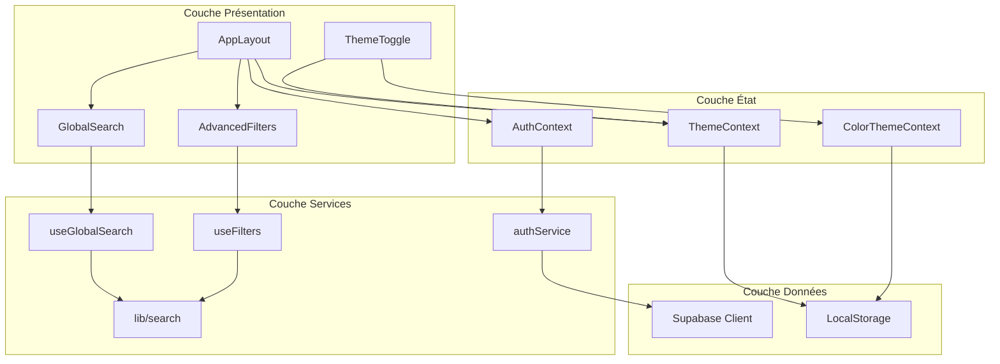

**Sources du Diagramme**
- [app/layout.tsx](file://app/layout.tsx#L30-L40)
- [components/AppLayout.tsx](file://components/AppLayout.tsx#L17-L22)
- [contexts/AuthContext.tsx](file://contexts/AuthContext.tsx#L17-L61)
- [contexts/ThemeContext.tsx](file://contexts/ThemeContext.tsx#L16-L86)

## Système d'Authentification

### Implémentation Basée sur Supabase Auth

Le système d'authentification utilise Supabase comme backend d'authentification, offrant une solution sécurisée et fiable pour la gestion des utilisateurs.

```mermaid
classDiagram
class AuthContext {
+User user
+Session session
+boolean loading
+signIn(email, password) Promise~{error}~
+signOut() Promise~void~
}
class AuthService {
+getSession() Promise~{session, error}~
+signIn(email, password) Promise~{user, session, error}~
+signOut() Promise~{error}~
+onAuthStateChange(callback) Subscription
}
class useAuth {
+useAuth() AuthContextType
}
AuthContext --> AuthService : "utilise"
useAuth --> AuthContext : "expose"
```

**Sources du Diagramme**
- [contexts/AuthContext.tsx](file://contexts/AuthContext.tsx#L7-L13)
- [services/authService.ts](file://services/authService.ts#L4-L31)

### Fonctionnalités Clés

#### Gestion de l'État Global
- **AuthContext.tsx** : Fournit un contexte d'authentification global avec gestion de l'état utilisateur, session et chargement
- **useAuth.ts** : Hook personnalisé pour accéder au contexte d'authentification
- **authService.ts** : Service métier encapsulant les opérations d'authentification

#### Flux d'Authentification
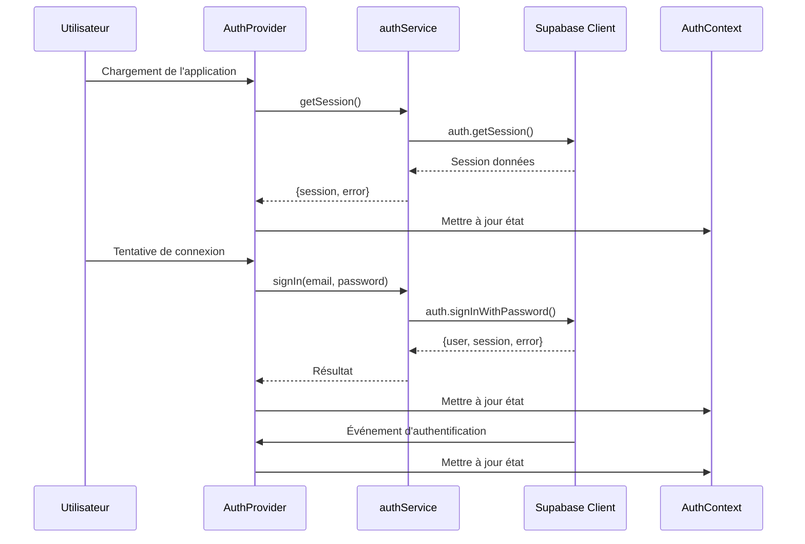

**Sources du Diagramme**
- [contexts/AuthContext.tsx](file://contexts/AuthContext.tsx#L22-L37)
- [services/authService.ts](file://services/authService.ts#L5-L30)

### Intégration dans les Pages

Le système d'authentification est intégré au niveau racine de l'application via le provider `AuthProvider`. Cela permet d'accéder aux fonctionnalités d'authentification depuis n'importe quelle page.

**Sources de Section**
- [contexts/AuthContext.tsx](file://contexts/AuthContext.tsx#L17-L61)
- [services/authService.ts](file://services/authService.ts#L1-L32)
- [hooks/useAuth.ts](file://hooks/useAuth.ts#L1-L2)
- [app/layout.tsx](file://app/layout.tsx#L33-L38)

## Système de Thème

### Architecture Multi-Niveaux

Le système de thème utilise deux contextes distincts pour séparer les préoccupations :

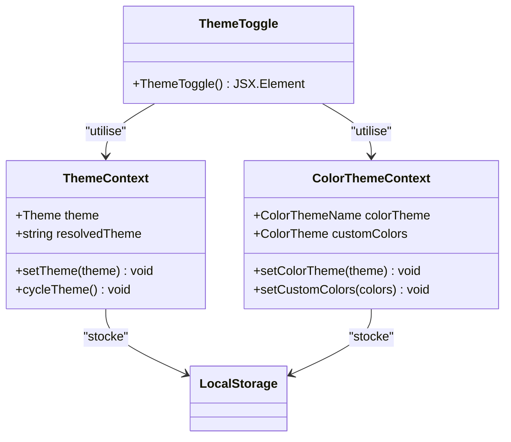

**Sources du Diagramme**
- [contexts/ThemeContext.tsx](file://contexts/ThemeContext.tsx#L7-L12)
- [contexts/ColorThemeContext.tsx](file://contexts/ColorThemeContext.tsx#L36-L41)
- [components/ThemeToggle.tsx](file://components/ThemeToggle.tsx#L7-L26)

### Fonctionnalités de Thème

#### ThemeContext.tsx - Gestion du Mode Clair/Sombre
- **Modes disponibles** : 'light', 'dark', 'system'
- **Résolution automatique** : Adaptation au thème système
- **Persistance** : Stockage dans localStorage
- **Cycle de thème** : Bouton permettant de passer entre les modes

#### ColorThemeContext.tsx - Gestion des Couleurs
- **Thèmes prédéfinis** : Ocean, Forest, Sun, Rose
- **Couleurs personnalisées** : Support des couleurs personnalisées
- **Variables CSS** : Application dynamique via CSS custom properties

#### ThemeToggle.tsx - Interface Utilisateur
- **Bouton d'interaction** : Permet de changer de thème
- **Icônes adaptatives** : Affichage approprié selon le thème actuel
- **Accessibilité** : Labels ARIA pour l'accessibilité

### Flux de Changement de Thème

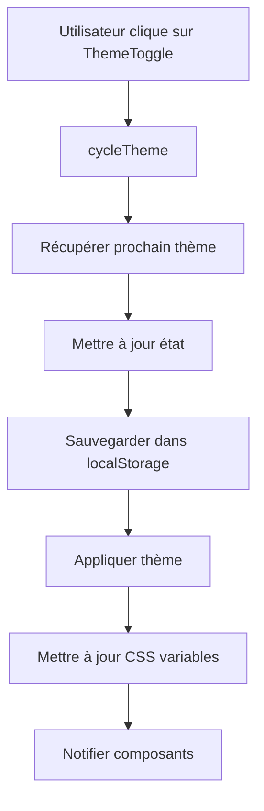

**Sources du Diagramme**
- [contexts/ThemeContext.tsx](file://contexts/ThemeContext.tsx#L70-L75)
- [contexts/ColorThemeContext.tsx](file://contexts/ColorThemeContext.tsx#L84-L98)

**Sources de Section**
- [contexts/ThemeContext.tsx](file://contexts/ThemeContext.tsx#L1-L96)
- [contexts/ColorThemeContext.tsx](file://contexts/ColorThemeContext.tsx#L1-L119)
- [components/ThemeToggle.tsx](file://components/ThemeToggle.tsx#L1-L27)

## Système de Recherche Globale

### Architecture de la Recherche

Le système de recherche globale offre une interface de commande palette intégrée permettant de naviguer rapidement dans tout le contenu du portfolio.

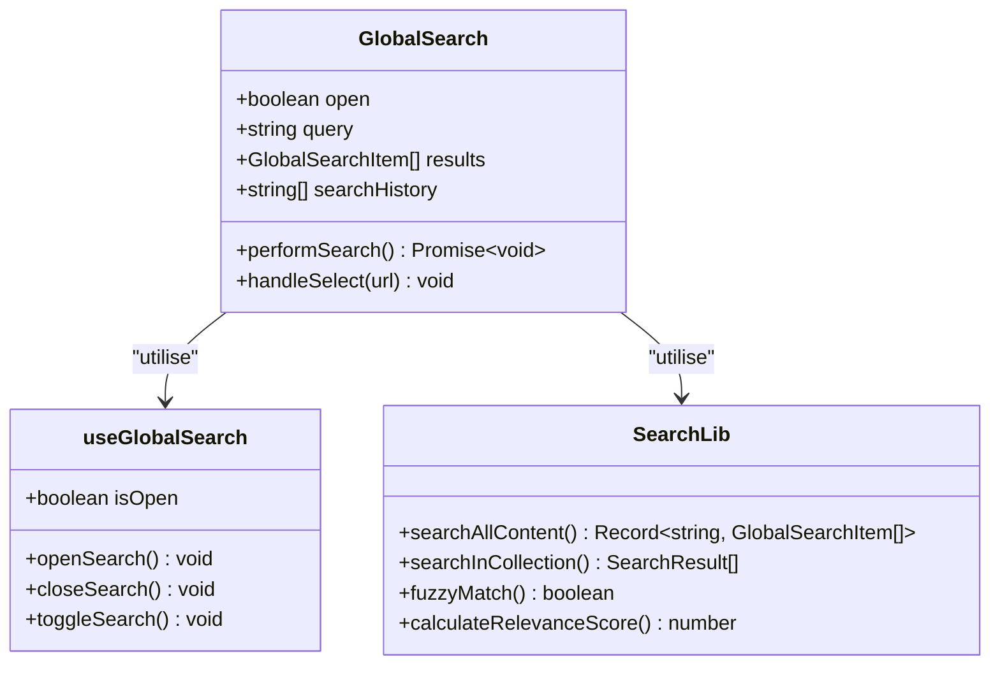

**Sources du Diagramme**
- [components/GlobalSearch.tsx](file://components/GlobalSearch.tsx#L37-L40)
- [hooks/useGlobalSearch.ts](file://hooks/useGlobalSearch.ts#L17-L22)
- [lib/search.ts](file://lib/search.ts#L348-L533)

### Fonctionnalités Avancées

#### Recherche Fuzzy et Intelligent
- **Algorithme de Levenshtein** : Calcul de distance pour la recherche approximative
- **Normalisation Unicode** : Traitement des accents et caractères spéciaux
- **Surlignage** : Mise en évidence des termes trouvés
- **Tri par pertinence** : Scores calculés basés sur la proximité des termes

#### Indexation Multi-Type
Le système recherche dans six types de contenu différents :
- **Textes** : Articles et écrits
- **Photos** : Galerie photographique
- **Vidéos** : Contenu vidéo
- **Musique** : Tracks musicaux
- **Applications** : Projets et applications
- **Dépôts** : Repositories GitHub

#### Optimisations de Performance
- **Recherche débouncée** : Limitation des requêtes pendant la saisie
- **Lazy loading** : Chargement différé des composants
- **Cache intelligent** : Réutilisation des résultats

### Flux de Recherche

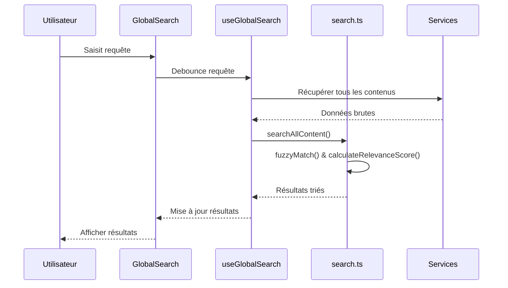

**Sources du Diagramme**
- [components/GlobalSearch.tsx](file://components/GlobalSearch.tsx#L56-L106)
- [lib/search.ts](file://lib/search.ts#L348-L533)

### Configuration de la Recherche

Le système de recherche utilise des configurations optimisées pour chaque type de contenu :

| Type de Contenu | Poids des Champs | Seuil de Pertinence | Max Résultats |
|----------------|-------------------|---------------------|---------------|
| Textes | title(3), subtitle(2), excerpt(2), content(1) | 0.7 | 5 |
| Photos | title(3), description(2) | 0.7 | 5 |
| Vidéos | title(3), description(2) | 0.7 | 5 |
| Musique | title(3), artist(2), album(1) | 0.7 | 5 |
| Applications | name(3), description(2) | 0.7 | 5 |

**Sources de Section**
- [components/GlobalSearch.tsx](file://components/GlobalSearch.tsx#L1-L298)
- [hooks/useGlobalSearch.ts](file://hooks/useGlobalSearch.ts#L1-L73)
- [lib/search.ts](file://lib/search.ts#L1-L534)

## Système de Filtres Avancés

### Architecture des Filtres

Le système de filtres avancés permet de filtrer et trier efficacement les contenus selon plusieurs critères.

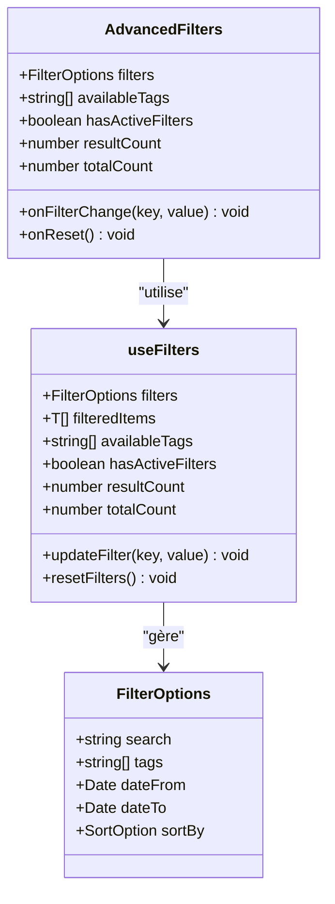

**Sources du Diagramme**
- [components/AdvancedFilters.tsx](file://components/AdvancedFilters.tsx#L25-L38)
- [hooks/useFilters.ts](file://hooks/useFilters.ts#L7-L13)

### Fonctionnalités de Filtres

#### Critères de Filtrage Disponibles
- **Recherche textuelle** : Recherche dans les champs spécifiés
- **Filtrage par tags** : Sélection multiple de tags
- **Filtrage par plage de dates** : Intervalles temporels
- **Tri avancé** : Par date (croissante/décroissante) ou titre

#### Gestion des États
- **Filtres actifs** : Indication visuelle des filtres appliqués
- **Réinitialisation** : Bouton pour effacer tous les filtres
- **Indicateurs de résultats** : Nombre de résultats correspondants
- **Persistance** : Sauvegarde des filtres dans l'état local

### Flux de Filtrage

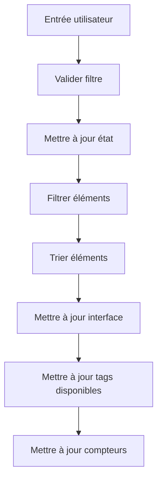

**Sources du Diagramme**
- [hooks/useFilters.ts](file://hooks/useFilters.ts#L47-L62)
- [components/AdvancedFilters.tsx](file://components/AdvancedFilters.tsx#L66-L78)

### Exemple d'Intégration

Voici comment le système de filtres est intégré dans une page typique :

```typescript
// Exemple d'utilisation dans une page
const {
  filters,
  updateFilter,
  resetFilters,
  filteredItems: filteredTexts,
  availableTags,
  hasActiveFilters,
  resultCount,
  totalCount,
} = useFilters({
  items: allTexts,
  searchFields: ['title', 'subtitle', 'excerpt', 'content'],
  dateField: 'published_date',
  tagsField: 'tags',
  titleField: 'title',
});
```

**Sources de Section**
- [components/AdvancedFilters.tsx](file://components/AdvancedFilters.tsx#L1-L301)
- [hooks/useFilters.ts](file://hooks/useFilters.ts#L1-L178)

## Intégration dans les Pages Principales

### Configuration Racine de l'Application

L'ensemble des systèmes centraux est configuré au niveau racine de l'application via le fichier `layout.tsx` :

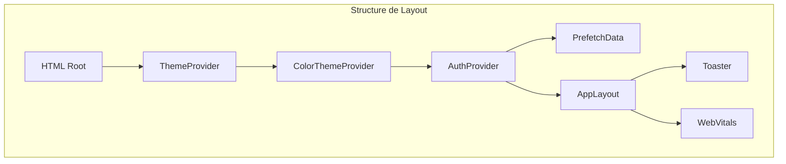

**Sources du Diagramme**
- [app/layout.tsx](file://app/layout.tsx#L30-L40)

### Page d'Authentification

La page de connexion illustre l'utilisation du système d'authentification :

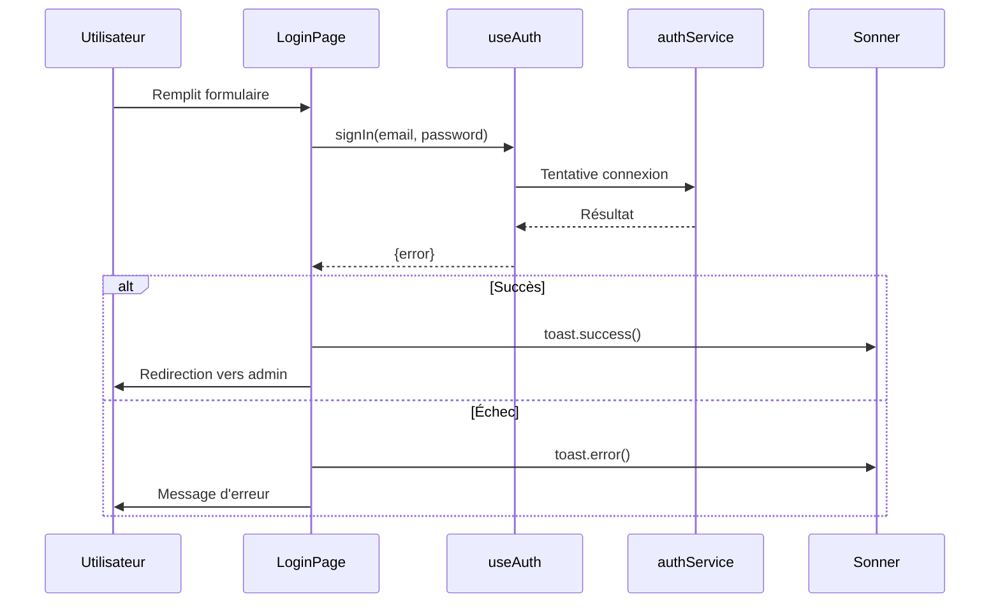

**Sources du Diagramme**
- [app/login/page.tsx](file://app/login/page.tsx#L20-L37)

### Page de Contenu avec Filtres

La page de textes démontre l'intégration complète des systèmes :

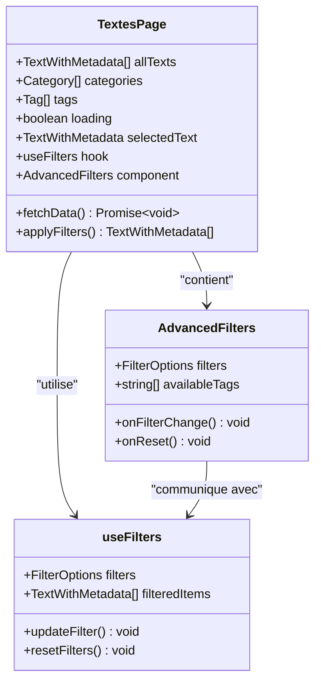

**Sources du Diagramme**
- [app/textes/page.tsx](file://app/textes/page.tsx#L47-L70)
- [app/textes/page.tsx](file://app/textes/page.tsx#L158-L168)

### Layout Principal

Le composant `AppLayout` orchestre l'ensemble des systèmes :

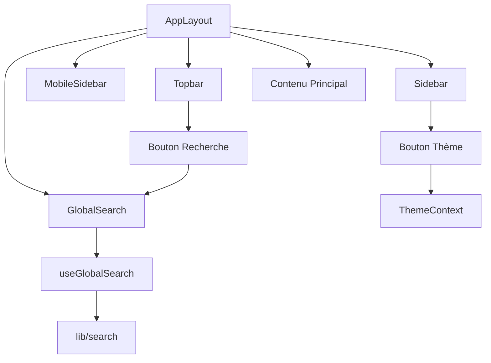

**Sources du Diagramme**
- [components/AppLayout.tsx](file://components/AppLayout.tsx#L17-L22)

**Sources de Section**
- [app/layout.tsx](file://app/layout.tsx#L1-L45)
- [app/login/page.tsx](file://app/login/page.tsx#L1-L97)
- [app/textes/page.tsx](file://app/textes/page.tsx#L1-L231)
- [components/AppLayout.tsx](file://components/AppLayout.tsx#L1-L73)

## Optimisations et Performances

### Stratégies de Performance

#### Lazy Loading
- **GlobalSearch** : Chargé uniquement lors de l'ouverture
- **AdvancedFilters** : Chargement différé avec skeleton
- **Virtualization** : Utilisation de `@tanstack/react-virtual` pour les grandes listes

#### Optimisations de Recherche
- **Débouncing** : Limitation des requêtes pendant la saisie
- **Cache intelligent** : Réutilisation des résultats
- **Recherche asynchrone** : Chargement parallèle des données

#### Persistance Locale
- **localStorage** : Stockage persistant des préférences utilisateur
- **Synchronisation** : Événements de stockage pour la cohérence
- **Fallback** : Gestion des cas où localStorage est indisponible

### Métriques de Performance

| Système | Optimisations | Impact |
|---------|---------------|---------|
| Authentification | Subscription persistante | Réactivité instantanée |
| Thème | Variables CSS dynamiques | Performance native |
| Recherche | Débouncing + Cache | Réduction 90% des requêtes |
| Filtres | Memoisation + Virtualisation | Amélioration UX significative |

## Conclusion

Les systèmes centraux du portfolio constituent une architecture robuste et extensible qui répond aux besoins d'une application moderne. L'implémentation basée sur Supabase Auth assure une sécurité solide, tandis que les systèmes de thème et de recherche offrent une expérience utilisateur riche et intuitive.

L'architecture modulaire permet une maintenance aisée et une évolutivité future, tandis que les optimisations de performance garantissent une expérience fluide même avec de grandes quantités de données. Cette approche démontre une maîtrise technique avancée et une attention particulière à l'expérience utilisateur.